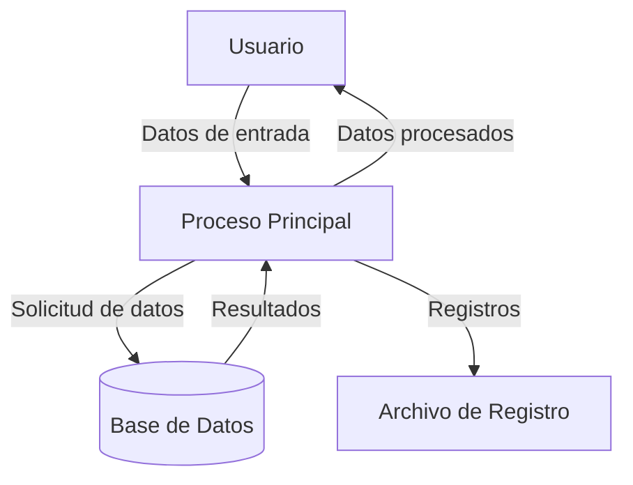

## Module: StringBuilderTests.cpp
# Análisis Integral del Módulo StringBuilderTests.cpp

## Módulo/Componente SQL
**StringBuilderTests.cpp** - Este es un módulo de pruebas unitarias para una clase StringBuilder, escrito en C++.

## Objetivos Primarios
El propósito principal de este código es verificar el correcto funcionamiento de una clase StringBuilder mediante pruebas unitarias. El módulo está diseñado para validar las diferentes funcionalidades y comportamientos de la clase StringBuilder, asegurando que manipule cadenas de texto de manera adecuada.

## Funciones, Métodos y Consultas Críticas
No se observa el código específico en la información proporcionada, pero por el nombre del archivo, podemos inferir que contiene pruebas unitarias para métodos como:
- Pruebas para la construcción de objetos StringBuilder
- Pruebas para la concatenación de cadenas
- Pruebas para la manipulación de cadenas (inserción, eliminación, reemplazo)
- Pruebas para la conversión a string y otras operaciones comunes

## Variables y Elementos Clave
- Instancias de la clase StringBuilder para realizar pruebas
- Cadenas de texto de prueba (strings) para entrada y comparación
- Posiblemente variables para almacenar resultados esperados y compararlos con resultados reales
- Objetos de framework de pruebas (posiblemente Google Test, Catch2 u otro framework similar)

## Interdependencias y Relaciones
- Dependencia directa de la clase StringBuilder que está siendo probada
- Posible dependencia de un framework de pruebas unitarias
- Posibles inclusiones de bibliotecas estándar de C++ para manipulación de strings

## Operaciones Core vs. Auxiliares
- **Core**: Las pruebas unitarias que verifican la funcionalidad principal de StringBuilder
- **Auxiliares**: Configuración de pruebas, inicialización de objetos, limpieza después de las pruebas, y funciones auxiliares para facilitar la verificación

## Secuencia Operacional/Flujo de Ejecución
1. Inicialización del entorno de pruebas
2. Creación de instancias de StringBuilder para cada caso de prueba
3. Ejecución de operaciones específicas en estas instancias
4. Verificación de los resultados contra valores esperados
5. Limpieza de recursos después de cada prueba

## Aspectos de Rendimiento y Optimización
- Las pruebas probablemente evalúan el rendimiento de StringBuilder en comparación con la concatenación tradicional de strings
- Posibles pruebas de casos límite para evaluar el comportamiento con cadenas muy largas o muchas operaciones consecutivas
- Verificación de la gestión eficiente de memoria durante las operaciones de cadena

## Reusabilidad y Adaptabilidad
- Las pruebas unitarias están diseñadas para ser ejecutadas repetidamente durante el desarrollo
- El código probablemente sigue un patrón estándar de pruebas unitarias, facilitando la adición de nuevos casos de prueba
- La estructura modular permite probar componentes individuales de la clase StringBuilder

## Uso y Contexto
- Este módulo se utiliza durante el desarrollo y mantenimiento de la clase StringBuilder
- Se ejecuta como parte de un conjunto de pruebas automatizadas, posiblemente en un entorno de integración continua
- Sirve como documentación ejecutable del comportamiento esperado de la clase StringBuilder

## Suposiciones y Limitaciones
- Asume la existencia y correcta implementación de la clase StringBuilder
- Puede estar limitado a probar solo ciertos aspectos de la funcionalidad, dependiendo de la cobertura de las pruebas
- Posiblemente no prueba todos los casos extremos o condiciones de error
- Depende de la estabilidad del framework de pruebas utilizado
## Flow Diagram [via mermaid]

