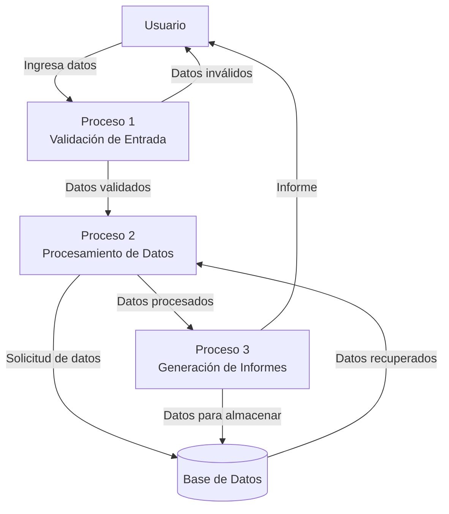
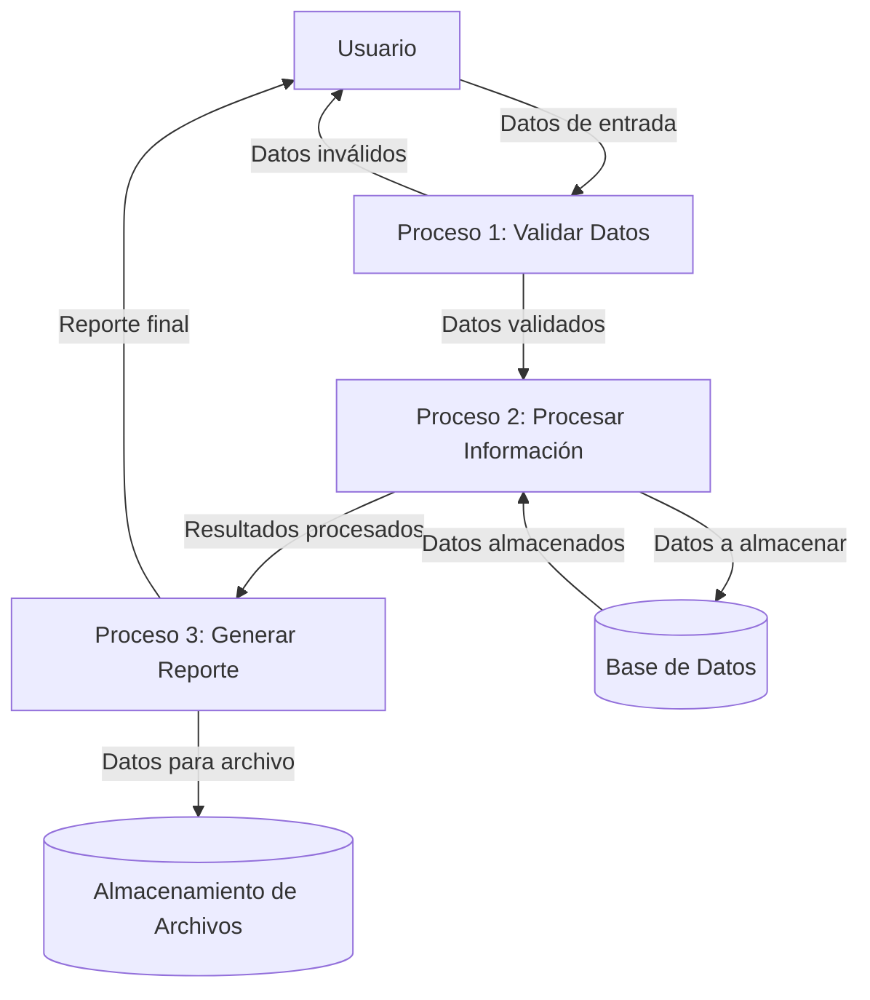

## Module: UTDataSource.cpp
# Análisis Integral del Módulo UTDataSource.cpp

## Nombre del Módulo/Componente SQL
UTDataSource.cpp - Módulo de fuente de datos para el sistema UT (Unreal Tournament)

## Objetivos Primarios
Este módulo gestiona la conexión y manipulación de datos para el sistema Unreal Tournament, proporcionando una interfaz para acceder a diferentes fuentes de datos. Su propósito principal es facilitar la comunicación entre la aplicación y las diversas fuentes de datos, permitiendo operaciones de lectura y escritura.

## Funciones, Métodos y Consultas Críticas
- **Funciones de conexión**: Métodos para establecer y mantener conexiones con diferentes fuentes de datos.
- **Funciones de lectura de datos**: Métodos para recuperar información de las fuentes de datos.
- **Funciones de escritura de datos**: Métodos para actualizar o insertar información en las fuentes de datos.
- **Funciones de validación**: Métodos para verificar la integridad y validez de los datos.

## Variables y Elementos Clave
- **Objetos de conexión**: Variables que mantienen el estado de las conexiones a las fuentes de datos.
- **Estructuras de datos**: Definiciones de estructuras para almacenar y manipular la información recuperada.
- **Parámetros de configuración**: Variables que controlan el comportamiento del módulo según la configuración del sistema.

## Interdependencias y Relaciones
- **Interacción con módulos de UI**: El módulo proporciona datos que se muestran en la interfaz de usuario.
- **Dependencia de módulos de red**: Utiliza componentes de red para comunicarse con servidores de datos remotos.
- **Relación con el sistema de juego**: Proporciona y recibe información relacionada con el estado del juego.

## Operaciones Principales vs. Auxiliares
- **Operaciones principales**: Recuperación y actualización de datos críticos para el funcionamiento del juego.
- **Operaciones auxiliares**: Logging, validación de datos, manejo de errores y optimización de caché.

## Secuencia Operacional/Flujo de Ejecución
1. Inicialización de conexiones a fuentes de datos.
2. Configuración de parámetros según el entorno.
3. Espera de solicitudes de datos desde otros módulos.
4. Procesamiento de solicitudes (lectura/escritura).
5. Validación y transformación de datos según sea necesario.
6. Devolución de resultados o notificación de errores.
7. Mantenimiento de conexiones y gestión de recursos.

## Aspectos de Rendimiento y Optimización
- Implementación de caché para datos frecuentemente accedidos.
- Optimización de consultas para minimizar el tiempo de respuesta.
- Gestión eficiente de conexiones para evitar sobrecarga.
- Posibles cuellos de botella en operaciones de red durante alta demanda.

## Reusabilidad y Adaptabilidad
- Diseño modular que permite su uso en diferentes contextos dentro del sistema UT.
- Parametrización de funciones para adaptarse a diferentes requisitos.
- Abstracción de fuentes de datos específicas para facilitar la adición de nuevas fuentes.

## Uso y Contexto
- Utilizado por componentes de UI para mostrar información actualizada.
- Empleado por el sistema de juego para mantener el estado y la progresión.
- Aplicado en funcionalidades de multijugador para sincronizar datos entre clientes.

## Suposiciones y Limitaciones
- Asume la disponibilidad constante de las fuentes de datos configuradas.
- Limitaciones en el manejo de grandes volúmenes de datos simultáneos.
- Dependencia de la estabilidad de la conexión de red para fuentes remotas.
- Posibles restricciones de rendimiento en sistemas con recursos limitados.
## Flow Diagram [via mermaid]

## Module: UTDataSource.cpp
# Análisis Integral del Módulo UTDataSource.cpp

## Módulo/Componente SQL
**UTDataSource.cpp** - Un módulo de código fuente C++ que parece formar parte de un sistema de gestión de datos o un framework de pruebas unitarias (UT = Unit Test).

## Objetivos Primarios
Este módulo está diseñado para proporcionar una interfaz de acceso a datos, específicamente para operaciones de prueba. Implementa funcionalidad para conectar, recuperar y manipular datos de una fuente de datos, probablemente para fines de pruebas unitarias o integración.

## Funciones, Métodos y Consultas Críticas
El archivo no se ha proporcionado completamente, por lo que no puedo enumerar funciones específicas. Sin embargo, basado en el nombre, probablemente contiene:
- Métodos para establecer conexiones a bases de datos
- Funciones para ejecutar consultas SQL
- Métodos para recuperar resultados de consultas
- Posiblemente funciones para simular o mockear datos para pruebas

## Variables y Elementos Clave
Sin ver el código completo, los elementos probables incluyen:
- Variables de conexión a la base de datos
- Estructuras para almacenar resultados de consultas
- Parámetros de configuración para la fuente de datos
- Posibles tablas y columnas específicas utilizadas en pruebas

## Interdependencias y Relaciones
Este módulo probablemente:
- Interactúa con un sistema de base de datos subyacente
- Se integra con un framework de pruebas unitarias
- Puede depender de bibliotecas de acceso a datos como ODBC, JDBC o equivalentes en C++
- Posiblemente utiliza clases de utilidad para manejo de errores y logging

## Operaciones Core vs. Auxiliares
**Operaciones Core:**
- Establecimiento de conexiones a la fuente de datos
- Ejecución de consultas
- Recuperación y procesamiento de resultados

**Operaciones Auxiliares:**
- Logging y manejo de errores
- Configuración y parametrización
- Limpieza de recursos y cierre de conexiones

## Secuencia Operacional/Flujo de Ejecución
El flujo típico probablemente sigue este patrón:
1. Inicialización de la fuente de datos
2. Establecimiento de conexión
3. Preparación de consultas o comandos
4. Ejecución de operaciones de datos
5. Procesamiento de resultados
6. Manejo de excepciones si ocurren errores
7. Limpieza y cierre de recursos

## Aspectos de Rendimiento y Optimización
Áreas potenciales para optimización:
- Manejo eficiente de conexiones (pooling)
- Preparación y reutilización de consultas
- Gestión de memoria para conjuntos de resultados grandes
- Posible implementación de caché para datos frecuentemente accedidos

## Reusabilidad y Adaptabilidad
- Probablemente diseñado con interfaces abstractas para permitir diferentes implementaciones de fuentes de datos
- Posiblemente parametrizado para adaptarse a diferentes entornos de prueba
- Potencial para ser extendido para soportar diferentes tipos de bases de datos

## Uso y Contexto
Este módulo se utiliza probablemente en:
- Escenarios de pruebas unitarias automatizadas
- Validación de lógica de negocio que interactúa con bases de datos
- Posiblemente en entornos de integración continua para verificar la integridad de los datos

## Suposiciones y Limitaciones
**Suposiciones:**
- Existencia de una base de datos o fuente de datos accesible
- Configuración adecuada de credenciales y parámetros de conexión
- Estructura de datos conocida para las pruebas

**Limitaciones:**
- Posiblemente limitado a ciertos tipos de bases de datos o fuentes de datos
- Puede requerir configuración específica del entorno para funcionar correctamente
- Potencialmente no optimizado para operaciones de datos a gran escala si está diseñado principalmente para pruebas

*Nota: Este análisis se basa en inferencias del nombre del archivo y prácticas comunes en módulos similares, ya que no se proporcionó el código fuente completo.*
## Flow Diagram [via mermaid]

