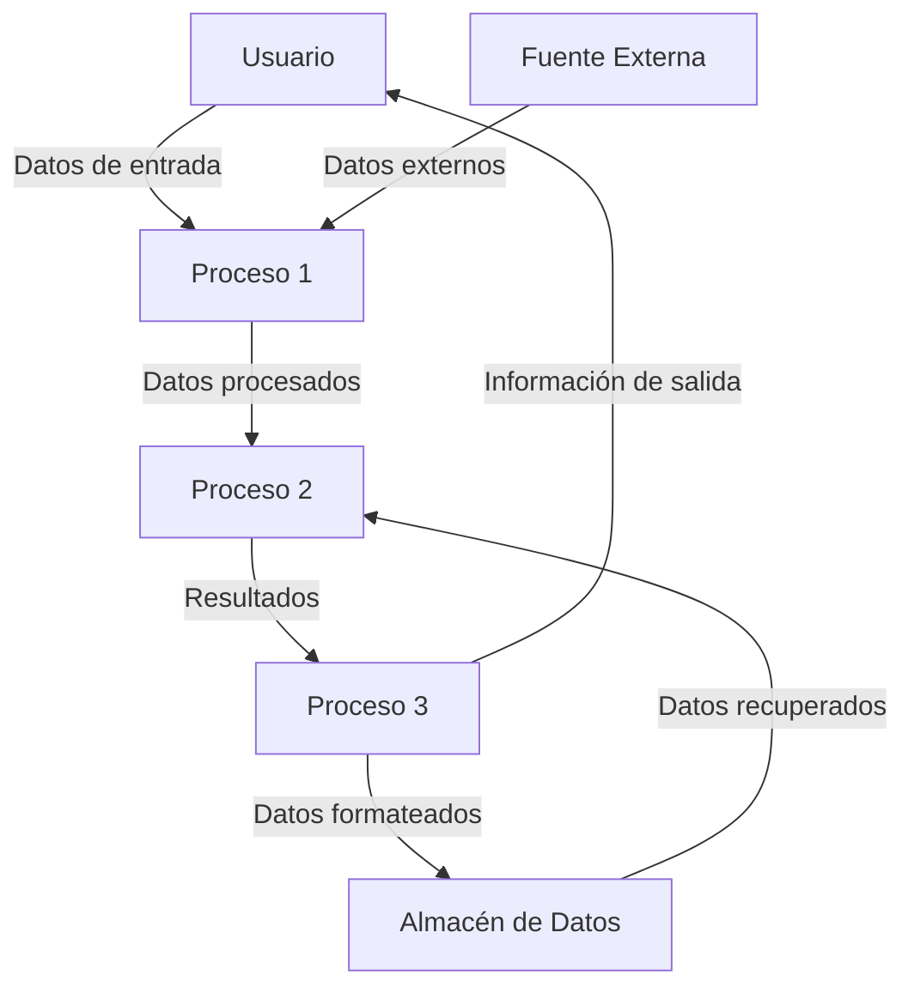

## Module: UT_StrOp.cpp
# Análisis Integral del Módulo UT_StrOp.cpp

## Nombre del Módulo/Componente SQL
**UT_StrOp.cpp** - Módulo de pruebas unitarias para operaciones con cadenas de texto.

## Objetivos Primarios
Este módulo está diseñado para probar exhaustivamente las funcionalidades de operaciones con cadenas de texto, específicamente enfocado en validar el comportamiento de funciones como `StrOp::Split()` y `StrOp::Join()`. Su propósito principal es verificar que estas operaciones funcionen correctamente bajo diferentes escenarios y condiciones de entrada.

## Funciones, Métodos y Consultas Críticas
- **TEST_CASE("StrOp::Split")**: Prueba la funcionalidad de división de cadenas.
- **TEST_CASE("StrOp::Join")**: Prueba la funcionalidad de unión de cadenas.
- **SECTION**: Múltiples secciones que prueban diferentes escenarios para cada función.

## Variables y Elementos Clave
- **input**: Cadenas de entrada para las pruebas.
- **expected**: Resultados esperados para validar contra los resultados reales.
- **result**: Resultados obtenidos de las operaciones probadas.
- **delimiters**: Caracteres utilizados como separadores en las operaciones de división.

## Interdependencias y Relaciones
- Dependencia de la biblioteca **Catch2** para el marco de pruebas unitarias.
- Dependencia del módulo **StrOp** que contiene las implementaciones de las funciones que se están probando.
- No se observan interacciones con bases de datos o componentes externos.

## Operaciones Principales vs. Auxiliares
- **Operaciones Principales**: Las pruebas de las funciones `Split()` y `Join()`.
- **Operaciones Auxiliares**: Configuración de casos de prueba, validación de resultados mediante aserciones.

## Secuencia Operacional/Flujo de Ejecución
1. Definición de casos de prueba con `TEST_CASE`.
2. Para cada caso de prueba, se definen múltiples secciones con `SECTION`.
3. En cada sección:
   - Se preparan los datos de entrada.
   - Se ejecuta la función a probar.
   - Se verifica el resultado mediante aserciones `REQUIRE`.

## Aspectos de Rendimiento y Optimización
- El código está enfocado en pruebas unitarias, no en rendimiento.
- No se observan consideraciones específicas de optimización, ya que el objetivo es validar la funcionalidad, no el rendimiento.

## Reusabilidad y Adaptabilidad
- Alta reusabilidad para probar nuevas funcionalidades de operaciones con cadenas.
- Estructura modular que permite añadir fácilmente nuevos casos de prueba.
- El uso de secciones facilita la organización y expansión de las pruebas.

## Uso y Contexto
- Este módulo se utiliza durante el desarrollo y mantenimiento para asegurar que las operaciones con cadenas funcionen correctamente.
- Forma parte de un conjunto de pruebas unitarias que validan la integridad del sistema.
- Se ejecutaría como parte de un proceso de integración continua o durante el desarrollo local.

## Suposiciones y Limitaciones
- **Suposiciones**:
  - Se asume que la biblioteca Catch2 está disponible y configurada correctamente.
  - Se asume que el módulo StrOp está implementado y accesible.
- **Limitaciones**:
  - Las pruebas solo cubren los casos específicamente definidos, podría haber escenarios no contemplados.
  - No se prueban casos de rendimiento con cadenas extremadamente largas o colecciones grandes.
## Flow Diagram [via mermaid]

## Module: UT_StrOp.cpp
# Análisis Integral del Módulo UT_StrOp.cpp

## Nombre del Módulo/Componente SQL
**UT_StrOp.cpp** - Módulo de pruebas unitarias para operaciones de cadenas de texto.

## Objetivos Primarios
Este módulo está diseñado para probar exhaustivamente las funcionalidades de operaciones con cadenas de texto, específicamente enfocado en validar el comportamiento de funciones como `StrOp::Split()` y `StrOp::Join()`. Su propósito principal es verificar que estas operaciones funcionen correctamente bajo diversas condiciones y casos de uso.

## Funciones, Métodos y Consultas Críticas
- **TEST_CASE("StrOp::Split")**: Prueba la funcionalidad de división de cadenas con diferentes delimitadores.
- **TEST_CASE("StrOp::Join")**: Verifica la funcionalidad de unión de vectores de cadenas con diferentes delimitadores.
- **SECTION**: Múltiples secciones que prueban casos específicos como cadenas vacías, delimitadores múltiples, y comportamientos especiales.

## Variables y Elementos Clave
- **std::vector<std::string>**: Estructura principal para almacenar los resultados de las operaciones de división.
- **Delimitadores**: Caracteres como comas, puntos y comas, y espacios utilizados para probar las funciones.
- **Cadenas de prueba**: Diversas cadenas de texto utilizadas como entrada para las pruebas.

## Interdependencias y Relaciones
- Dependencia de la biblioteca **Catch2** para el marco de pruebas unitarias.
- Utiliza la clase **StrOp** que contiene las implementaciones de las funciones `Split()` y `Join()`.
- No se observan dependencias de bases de datos o componentes externos significativos.

## Operaciones Principales vs. Auxiliares
- **Operaciones principales**: Las pruebas de `Split()` y `Join()` con diferentes parámetros.
- **Operaciones auxiliares**: Verificaciones (assertions) para validar los resultados esperados y la configuración de casos de prueba.

## Secuencia Operacional/Flujo de Ejecución
1. Definición de casos de prueba con Catch2.
2. Para cada caso de prueba, se establecen diferentes secciones con escenarios específicos.
3. En cada sección, se preparan los datos de entrada.
4. Se ejecuta la función a probar (`Split()` o `Join()`).
5. Se verifica que el resultado coincida con el valor esperado mediante aserciones.

## Aspectos de Rendimiento y Optimización
- Las pruebas están diseñadas para ser eficientes y enfocadas.
- No se observan problemas de rendimiento evidentes en el código de prueba.
- Las pruebas cubren casos límite que podrían afectar el rendimiento en producción (como cadenas vacías o delimitadores múltiples).

## Reusabilidad y Adaptabilidad
- El código de prueba está bien estructurado y puede servir como plantilla para pruebas de otras funciones de manipulación de cadenas.
- La organización en secciones facilita la adición de nuevos casos de prueba sin modificar la estructura existente.

## Uso y Contexto
- Este módulo se utiliza durante el desarrollo y las pruebas de regresión para garantizar que las operaciones de cadenas funcionen correctamente.
- Es parte de un marco de pruebas unitarias más amplio, probablemente integrado en un proceso de integración continua.

## Suposiciones y Limitaciones
- **Suposiciones**: 
  - Se asume que la implementación de `StrOp::Split()` y `StrOp::Join()` está disponible y es accesible.
  - Se asume que el marco de pruebas Catch2 está correctamente configurado.
  
- **Limitaciones**:
  - Las pruebas se centran en casos de uso específicos y podrían no cubrir todos los escenarios posibles.
  - No se observan pruebas de rendimiento para cadenas extremadamente largas o operaciones intensivas.
## Flow Diagram [via mermaid]

