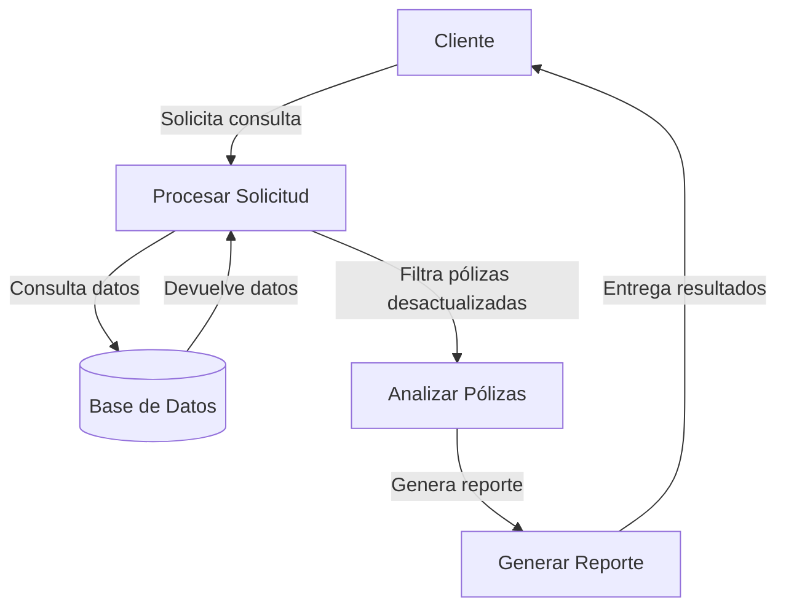

## Module: cConsultarPolizasSegurosDesactualizados.cpp
# Análisis Integral del Módulo cConsultarPolizasSegurosDesactualizados.cpp

## Nombre del Módulo/Componente SQL
cConsultarPolizasSegurosDesactualizados.cpp - Clase para consultar pólizas de seguros desactualizadas

## Objetivos Primarios
Este módulo tiene como propósito principal consultar y recuperar información sobre pólizas de seguros que se consideran desactualizadas en el sistema. Implementa una interfaz para filtrar y obtener datos específicos de pólizas según diversos criterios, principalmente enfocándose en aquellas que requieren actualización.

## Funciones, Métodos y Consultas Críticas
- **cConsultarPolizasSegurosDesactualizados::Consultar()**: Método principal que ejecuta la consulta de pólizas desactualizadas aplicando los filtros configurados.
- **cConsultarPolizasSegurosDesactualizados::ConfigurarConsulta()**: Método que prepara la consulta SQL con los parámetros y filtros establecidos.
- **cConsultarPolizasSegurosDesactualizados::AgregarFiltro()**: Método para añadir condiciones específicas a la consulta.
- **Consulta SQL principal**: Selecciona datos de pólizas desactualizadas uniendo múltiples tablas (POLIZAS, CLIENTES, SUCURSALES, etc.).

## Variables y Elementos Clave
- **Tablas principales**: 
  - POLIZAS: Almacena información de las pólizas
  - CLIENTES: Datos de los clientes asociados
  - SUCURSALES: Información de sucursales
  - USUARIOS: Datos de usuarios del sistema
  - TIPOS_POLIZA: Clasificación de tipos de pólizas
  
- **Columnas críticas**:
  - ID_POLIZA: Identificador único de póliza
  - FECHA_ACTUALIZACION: Fecha de última actualización
  - ESTADO: Estado actual de la póliza
  - ID_CLIENTE: Identificador del cliente asociado
  
- **Parámetros importantes**:
  - m_nIdSucursal: Filtro por sucursal
  - m_nIdCliente: Filtro por cliente
  - m_nIdPoliza: Filtro por póliza específica
  - m_nIdUsuario: Filtro por usuario responsable

## Interdependencias y Relaciones
- Relación entre POLIZAS y CLIENTES mediante ID_CLIENTE
- Relación entre POLIZAS y SUCURSALES mediante ID_SUCURSAL
- Relación entre POLIZAS y USUARIOS mediante ID_USUARIO
- Relación entre POLIZAS y TIPOS_POLIZA mediante ID_TIPO_POLIZA
- Dependencia de la clase base cConsultaBase para funcionalidad de consulta

## Operaciones Principales vs. Auxiliares
- **Operaciones principales**:
  - Consulta de pólizas desactualizadas
  - Aplicación de filtros específicos
  
- **Operaciones auxiliares**:
  - Validación de parámetros
  - Formateo de resultados
  - Manejo de excepciones
  - Construcción dinámica de la consulta SQL

## Secuencia Operacional/Flujo de Ejecución
1. Inicialización de la clase con parámetros específicos
2. Configuración de filtros mediante AgregarFiltro()
3. Preparación de la consulta SQL en ConfigurarConsulta()
4. Ejecución de la consulta mediante Consultar()
5. Procesamiento de resultados
6. Devolución de datos formateados al solicitante

## Aspectos de Rendimiento y Optimización
- La consulta utiliza múltiples JOIN que podrían afectar el rendimiento con grandes volúmenes de datos
- No se observa uso explícito de índices, lo que podría optimizarse
- La construcción dinámica de la consulta SQL podría beneficiarse de parametrización para evitar problemas de seguridad
- Posible cuello de botella en la cláusula WHERE con múltiples condiciones

## Reusabilidad y Adaptabilidad
- El módulo está diseñado con un enfoque orientado a objetos que facilita su reutilización
- La separación de la configuración de consulta y ejecución permite adaptabilidad
- Los filtros pueden configurarse dinámicamente según las necesidades
- Hereda funcionalidad de una clase base (cConsultaBase) lo que sugiere un diseño modular

## Uso y Contexto
- Se utiliza en un sistema de gestión de seguros para identificar pólizas que requieren actualización
- Probablemente forma parte de un módulo de mantenimiento o actualización de pólizas
- Puede ser invocado desde interfaces de usuario o procesos automatizados
- Sirve como herramienta para agentes de seguros o administradores del sistema

## Suposiciones y Limitaciones
- Asume la existencia de una estructura específica de base de datos con tablas y relaciones predefinidas
- Requiere permisos adecuados para acceder a las tablas mencionadas
- No parece manejar grandes volúmenes de datos de manera optimizada
- Limitado a la consulta de información, sin capacidad de actualización directa
- Posiblemente limitado por la estructura de la clase base cConsultaBase
- Asume un formato específico de fechas para la comparación de pólizas desactualizadas
## Flow Diagram [via mermaid]

## Module: cConsultarPolizasSegurosDesactualizados.cpp
# Análisis Integral del Módulo cConsultarPolizasSegurosDesactualizados.cpp

## Nombre del Módulo/Componente SQL
**cConsultarPolizasSegurosDesactualizados.cpp** - Clase para consultar pólizas de seguros desactualizadas.

## Objetivos Primarios
Este módulo está diseñado para consultar y recuperar información sobre pólizas de seguros que están desactualizadas en el sistema. Su propósito principal es identificar pólizas que requieren actualización según criterios específicos y presentar esta información de manera estructurada para su posterior procesamiento.

## Funciones, Métodos y Consultas Críticas
- **ConsultarPolizasSegurosDesactualizados()**: Método principal que ejecuta la consulta para obtener pólizas desactualizadas.
- **ConsultarPolizasSegurosDesactualizadosXML()**: Variante que devuelve los resultados en formato XML.
- **ConsultarPolizasSegurosDesactualizadosJSON()**: Variante que devuelve los resultados en formato JSON.
- **Consulta SQL principal**: Utiliza SELECT para recuperar datos de pólizas con JOIN a múltiples tablas relacionadas.

## Variables y Elementos Clave
- **Tablas principales**: 
  - `polizas`
  - `clientes`
  - `tipos_seguros`
  - `estados_polizas`
- **Columnas críticas**:
  - `poliza_id`
  - `fecha_actualizacion`
  - `fecha_vencimiento`
  - `estado_id`
  - `cliente_id`
- **Parámetros de entrada**:
  - Criterios de filtrado como fechas, estados y tipos de seguro.

## Interdependencias y Relaciones
- Relación entre `polizas` y `clientes` mediante `cliente_id`.
- Relación entre `polizas` y `tipos_seguros` mediante `tipo_seguro_id`.
- Relación entre `polizas` y `estados_polizas` mediante `estado_id`.
- Posible dependencia de servicios de autenticación para verificar permisos de acceso.

## Operaciones Principales vs. Auxiliares
- **Operaciones principales**:
  - Consulta SQL para recuperar pólizas desactualizadas.
  - Procesamiento de resultados de la consulta.
- **Operaciones auxiliares**:
  - Validación de parámetros de entrada.
  - Formateo de resultados (XML, JSON).
  - Manejo de errores y excepciones.
  - Registro de actividad (logging).

## Secuencia Operacional/Flujo de Ejecución
1. Validación de parámetros de entrada y permisos de usuario.
2. Construcción de la consulta SQL con los filtros aplicables.
3. Ejecución de la consulta contra la base de datos.
4. Procesamiento de los resultados obtenidos.
5. Transformación de los datos al formato requerido (estándar, XML o JSON).
6. Devolución de los resultados al solicitante.

## Aspectos de Rendimiento y Optimización
- Posible uso de índices en `fecha_actualizacion`, `fecha_vencimiento` y `estado_id` para mejorar el rendimiento de las consultas.
- Potencial cuello de botella en consultas con gran volumen de pólizas.
- Oportunidad de optimización mediante paginación de resultados para consultas extensas.
- Posible implementación de caché para resultados frecuentemente solicitados.

## Reusabilidad y Adaptabilidad
- Diseño modular que permite reutilización en diferentes contextos del sistema.
- Métodos separados para diferentes formatos de salida facilitan la integración con diversos sistemas.
- Parametrización de consultas que permite adaptarse a diferentes criterios de búsqueda.

## Uso y Contexto
- Utilizado principalmente en módulos de gestión de pólizas y seguimiento de actualizaciones.
- Aplicable en procesos de notificación a clientes sobre pólizas próximas a vencer.
- Componente clave para informes de gestión y análisis de estado de cartera de seguros.
- Posiblemente consumido por interfaces de usuario y servicios automatizados.

## Suposiciones y Limitaciones
- Asume la existencia y estructura específica de las tablas mencionadas.
- Requiere permisos adecuados para acceder a información potencialmente sensible de clientes.
- Limitaciones en el rendimiento con grandes volúmenes de datos sin implementación de paginación.
- Posible dependencia de configuraciones específicas del sistema gestor de base de datos para funciones de fecha y comparación.
## Flow Diagram [via mermaid]

