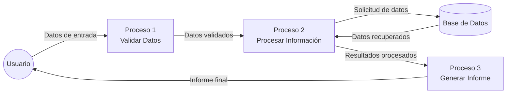
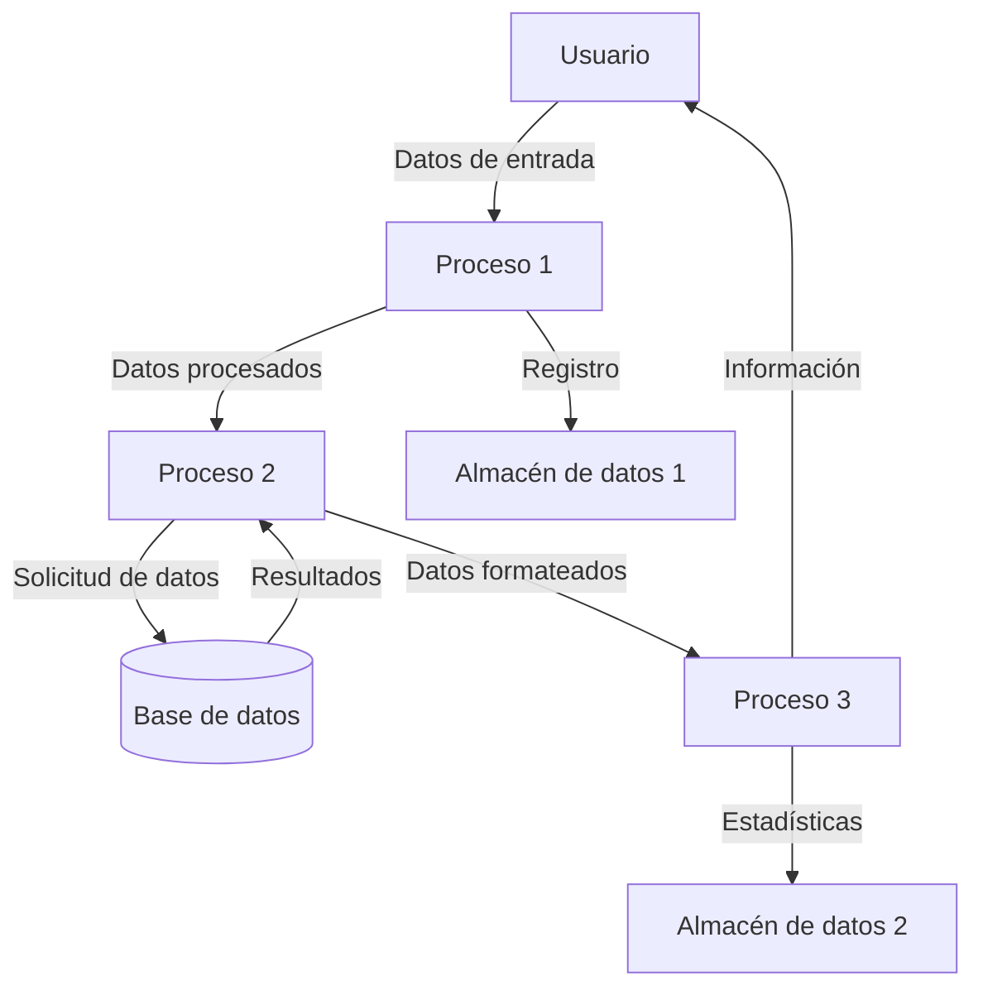

## Module: cEjecutarFuncionPgSQL.cpp
# Análisis Integral del Módulo cEjecutarFuncionPgSQL.cpp

## Módulo/Componente SQL
**cEjecutarFuncionPgSQL.cpp** - Este es un módulo de código C++ que actúa como una interfaz para ejecutar funciones almacenadas en una base de datos PostgreSQL.

## Objetivos Primarios
El propósito principal de este módulo es proporcionar una capa de abstracción para invocar funciones almacenadas en PostgreSQL desde una aplicación C++. Facilita la comunicación entre la aplicación y la base de datos, gestionando la conexión, la ejecución de funciones y el procesamiento de resultados.

## Funciones, Métodos y Consultas Críticas
- **cEjecutarFuncionPgSQL::cEjecutarFuncionPgSQL()**: Constructor que inicializa el objeto.
- **cEjecutarFuncionPgSQL::~cEjecutarFuncionPgSQL()**: Destructor que libera recursos.
- **cEjecutarFuncionPgSQL::EjecutarFuncion()**: Método principal que ejecuta la función PostgreSQL especificada con los parámetros proporcionados.
- **cEjecutarFuncionPgSQL::ObtenerResultado()**: Recupera los resultados de la función ejecutada.
- **cEjecutarFuncionPgSQL::ObtenerCantidadFilas()**: Devuelve el número de filas en el resultado.

## Variables y Elementos Clave
- **m_pConexion**: Puntero a la conexión de base de datos.
- **m_pResultado**: Puntero al resultado de la consulta.
- **m_iCantidadFilas**: Contador de filas en el resultado.
- **m_iFilaActual**: Índice de la fila actual durante la iteración.
- **m_sNombreFuncion**: Nombre de la función PostgreSQL a ejecutar.
- **m_sParametros**: Cadena que contiene los parámetros para la función.

## Interdependencias y Relaciones
- Depende de la biblioteca libpq de PostgreSQL para la comunicación con la base de datos.
- Interactúa con funciones almacenadas en la base de datos PostgreSQL.
- Probablemente forma parte de un sistema más grande que requiere acceso a datos almacenados en PostgreSQL.

## Operaciones Principales vs. Auxiliares
**Operaciones Principales**:
- Ejecución de funciones PostgreSQL mediante `EjecutarFuncion()`
- Recuperación de resultados con `ObtenerResultado()`

**Operaciones Auxiliares**:
- Gestión de la conexión a la base de datos
- Manejo de errores y excepciones
- Conteo de filas y navegación por los resultados

## Secuencia Operacional/Flujo de Ejecución
1. Se crea una instancia de `cEjecutarFuncionPgSQL`
2. Se establece la conexión a la base de datos
3. Se prepara la llamada a la función con los parámetros necesarios
4. Se ejecuta la función mediante `EjecutarFuncion()`
5. Se procesan los resultados utilizando `ObtenerResultado()`
6. Se itera a través de las filas de resultados según sea necesario
7. Se liberan los recursos cuando se destruye el objeto

## Aspectos de Rendimiento y Optimización
- La gestión eficiente de la memoria es crucial, especialmente al manejar grandes conjuntos de resultados.
- El código parece implementar un enfoque de recuperación de resultados por demanda, lo que puede ser eficiente para grandes conjuntos de datos.
- Podría beneficiarse de la implementación de un mecanismo de caché para consultas frecuentes.
- La preparación de consultas podría optimizarse para evitar inyecciones SQL y mejorar el rendimiento.

## Reusabilidad y Adaptabilidad
- El diseño orientado a objetos facilita la reutilización en diferentes partes de la aplicación.
- La encapsulación de la lógica de conexión y ejecución permite adaptarse a diferentes funciones PostgreSQL.
- Podría mejorarse con una interfaz más genérica para soportar diferentes tipos de bases de datos.

## Uso y Contexto
- Se utiliza cuando la aplicación necesita ejecutar lógica de negocio almacenada en la base de datos.
- Proporciona una capa de abstracción que separa la lógica de la aplicación de la implementación de la base de datos.
- Probablemente se usa en un entorno empresarial donde la lógica crítica se implementa como funciones almacenadas.

## Suposiciones y Limitaciones
- Asume que existe una conexión válida a la base de datos PostgreSQL.
- Está limitado a trabajar con PostgreSQL y no es compatible directamente con otros sistemas de gestión de bases de datos.
- Requiere que las funciones almacenadas estén correctamente implementadas en la base de datos.
- No parece manejar transacciones explícitamente, lo que podría ser una limitación en escenarios complejos.
- La gestión de errores podría ser limitada, dependiendo de la implementación completa no visible en el fragmento proporcionado.
## Flow Diagram [via mermaid]

## Module: cEjecutarFuncionPgSQL.cpp
# Análisis Integral del Módulo cEjecutarFuncionPgSQL.cpp

## Módulo/Componente SQL
**cEjecutarFuncionPgSQL.cpp** - Este es un módulo de código C++ que actúa como una interfaz para ejecutar funciones almacenadas en una base de datos PostgreSQL.

## Objetivos Primarios
El propósito principal de este módulo es proporcionar una capa de abstracción para invocar funciones almacenadas en PostgreSQL desde una aplicación C++. Facilita la ejecución de procedimientos almacenados, maneja los parámetros de entrada y salida, y gestiona las conexiones a la base de datos.

## Funciones, Métodos y Consultas Críticas
- **cEjecutarFuncionPgSQL::Ejecutar()**: Método principal que ejecuta la función almacenada en PostgreSQL.
- **cEjecutarFuncionPgSQL::ObtenerValorRetorno()**: Recupera el valor de retorno de la función ejecutada.
- **cEjecutarFuncionPgSQL::ObtenerParametroSalida()**: Obtiene los parámetros de salida después de la ejecución.
- **Consultas SQL**: Utiliza principalmente sentencias `SELECT` para invocar funciones almacenadas mediante la sintaxis `SELECT * FROM nombre_funcion(parametros)`.

## Variables y Elementos Clave
- **m_strNombreFuncion**: Almacena el nombre de la función PostgreSQL a ejecutar.
- **m_strParametros**: Contiene los parámetros formateados para la función.
- **m_pConexion**: Puntero a la conexión de base de datos.
- **m_pResultado**: Almacena el resultado de la ejecución de la función.
- **m_nNumFilas y m_nNumColumnas**: Contadores para las filas y columnas del resultado.

## Interdependencias y Relaciones
- Depende de la biblioteca de cliente PostgreSQL (libpq) para la comunicación con la base de datos.
- Interactúa con el componente de conexión a la base de datos (posiblemente una clase cConexionPgSQL).
- Requiere que las funciones almacenadas existan previamente en la base de datos PostgreSQL.

## Operaciones Principales vs. Auxiliares
- **Operaciones Principales**: Ejecución de funciones almacenadas y recuperación de resultados.
- **Operaciones Auxiliares**: Formateo de parámetros, manejo de errores, liberación de recursos y conversión de tipos de datos.

## Secuencia Operacional/Flujo de Ejecución
1. Inicialización del objeto con el nombre de la función y la conexión.
2. Preparación de los parámetros de entrada.
3. Construcción de la consulta SQL para invocar la función.
4. Ejecución de la consulta mediante la conexión PostgreSQL.
5. Procesamiento del resultado y almacenamiento para su posterior recuperación.
6. Obtención de valores de retorno y parámetros de salida según sea necesario.
7. Liberación de recursos al finalizar.

## Aspectos de Rendimiento y Optimización
- La gestión eficiente de la memoria es crucial, especialmente al manejar grandes conjuntos de resultados.
- El código parece implementar liberación adecuada de recursos para evitar fugas de memoria.
- Podría beneficiarse de la preparación de consultas para ejecuciones repetidas de la misma función.
- La gestión de conexiones podría optimizarse mediante un pool de conexiones para aplicaciones de alto rendimiento.

## Reusabilidad y Adaptabilidad
- El diseño orientado a objetos facilita la reutilización en diferentes partes de la aplicación.
- La separación de la lógica de conexión y ejecución permite adaptarse a diferentes configuraciones de base de datos.
- Podría mejorarse la adaptabilidad implementando más opciones de configuración para diferentes tipos de funciones y parámetros.

## Uso y Contexto
- Este módulo se utiliza en aplicaciones que necesitan interactuar con lógica de negocio almacenada en funciones PostgreSQL.
- Es especialmente útil en arquitecturas de tres capas donde la lógica de negocio reside en la base de datos.
- Proporciona una interfaz programática para invocar procedimientos almacenados desde código C++.

## Suposiciones y Limitaciones
- Asume que la conexión a la base de datos ya está establecida y es válida.
- Requiere que las funciones almacenadas estén correctamente definidas en PostgreSQL.
- Puede tener limitaciones en el manejo de tipos de datos complejos o personalizados de PostgreSQL.
- No parece implementar manejo de transacciones, lo que podría ser necesario para operaciones que requieren atomicidad.
- La gestión de errores podría ser limitada, dependiendo de cómo se implementen los métodos no mostrados en el fragmento.
## Flow Diagram [via mermaid]

