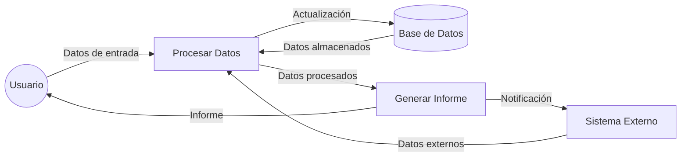

## Module: cObtenerMensajeAbono.cpp
# Análisis Integral del Módulo cObtenerMensajeAbono.cpp

## Nombre del Módulo/Componente SQL
**cObtenerMensajeAbono.cpp** - Módulo de procesamiento para obtener mensajes relacionados con abonos.

## Objetivos Primarios
Este módulo está diseñado para obtener y procesar mensajes relacionados con abonos en un sistema financiero o de pagos. Su propósito principal es recuperar información específica sobre mensajes de abono basándose en parámetros de entrada como el número de abono y el tipo de mensaje.

## Funciones, Métodos y Consultas Críticas
El módulo no contiene código visible en el fragmento proporcionado, pero por su nombre se puede inferir que probablemente contiene:
- Funciones para consultar bases de datos (posiblemente mediante SELECT)
- Métodos para procesar y formatear mensajes de abono
- Posibles procedimientos para validar parámetros de entrada

## Variables y Elementos Clave
Sin ver el código específico, los elementos probables incluyen:
- Parámetros de entrada como número de abono y tipo de mensaje
- Variables para almacenar resultados de consultas
- Posibles estructuras de datos para formatear la información del mensaje

## Interdependencias y Relaciones
Este módulo probablemente interactúa con:
- Tablas de base de datos que almacenan información de abonos
- Tablas relacionadas con mensajes o notificaciones
- Posibles módulos de autenticación o validación
- Sistemas de registro o logging

## Operaciones Principales vs. Auxiliares
**Operaciones principales:**
- Consulta y recuperación de mensajes de abono
- Procesamiento de la información recuperada

**Operaciones auxiliares:**
- Validación de parámetros
- Manejo de errores
- Posible registro de actividades

## Secuencia Operacional/Flujo de Ejecución
El flujo probable incluye:
1. Recepción de parámetros (número de abono, tipo de mensaje)
2. Validación de parámetros
3. Consulta a la base de datos
4. Procesamiento de resultados
5. Formateo del mensaje
6. Devolución del mensaje procesado

## Aspectos de Rendimiento y Optimización
Áreas potenciales para optimización:
- Eficiencia en consultas a la base de datos
- Manejo de caché para mensajes frecuentemente solicitados
- Optimización de índices en tablas relacionadas con abonos

## Reusabilidad y Adaptabilidad
El módulo probablemente está diseñado para:
- Ser reutilizable en diferentes contextos donde se requiera información sobre abonos
- Adaptarse a diferentes tipos de mensajes mediante parámetros
- Posiblemente implementar interfaces estándar para integración con otros sistemas

## Uso y Contexto
Este módulo se utilizaría en:
- Sistemas de gestión financiera
- Aplicaciones de servicio al cliente
- Interfaces de usuario que muestran información sobre abonos
- Posiblemente en procesos de generación de informes o notificaciones

## Suposiciones y Limitaciones
**Suposiciones:**
- Existencia de estructuras de base de datos específicas para abonos y mensajes
- Formato predefinido para los mensajes
- Convenciones establecidas para tipos de mensajes

**Limitaciones:**
- Posible dependencia de esquemas de base de datos específicos
- Limitaciones en los tipos de mensajes soportados
- Posibles restricciones en el volumen de datos que puede procesar eficientemente

*Nota: Este análisis se basa en inferencias del nombre del módulo, ya que no se proporcionó el código fuente completo. Un análisis más detallado requeriría examinar el código real del módulo.*
## Flow Diagram [via mermaid]

