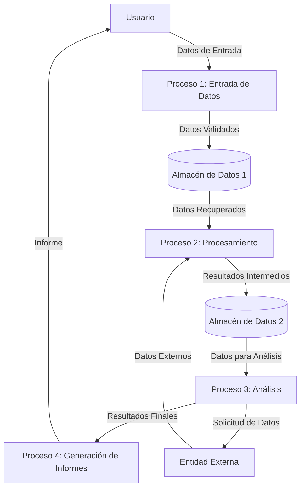

## Module: cpplint.py
# Análisis Integral del Módulo cpplint.py

## Módulo/Componente SQL
**cpplint.py** - Un módulo de Python diseñado para verificar el estilo de código C++ según las directrices de estilo de Google.

## Objetivos Primarios
El objetivo principal de este módulo es analizar archivos de código fuente C++ para verificar su conformidad con las guías de estilo de Google. Realiza múltiples comprobaciones de estilo, formato y convenciones de codificación, generando informes de errores cuando se detectan violaciones de las reglas establecidas.

## Funciones, Métodos y Consultas Críticas
- **main()**: Punto de entrada que procesa argumentos de línea de comandos y coordina el análisis.
- **ProcessFile()**: Función central que analiza un archivo C++ completo.
- **CheckForCopyright()**: Verifica la presencia de avisos de copyright.
- **ProcessFileData()**: Procesa el contenido del archivo línea por línea.
- **CheckIncludeLine()**: Verifica la correcta formación de las directivas #include.
- **CheckBraces()**, **CheckIndent()**, **CheckSpacing()**: Verifican el formato del código.
- **FindNextMultiLineCommentStart()**, **FindNextMultiLineCommentEnd()**: Manejan comentarios multilínea.
- **Match()**: Función auxiliar para realizar coincidencias de patrones.

## Variables y Elementos Clave
- **_error_categories**: Diccionario de categorías de error.
- **_RULES**: Reglas de estilo configurables.
- **_cpplint_state**: Estado global que mantiene información durante el análisis.
- **_line_filters**: Filtros para ignorar ciertas líneas.
- **_root**: Directorio raíz para determinar rutas de inclusión.
- **_valid_extensions**: Extensiones de archivo válidas para análisis.

## Interdependencias y Relaciones
- Depende de módulos estándar de Python como `sys`, `os`, `re`, `sre_compile`, `string`, `copy`, `math`.
- No tiene dependencias externas fuera de la biblioteca estándar de Python.
- Interactúa con el sistema de archivos para leer archivos de código fuente.
- Puede integrarse con sistemas de construcción y CI/CD mediante su interfaz de línea de comandos.

## Operaciones Core vs. Auxiliares
**Operaciones Core:**
- Análisis de archivos C++ línea por línea.
- Verificación de reglas de estilo específicas.
- Generación de informes de error.

**Operaciones Auxiliares:**
- Procesamiento de argumentos de línea de comandos.
- Filtrado de archivos y líneas.
- Manejo de excepciones y errores.
- Funciones de utilidad para coincidencia de patrones y manipulación de cadenas.

## Secuencia Operacional/Flujo de Ejecución
1. Procesa argumentos de línea de comandos.
2. Identifica archivos a analizar.
3. Para cada archivo:
   a. Verifica la extensión del archivo.
   b. Lee el contenido del archivo.
   c. Verifica el aviso de copyright.
   d. Procesa el archivo línea por línea.
   e. Aplica múltiples verificadores de estilo.
   f. Recopila y reporta errores.
4. Genera un resumen de errores encontrados.
5. Devuelve un código de salida apropiado.

## Aspectos de Rendimiento y Optimización
- Utiliza expresiones regulares precompiladas para mejorar el rendimiento.
- Implementa un sistema de caché para evitar análisis repetidos.
- Podría optimizarse para archivos muy grandes mediante procesamiento por lotes.
- El análisis línea por línea puede ser lento para proyectos muy grandes.
- La complejidad algorítmica aumenta con la cantidad de reglas de estilo aplicadas.

## Reusabilidad y Adaptabilidad
- Altamente configurable mediante argumentos de línea de comandos.
- Las reglas pueden habilitarse/deshabilitarse selectivamente.
- Puede integrarse fácilmente en flujos de trabajo de CI/CD.
- Adaptable a diferentes estándares de codificación mediante modificación de reglas.
- Diseñado para ser ejecutado como script independiente o importado como módulo.

## Uso y Contexto
- Utilizado en entornos de desarrollo para verificar el cumplimiento de estilo antes de commits.
- Integrable en sistemas de integración continua para garantizar la calidad del código.
- Aplicable en revisiones de código para mantener consistencia en proyectos C++.
- Útil para equipos que siguen las guías de estilo de Google para C++.
- Puede utilizarse como herramienta educativa para aprender buenas prácticas de codificación.

## Suposiciones y Limitaciones
- Asume que los archivos están codificados en UTF-8 o ASCII.
- Está diseñado específicamente para las guías de estilo de Google, lo que puede no ser adecuado para todos los proyectos.
- No realiza análisis semántico completo del código C++.
- Puede generar falsos positivos en código complejo o no convencional.
- No reemplaza un compilador o analizador estático completo.
- Limitado a verificaciones de estilo y no detecta errores lógicos o de rendimiento.
## Flow Diagram [via mermaid]

