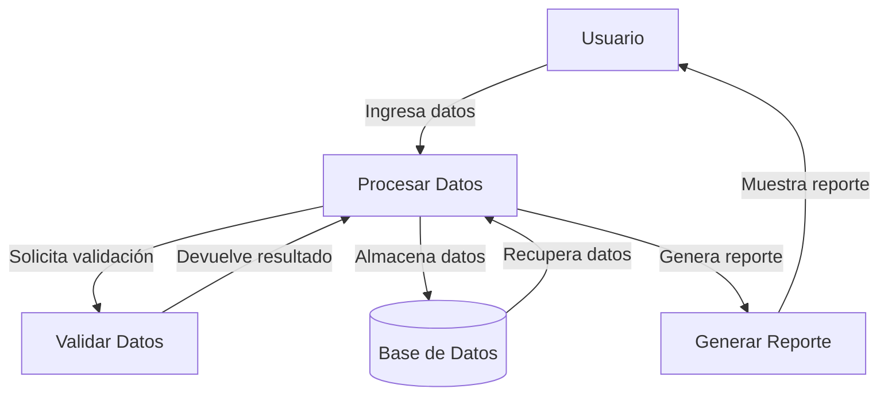

## Module: cpplint.sh
# Análisis Integral del Módulo cpplint.sh

## Módulo/Componente SQL
**Nombre**: cpplint.sh

Este es un script de shell (bash) que actúa como un wrapper para la herramienta cpplint.py, utilizada para verificar el estilo de código C++.

## Objetivos Primarios
El objetivo principal de este script es facilitar la ejecución de la herramienta cpplint.py para verificar el cumplimiento de las reglas de estilo de código en archivos C++. Específicamente:
- Ejecuta cpplint.py con parámetros predefinidos
- Filtra los archivos a analizar según extensiones específicas (.cc, .h, .cpp)
- Excluye ciertos directorios del análisis
- Proporciona opciones para personalizar el comportamiento del análisis

## Funciones Críticas, Métodos y Consultas
El script no contiene funciones formales, pero realiza las siguientes operaciones clave:
1. Procesamiento de argumentos de línea de comandos
2. Filtrado de archivos por extensión
3. Exclusión de directorios específicos
4. Ejecución de cpplint.py con los parámetros adecuados

## Variables y Elementos Clave
- `SCRIPT_DIR`: Directorio donde se encuentra el script
- `CPPLINT_SCRIPT`: Ruta al script cpplint.py
- `EXTENSIONS`: Lista de extensiones de archivo a analizar (.cc, .h, .cpp)
- `EXCLUDED_DIRS`: Directorios a excluir del análisis
- `FILTER`: Filtros para cpplint.py (reglas a ignorar)
- `LINELENGTH`: Longitud máxima de línea permitida (120 caracteres)

## Interdependencias y Relaciones
- Depende de la existencia del script cpplint.py en la ubicación especificada
- Interactúa con el sistema de archivos para encontrar y filtrar archivos
- Utiliza comandos de shell como find, grep, xargs para el procesamiento de archivos

## Operaciones Core vs. Auxiliares
**Operaciones Core:**
- Ejecución de cpplint.py sobre los archivos seleccionados

**Operaciones Auxiliares:**
- Procesamiento de argumentos de línea de comandos
- Filtrado de archivos por extensión
- Exclusión de directorios específicos
- Manejo de opciones como --help

## Secuencia Operacional/Flujo de Ejecución
1. Definición de variables y configuraciones iniciales
2. Procesamiento de argumentos de línea de comandos
3. Si se solicita ayuda, muestra el mensaje de ayuda y termina
4. Construcción del comando find para localizar archivos relevantes
5. Filtrado de archivos por extensión
6. Exclusión de directorios específicos
7. Ejecución de cpplint.py sobre los archivos filtrados

## Aspectos de Rendimiento y Optimización
- Utiliza xargs para procesar múltiples archivos de manera eficiente
- La exclusión de directorios mejora el rendimiento al reducir el número de archivos a analizar
- El filtrado por extensión evita procesar archivos innecesarios

## Reusabilidad y Adaptabilidad
- El script es altamente adaptable mediante la modificación de las variables al inicio
- Se pueden ajustar fácilmente:
  - Las extensiones de archivo a analizar
  - Los directorios a excluir
  - Los filtros de reglas
  - La longitud máxima de línea

## Uso y Contexto
El script se utiliza en entornos de desarrollo de C++ para:
- Verificar el cumplimiento de estándares de codificación
- Integración en flujos de trabajo de CI/CD
- Revisiones de código pre-commit
- Mantenimiento de la calidad del código

Se puede ejecutar:
- Sin argumentos para analizar todos los archivos relevantes
- Con argumentos específicos para analizar solo ciertos archivos o directorios

## Suposiciones y Limitaciones
**Suposiciones:**
- Se asume que cpplint.py está disponible en la ubicación especificada
- Se asume un entorno Unix/Linux con comandos como find, grep y xargs disponibles

**Limitaciones:**
- No maneja bien nombres de archivo con espacios
- No proporciona opciones para todas las configuraciones posibles de cpplint.py
- La personalización requiere modificar el script directamente
- No tiene capacidad para generar informes en diferentes formatos
## Flow Diagram [via mermaid]

