# Introduction :

# Descripción General del Sistema

Este sistema es una aplicación de gestión de datos que facilita la manipulación, transformación y análisis de información estructurada. Su propósito principal es proporcionar una interfaz eficiente para procesar conjuntos de datos, permitiendo a los usuarios realizar operaciones complejas sin necesidad de conocimientos avanzados de programación.

El sistema implementa una arquitectura modular que separa la lógica de procesamiento de datos de la interfaz de usuario, lo que permite una mayor flexibilidad y escalabilidad. Utiliza algoritmos optimizados para el manejo de grandes volúmenes de información, garantizando un rendimiento eficiente incluso con conjuntos de datos extensos.

Las funcionalidades clave incluyen importación/exportación de datos en múltiples formatos, transformaciones avanzadas, análisis estadístico y visualización de resultados. La aplicación está diseñada siguiendo principios de usabilidad, asegurando que tanto usuarios novatos como expertos puedan aprovechar sus capacidades.
# Module Overview
## Module: 
# Análisis Integral del Módulo

No se ha proporcionado ningún código o componente SQL para analizar. Para realizar un análisis completo según los criterios solicitados, necesitaría examinar el código fuente específico, ya sea un módulo de programación, un script SQL, un procedimiento almacenado, una vista, un disparador u otro componente.

Si desea obtener un análisis detallado, por favor proporcione el código o componente SQL que necesita ser evaluado. Una vez recibido, podré generar un análisis completo que incluya:

- Nombre e identificación del módulo
- Objetivos primarios
- Funciones críticas, métodos y consultas
- Variables y elementos clave
- Interdependencias y relaciones
- Operaciones principales vs. auxiliares
- Secuencia operacional y flujo de ejecución
- Aspectos de rendimiento y optimización
- Reutilización y adaptabilidad
- Uso y contexto
- Suposiciones y limitaciones

Estoy a su disposición para realizar este análisis tan pronto como reciba el código correspondiente.
## Flow Diagram [via mermaid]

