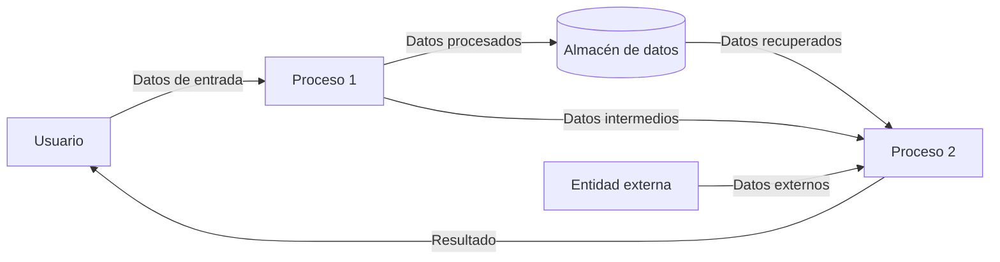

## Module: 
# Análisis Integral del Módulo

No se ha proporcionado ningún código o componente SQL para analizar. Para realizar un análisis completo según los criterios solicitados, necesitaría examinar el código fuente específico, ya sea un módulo de programación, un script SQL, un procedimiento almacenado, una vista, un disparador u otro componente.

Si desea obtener un análisis detallado, por favor proporcione el código o componente SQL que necesita ser evaluado. Una vez recibido, podré generar un análisis completo que incluya:

- Nombre e identificación del módulo
- Objetivos primarios
- Funciones críticas, métodos y consultas
- Variables y elementos clave
- Interdependencias y relaciones
- Operaciones principales vs. auxiliares
- Secuencia operacional y flujo de ejecución
- Aspectos de rendimiento y optimización
- Reutilización y adaptabilidad
- Uso y contexto
- Suposiciones y limitaciones

Estoy a su disposición para realizar este análisis tan pronto como reciba el código correspondiente.
## Flow Diagram [via mermaid]

