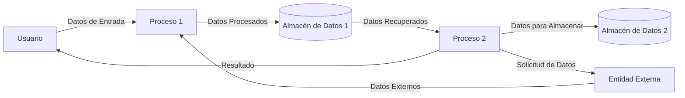

## Module: format-code.sh
# Análisis Integral del Módulo format-code.sh

## Módulo/Componente SQL
**Nombre del Módulo**: format-code.sh

## Objetivos Primarios
Este script es una herramienta de utilidad para formatear código fuente en varios lenguajes de programación. Su propósito principal es aplicar formateo consistente a archivos de código según estándares predefinidos, utilizando herramientas específicas para cada tipo de lenguaje.

## Funciones, Métodos y Consultas Críticas
- **format_file()**: Función principal que determina qué formateador usar según la extensión del archivo.
- **format_python()**: Formatea archivos Python usando Black y isort.
- **format_js()**: Formatea archivos JavaScript/TypeScript usando Prettier.
- **format_go()**: Formatea archivos Go usando gofmt.
- **format_shell()**: Formatea scripts de shell usando shfmt.
- **format_rust()**: Formatea código Rust usando rustfmt.
- **format_c()**: Formatea código C/C++ usando clang-format.

## Variables y Elementos Clave
- **VERBOSE**: Controla el nivel de detalle en la salida del script.
- **PYTHON_FILES**, **JS_FILES**, **GO_FILES**, etc.: Arrays que almacenan patrones de archivos para cada lenguaje.
- **Herramientas externas**: Black, isort, Prettier, gofmt, shfmt, rustfmt, clang-format.

## Interdependencias y Relaciones
El script depende de varias herramientas externas de formateo que deben estar instaladas en el sistema:
- Black e isort para Python
- Prettier para JavaScript/TypeScript
- gofmt para Go
- shfmt para scripts de shell
- rustfmt para Rust
- clang-format para C/C++

## Operaciones Principales vs. Auxiliares
- **Operaciones principales**: Las funciones de formateo específicas para cada lenguaje.
- **Operaciones auxiliares**: Detección de extensiones de archivo, manejo de errores, verificación de disponibilidad de herramientas, y salida de información en modo verbose.

## Secuencia Operacional/Flujo de Ejecución
1. Procesa los argumentos de línea de comandos.
2. Verifica si se proporcionaron archivos específicos o si debe buscar todos los archivos relevantes.
3. Para cada archivo encontrado:
   - Determina su tipo según la extensión.
   - Llama a la función de formateo apropiada.
   - Muestra información sobre el proceso si el modo verbose está activado.

## Aspectos de Rendimiento y Optimización
- El script utiliza herramientas externas optimizadas para cada lenguaje.
- Para mejorar el rendimiento, podría implementarse procesamiento en paralelo para formatear múltiples archivos simultáneamente.
- La verificación de disponibilidad de herramientas podría optimizarse para ejecutarse solo una vez por tipo de archivo.

## Reusabilidad y Adaptabilidad
- Alta reusabilidad: puede aplicarse a cualquier proyecto con los lenguajes soportados.
- Fácilmente extensible para añadir soporte a nuevos lenguajes siguiendo el patrón establecido.
- Parametrizable mediante argumentos de línea de comandos para adaptarse a diferentes escenarios.

## Uso y Contexto
- Se utiliza en flujos de trabajo de desarrollo para mantener consistencia en el estilo de código.
- Puede integrarse en sistemas de integración continua (CI) para verificar el formateo antes de aceptar cambios.
- Útil en proyectos multilenguaje donde se requiere mantener estándares de código uniformes.

## Suposiciones y Limitaciones
- **Suposiciones**:
  - Las herramientas de formateo necesarias están instaladas en el sistema.
  - Los archivos tienen extensiones estándar que corresponden a sus lenguajes.
  - Los usuarios tienen permisos para modificar los archivos que se formatearán.
  
- **Limitaciones**:
  - No maneja configuraciones personalizadas para las herramientas de formateo.
  - No detecta lenguajes por contenido, solo por extensión de archivo.
  - No ofrece opciones para ignorar ciertas reglas de formateo.
  - Depende completamente de herramientas externas, lo que podría causar problemas si estas cambian su interfaz o comportamiento.
## Flow Diagram [via mermaid]

