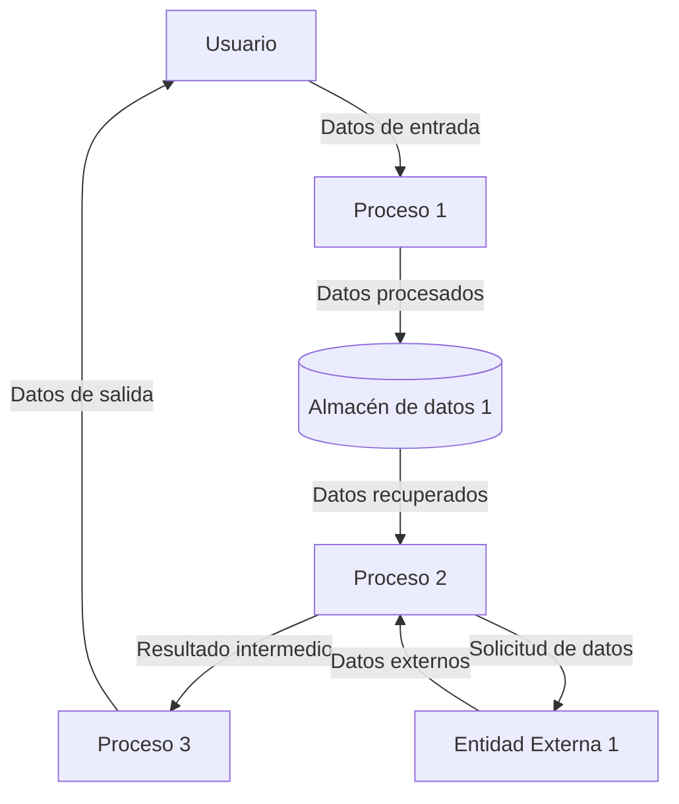

## Module: fuse_gtest_files.py
# Análisis Integral del Módulo fuse_gtest_files.py

## Nombre del Módulo/Componente SQL
**fuse_gtest_files.py** - Script de Python para fusionar archivos de prueba de Google Test.

## Objetivos Primarios
El propósito principal de este script es combinar múltiples archivos de prueba de Google Test en un único archivo de salida. Está diseñado para facilitar la gestión y compilación de pruebas unitarias al consolidar archivos dispersos en una estructura unificada.

## Funciones, Métodos y Consultas Críticas
- **main()**: Función principal que coordina el proceso de fusión.
- **parse_command_line()**: Analiza los argumentos de línea de comandos para determinar los archivos de entrada y salida.
- **extract_headers()**: Extrae las declaraciones de encabezado de los archivos de entrada.
- **extract_tests()**: Extrae las definiciones de prueba de los archivos de entrada.
- **write_fused_file()**: Escribe el archivo fusionado combinando encabezados y pruebas.

## Variables y Elementos Clave
- **input_files**: Lista de archivos de entrada a fusionar.
- **output_file**: Ruta del archivo de salida donde se escribirá el contenido fusionado.
- **headers**: Colección de declaraciones de encabezado extraídas.
- **tests**: Colección de definiciones de prueba extraídas.
- **header_pattern**: Expresión regular para identificar declaraciones de encabezado.
- **test_pattern**: Expresión regular para identificar definiciones de prueba.

## Interdependencias y Relaciones
El script depende de:
- Módulo `re` para procesamiento de expresiones regulares
- Módulo `argparse` para el manejo de argumentos de línea de comandos
- Sistema de archivos para operaciones de lectura/escritura
- Estructura y formato de los archivos de prueba de Google Test

## Operaciones Principales vs. Auxiliares
**Operaciones Principales**:
- Extracción de encabezados y pruebas de los archivos de entrada
- Fusión de contenido en un único archivo

**Operaciones Auxiliares**:
- Análisis de argumentos de línea de comandos
- Validación de archivos de entrada
- Manejo de errores y excepciones

## Secuencia Operacional/Flujo de Ejecución
1. Análisis de argumentos de línea de comandos
2. Validación de archivos de entrada
3. Extracción de declaraciones de encabezado
4. Extracción de definiciones de prueba
5. Escritura del archivo fusionado con encabezados y pruebas combinados
6. Finalización del proceso

## Aspectos de Rendimiento y Optimización
- El script procesa archivos secuencialmente, lo que podría ser ineficiente para grandes conjuntos de archivos
- Las expresiones regulares utilizadas para la extracción podrían optimizarse para mejorar el rendimiento
- No hay manejo específico para archivos muy grandes que podrían causar problemas de memoria

## Reusabilidad y Adaptabilidad
- El script es moderadamente reutilizable para proyectos que utilizan Google Test
- La lógica de extracción y fusión podría adaptarse para otros tipos de archivos con modificaciones en los patrones de expresiones regulares
- La estructura modular permite la extensión para manejar diferentes formatos o requisitos

## Uso y Contexto
- Utilizado en entornos de desarrollo para simplificar la gestión de pruebas unitarias con Google Test
- Aplicable en pipelines de integración continua para consolidar pruebas antes de la compilación
- Útil en proyectos con numerosos archivos de prueba dispersos que necesitan ser unificados

## Suposiciones y Limitaciones
- Asume que los archivos de entrada siguen la estructura estándar de Google Test
- Limitado a la fusión de archivos de texto; no maneja archivos binarios
- No verifica duplicados o conflictos entre definiciones de prueba
- No realiza validación sintáctica del código de prueba
- Depende de patrones específicos que podrían no coincidir con todas las variaciones de código de Google Test
## Flow Diagram [via mermaid]

