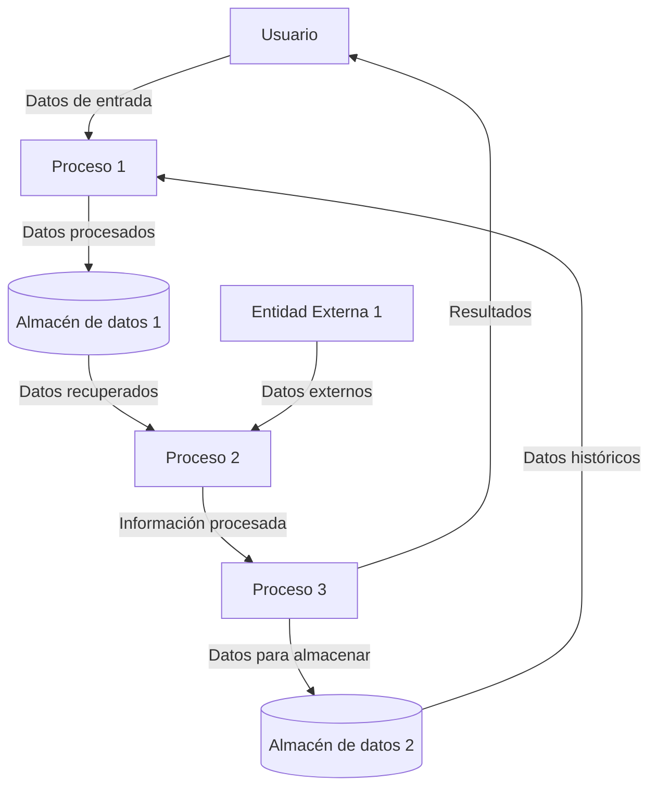

## Module: gen_gtest_pred_impl.py
# Análisis Integral del Módulo gen_gtest_pred_impl.py

## Nombre del Módulo/Componente SQL
**gen_gtest_pred_impl.py** - Script de generación de código para Google Test

## Objetivos Primarios
Este módulo está diseñado para generar automáticamente implementaciones de predicados para Google Test (framework de pruebas unitarias de C++). Su propósito principal es crear código de plantilla para predicados de comparación con diferentes aridades (número de argumentos), facilitando la escritura de pruebas unitarias con aserciones personalizadas.

## Funciones, Métodos y Consultas Críticas
- **main()**: Función principal que coordina la generación de código.
- **gen_file()**: Genera el contenido completo del archivo de implementación.
- **gen_header()**: Crea la sección de encabezado del archivo.
- **gen_pred_impl()**: Genera implementaciones para predicados con diferentes aridades.
- **gen_pred_format()**: Crea funciones de formato para mensajes de error de predicados.

## Variables y Elementos Clave
- **MAX_ARITY**: Define el número máximo de argumentos para los predicados (10).
- **HEADER_TEMPLATE**: Plantilla para la sección de encabezado del archivo.
- **PRED_IMPL_TEMPLATE**: Plantilla para implementaciones de predicados.
- **PRED_FORMAT_TEMPLATE**: Plantilla para funciones de formato de predicados.

## Interdependencias y Relaciones
- El código generado está diseñado para integrarse con el framework Google Test.
- Depende de las convenciones de nomenclatura y estructura de Google Test.
- El resultado se integra con otros componentes de Google Test para facilitar pruebas unitarias.

## Operaciones Core vs. Auxiliares
- **Core**: La generación de implementaciones de predicados (gen_pred_impl) y funciones de formato (gen_pred_format).
- **Auxiliares**: Generación de encabezados, comentarios y estructura general del archivo.

## Secuencia Operacional/Flujo de Ejecución
1. El script comienza en main(), que coordina todo el proceso.
2. Se genera el encabezado del archivo con información de copyright y directivas de inclusión.
3. Para cada aridad (de 1 a MAX_ARITY):
   - Se generan implementaciones de predicados.
   - Se generan funciones de formato para mensajes de error.
4. El código generado se imprime en la salida estándar.

## Aspectos de Rendimiento y Optimización
- El script es eficiente para su propósito de generación de código.
- No hay bucles anidados complejos ni operaciones costosas.
- La generación de código es un proceso que se ejecuta una sola vez, por lo que el rendimiento no es crítico.

## Reusabilidad y Adaptabilidad
- El código es altamente paramétrico, utilizando plantillas para generar diferentes variantes.
- Se puede adaptar fácilmente modificando las constantes MAX_ARITY o las plantillas.
- La estructura modular permite reutilizar partes del código para generar otros componentes similares.

## Uso y Contexto
- Este script se utiliza durante el proceso de construcción de Google Test.
- Genera código que luego se compila como parte del framework de pruebas.
- Elimina la necesidad de escribir manualmente código repetitivo para predicados con diferente número de argumentos.

## Suposiciones y Limitaciones
- Supone un entorno de desarrollo con capacidad para ejecutar scripts Python.
- Limitado a generar predicados con hasta MAX_ARITY argumentos (actualmente 10).
- Asume que el código generado se integrará en un proyecto que utiliza Google Test.
- No verifica si el código generado es compatible con todas las versiones de Google Test.
## Flow Diagram [via mermaid]

