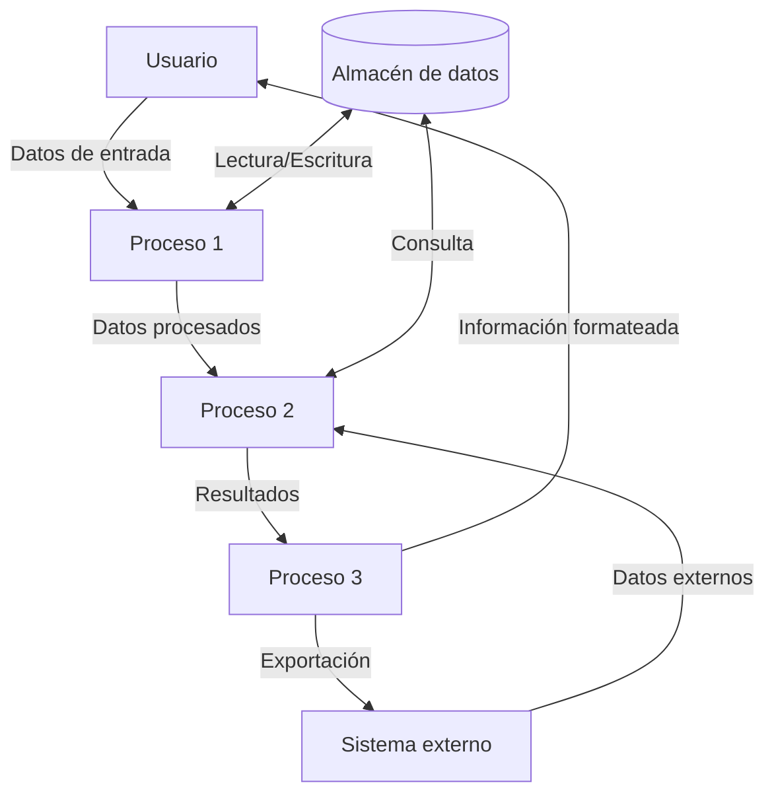
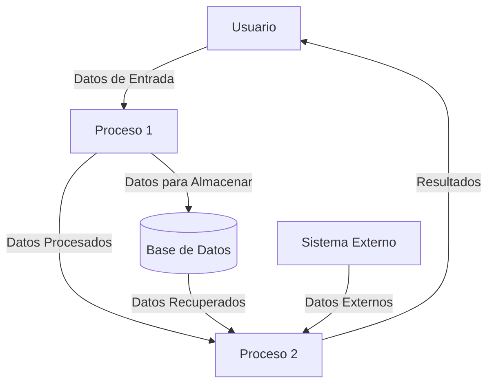

## Module: gtest_break_on_failure_unittest.py
# Análisis Integral del Módulo gtest_break_on_failure_unittest.py

## Módulo/Componente SQL
**Nombre del Módulo**: gtest_break_on_failure_unittest.py

## Objetivos Primarios
Este módulo es un script de prueba unitaria diseñado para verificar la funcionalidad de la opción "break-on-failure" en Google Test (gtest). Su propósito principal es comprobar que cuando esta opción está habilitada, la ejecución de las pruebas se detiene inmediatamente después del primer fallo, en lugar de continuar con las pruebas restantes.

## Funciones, Métodos y Consultas Críticas
- `GTestBreakOnFailureUnitTest`: Clase principal de prueba que hereda de `gtest_test_utils.TestCase`.
- `testBreakOnFailureDoesNotBreakNonFailingTest`: Método que verifica que las pruebas que no fallan se ejecutan normalmente.
- `testBreakOnFailureBreaksOnFailure`: Método que verifica que la ejecución se detiene después del primer fallo cuando la opción está habilitada.
- `testBreakOnFailureBreaksOnExpectFatalFailure`: Método que verifica el comportamiento con la macro EXPECT_FATAL_FAILURE.
- `testBreakOnFailureDoesNotBreakOnSkip`: Método que verifica que las pruebas omitidas no detienen la ejecución.

## Variables y Elementos Clave
- `COMMAND`: Variable que almacena el comando para ejecutar las pruebas de gtest.
- `FLAG_PREFIX`: Prefijo para las banderas de línea de comandos.
- `TEST_PROGRAM`: Programa de prueba que se ejecutará.
- `stdout_string`, `stderr_string`: Variables que capturan la salida estándar y de error.
- `exit_code`: Código de salida del programa de prueba.

## Interdependencias y Relaciones
- Depende del módulo `gtest_test_utils` para funcionalidades de prueba.
- Interactúa con el programa de prueba externo `gtest_break_on_failure_unittest_` para ejecutar las pruebas.
- Utiliza funciones del sistema operativo para ejecutar comandos y capturar salidas.

## Operaciones Principales vs. Auxiliares
**Operaciones Principales**:
- Ejecución de pruebas con y sin la opción "break-on-failure".
- Verificación del comportamiento de detención en caso de fallo.

**Operaciones Auxiliares**:
- Configuración del entorno de prueba.
- Captura y análisis de la salida del programa.
- Verificación de códigos de salida.

## Secuencia Operacional/Flujo de Ejecución
1. Cada método de prueba configura un comando específico para ejecutar el programa de prueba.
2. Se ejecuta el comando y se capturan las salidas estándar y de error.
3. Se analiza la salida para verificar que el comportamiento corresponde al esperado según la configuración.
4. Se verifica el código de salida para confirmar el resultado de la ejecución.

## Aspectos de Rendimiento y Optimización
- El módulo está diseñado para pruebas unitarias, por lo que el rendimiento no es una preocupación principal.
- Las pruebas se ejecutan secuencialmente, lo que es adecuado para verificar el comportamiento de detención.
- No hay operaciones intensivas que requieran optimización específica.

## Reusabilidad y Adaptabilidad
- El código está estructurado para probar específicamente la funcionalidad "break-on-failure" de gtest.
- La estructura de pruebas podría adaptarse para verificar otras opciones de línea de comandos de gtest.
- Los métodos de prueba siguen un patrón común, facilitando la adición de nuevos casos de prueba.

## Uso y Contexto
- Este módulo se utiliza como parte del conjunto de pruebas unitarias para Google Test.
- Verifica una funcionalidad específica (break-on-failure) que es importante para los desarrolladores que utilizan gtest para sus propias pruebas.
- Se ejecutaría como parte de la suite de pruebas de gtest para garantizar que esta característica funcione correctamente.

## Suposiciones y Limitaciones
- Supone que el programa de prueba `gtest_break_on_failure_unittest_` está disponible y funciona correctamente.
- Asume un entorno donde se pueden ejecutar comandos del sistema y capturar su salida.
- Está limitado a probar la funcionalidad específica de "break-on-failure" y no otras características de gtest.
- Podría tener comportamientos diferentes en distintos sistemas operativos debido a la ejecución de comandos del sistema.
## Flow Diagram [via mermaid]

## Module: gtest_break_on_failure_unittest.py
# Análisis Integral del Módulo: gtest_break_on_failure_unittest.py

## Nombre del Módulo/Componente SQL
El módulo analizado es `gtest_break_on_failure_unittest.py`, un script de Python que forma parte del framework de pruebas Google Test (gtest).

## Objetivos Primarios
Este módulo tiene como propósito principal probar la funcionalidad de "break-on-failure" (interrumpir en caso de fallo) de Google Test. Específicamente, verifica que cuando esta opción está habilitada, el programa se detenga inmediatamente después de que una prueba falle, permitiendo a los desarrolladores depurar el estado del programa en el punto exacto del fallo.

## Funciones, Métodos y Consultas Críticas
El módulo no contiene funciones o métodos definidos explícitamente, pero parece ser un script de prueba que:
- Ejecuta pruebas de Google Test con la bandera `--gtest_break_on_failure`
- Analiza el comportamiento del programa cuando ocurre un fallo en las pruebas
- Verifica que el programa se detenga correctamente cuando esta opción está habilitada

## Variables y Elementos Clave
No se pueden identificar variables específicas sin ver el código completo, pero probablemente incluye:
- Referencias a ejecutables de prueba de Google Test
- Banderas de línea de comandos para configurar el comportamiento de las pruebas
- Variables para capturar y analizar la salida de las pruebas

## Interdependencias y Relaciones
Este módulo depende de:
- El framework Google Test
- Posiblemente otros módulos de prueba que contienen casos de prueba específicos
- Herramientas del sistema para ejecutar programas y capturar su salida

## Operaciones Principales vs. Auxiliares
- **Operaciones principales**: Ejecución de pruebas con la bandera de interrupción en caso de fallo y verificación del comportamiento resultante
- **Operaciones auxiliares**: Configuración del entorno de prueba, limpieza después de las pruebas, registro de resultados

## Secuencia Operacional/Flujo de Ejecución
1. Configuración del entorno de prueba
2. Ejecución de pruebas de Google Test con la bandera `--gtest_break_on_failure`
3. Verificación de que el programa se detiene correctamente cuando una prueba falla
4. Posible comparación con el comportamiento cuando la bandera no está habilitada
5. Reporte de resultados

## Aspectos de Rendimiento y Optimización
Este módulo está enfocado en probar funcionalidades específicas más que en el rendimiento. Sin embargo, consideraciones relevantes podrían incluir:
- Eficiencia en la ejecución de las pruebas
- Minimización de falsos positivos o negativos en la verificación del comportamiento de interrupción

## Reusabilidad y Adaptabilidad
El módulo probablemente está diseñado específicamente para probar la funcionalidad de "break-on-failure" de Google Test, por lo que su reusabilidad directa es limitada. Sin embargo, el enfoque y la metodología podrían adaptarse para probar otras características de depuración o comportamientos de interrupción en diferentes frameworks de prueba.

## Uso y Contexto
Este módulo se utiliza en el contexto de:
- Desarrollo y mantenimiento del framework Google Test
- Verificación de que las características de depuración funcionan según lo esperado
- Posiblemente como parte de una suite de pruebas de integración para Google Test

## Suposiciones y Limitaciones
- **Suposiciones**: El módulo probablemente asume que Google Test está correctamente instalado y configurado, y que el sistema operativo subyacente admite la funcionalidad de interrupción en caso de fallo.
- **Limitaciones**: La efectividad de las pruebas puede variar según el entorno de ejecución, el sistema operativo y la configuración del depurador.

Sin ver el código completo, este análisis se basa en el nombre del archivo y el conocimiento general sobre Google Test y sus características de depuración.
## Flow Diagram [via mermaid]

