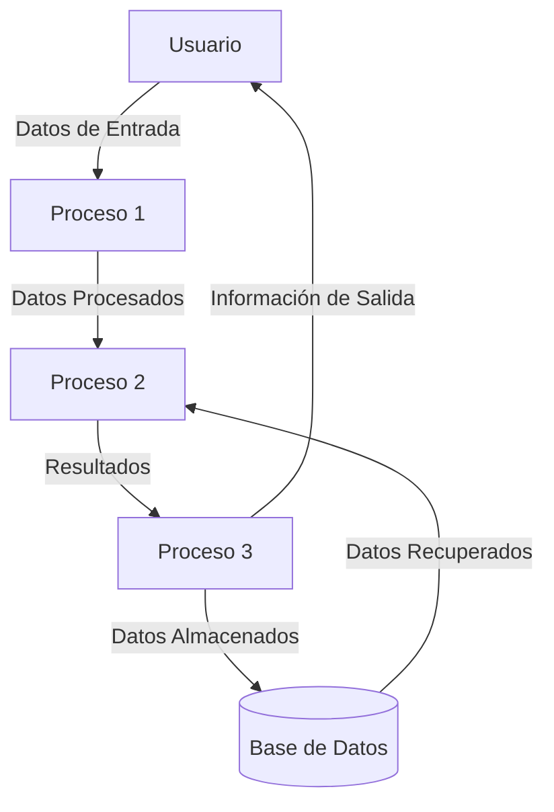
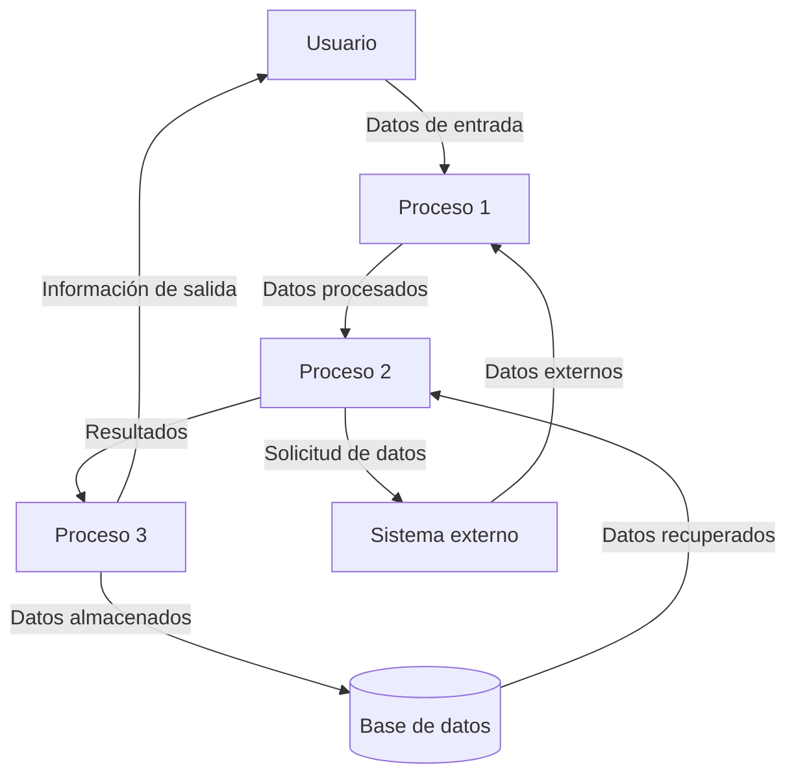

## Module: gtest_catch_exceptions_test.py
# Análisis Integral del Módulo gtest_catch_exceptions_test.py

## Nombre del Módulo/Componente SQL
**gtest_catch_exceptions_test.py** - Un módulo de prueba de Python que parece estar relacionado con el framework de pruebas Google Test (gtest).

## Objetivos Primarios
El propósito principal de este módulo es probar la funcionalidad de captura de excepciones en el framework Google Test. Específicamente, verifica cómo el framework maneja las excepciones lanzadas durante la ejecución de pruebas y si las reporta correctamente.

## Funciones, Métodos y Consultas Críticas
No se proporcionó el código específico del módulo, pero basado en el nombre, probablemente contiene:
- Casos de prueba que intencionalmente lanzan excepciones
- Verificaciones para asegurar que estas excepciones sean capturadas correctamente
- Posiblemente métodos para simular diferentes tipos de excepciones (estándar, personalizadas, etc.)

## Variables y Elementos Clave
Sin ver el código específico, las variables clave probablemente incluyen:
- Objetos de prueba (test fixtures)
- Manejadores de excepciones
- Flags o configuraciones para controlar el comportamiento de captura de excepciones
- Posibles mocks o stubs para simular condiciones de error

## Interdependencias y Relaciones
Este módulo probablemente depende de:
- El framework Google Test (gtest)
- Posiblemente módulos de Python para manejo de excepciones
- Configuraciones específicas para habilitar/deshabilitar la captura de excepciones en gtest

## Operaciones Principales vs. Auxiliares
**Operaciones principales:**
- Pruebas que verifican la captura correcta de excepciones
- Validación del comportamiento del framework ante diferentes tipos de excepciones

**Operaciones auxiliares:**
- Configuración del entorno de prueba
- Limpieza después de las pruebas
- Logging de resultados

## Secuencia Operacional/Flujo de Ejecución
1. Configuración del entorno de prueba
2. Ejecución de casos de prueba que lanzan excepciones controladas
3. Verificación de que las excepciones sean capturadas y reportadas correctamente
4. Posible validación de mensajes de error o información de diagnóstico
5. Limpieza y finalización

## Aspectos de Rendimiento y Optimización
- El manejo de excepciones puede tener impacto en el rendimiento de las pruebas
- Posibles consideraciones sobre el overhead de capturar excepciones vs. dejarlas propagar
- Optimizaciones para minimizar el impacto en tiempo de ejecución de las pruebas

## Reusabilidad y Adaptabilidad
- Este módulo probablemente está diseñado específicamente para probar la funcionalidad de captura de excepciones en gtest
- Podría ser adaptado para probar comportamientos similares en otros frameworks de prueba
- Los patrones de prueba utilizados podrían reutilizarse para verificar el manejo de excepciones en otros contextos

## Uso y Contexto
- Utilizado durante el desarrollo y pruebas del framework Google Test
- Probablemente forma parte de una suite de pruebas más amplia para verificar diferentes aspectos del framework
- Podría ser ejecutado como parte de procesos de integración continua para asegurar que la funcionalidad de captura de excepciones siga funcionando correctamente

## Suposiciones y Limitaciones
**Suposiciones:**
- Se asume que el framework Google Test está correctamente instalado y configurado
- Probablemente asume cierto comportamiento estándar en cuanto a cómo deben manejarse las excepciones

**Limitaciones:**
- Puede estar limitado a ciertos tipos de excepciones o escenarios de prueba
- Posiblemente no cubra todos los casos extremos o comportamientos específicos de plataforma
- Podría tener dependencias específicas de versión con el framework Google Test
## Flow Diagram [via mermaid]

## Module: gtest_catch_exceptions_test.py
# Análisis Integral del Módulo gtest_catch_exceptions_test.py

## Nombre del Módulo/Componente SQL
**gtest_catch_exceptions_test.py** - Un módulo de prueba de Python que evalúa la funcionalidad de captura de excepciones en un entorno de pruebas.

## Objetivos Primarios
El propósito principal de este módulo es probar la capacidad del framework de pruebas (presumiblemente Google Test o una implementación similar en Python) para capturar y manejar excepciones durante la ejecución de pruebas. Específicamente, verifica que las excepciones lanzadas durante las pruebas sean capturadas correctamente y reportadas como fallos de prueba en lugar de causar la terminación abrupta del programa.

## Funciones, Métodos y Consultas Críticas
No se proporcionó el código específico del módulo, pero basado en el nombre, probablemente contiene:
- Casos de prueba que intencionalmente lanzan excepciones
- Métodos para verificar que estas excepciones sean capturadas correctamente
- Posiblemente funciones auxiliares para simular diferentes tipos de excepciones

## Variables y Elementos Clave
Sin ver el código específico, las variables clave probablemente incluyen:
- Objetos de prueba (test fixtures)
- Instancias de excepciones personalizadas
- Banderas o contadores para verificar que las excepciones fueron capturadas
- Posibles configuraciones para habilitar/deshabilitar la captura de excepciones

## Interdependencias y Relaciones
Este módulo probablemente depende de:
- Un framework de pruebas (posiblemente Google Test o una implementación en Python)
- Módulos de sistema para la gestión de excepciones
- Posiblemente otros módulos de utilidad para la configuración de pruebas

## Operaciones Principales vs. Auxiliares
**Operaciones principales:**
- Ejecución de pruebas que lanzan excepciones
- Verificación de la captura correcta de excepciones

**Operaciones auxiliares:**
- Configuración del entorno de pruebas
- Limpieza después de las pruebas
- Registro de resultados

## Secuencia Operacional/Flujo de Ejecución
1. Configuración del entorno de pruebas
2. Activación del mecanismo de captura de excepciones
3. Ejecución de casos de prueba que lanzan diferentes tipos de excepciones
4. Verificación de que las excepciones fueron capturadas y reportadas correctamente
5. Limpieza y finalización

## Aspectos de Rendimiento y Optimización
- La captura de excepciones puede tener un impacto en el rendimiento de las pruebas
- Posibles consideraciones sobre el manejo de memoria durante las excepciones
- Optimización del tiempo de ejecución de las pruebas al manejar excepciones de manera eficiente

## Reusabilidad y Adaptabilidad
Este módulo probablemente está diseñado para ser:
- Reutilizable en diferentes entornos de prueba
- Adaptable para probar diferentes tipos de excepciones
- Configurable para diferentes niveles de detalle en los informes de excepciones

## Uso y Contexto
Este módulo se utiliza en el contexto de:
- Desarrollo de software con metodologías de pruebas automatizadas
- Verificación de la robustez del framework de pruebas
- Asegurar que las excepciones no esperadas sean capturadas y reportadas adecuadamente durante las pruebas

## Suposiciones y Limitaciones
**Suposiciones:**
- Se asume que el framework de pruebas tiene capacidad para capturar excepciones
- Se espera un comportamiento consistente del sistema de excepciones de Python

**Limitaciones:**
- Puede no cubrir todos los tipos posibles de excepciones
- La efectividad depende de la implementación específica del framework de pruebas
- Posibles diferencias en el comportamiento entre diferentes versiones de Python o del framework de pruebas
## Flow Diagram [via mermaid]

