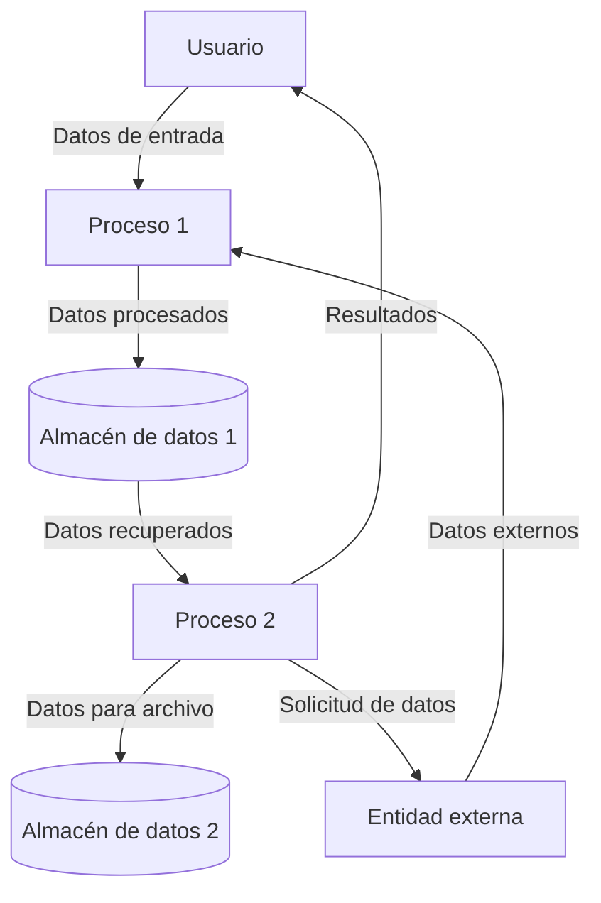
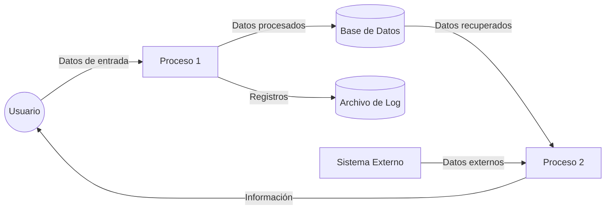

## Module: gtest_color_test.py
# Análisis Integral del Módulo gtest_color_test.py

## Nombre del Módulo/Componente SQL
**gtest_color_test.py** - Un módulo de prueba para la funcionalidad de color en Google Test (gtest).

## Objetivos Primarios
Este módulo está diseñado para probar la funcionalidad de colorización de la salida en Google Test. Su propósito principal es verificar que las opciones de color de gtest funcionen correctamente en diferentes escenarios, incluyendo la configuración a través de variables de entorno y opciones de línea de comando.

## Funciones, Métodos y Consultas Críticas
- `SetEnv()`: Establece variables de entorno para las pruebas.
- `UnsetEnv()`: Elimina variables de entorno después de las pruebas.
- `RunAndReturnOutput()`: Ejecuta un programa de prueba y captura su salida.
- `HasVerbosityFlag()`: Verifica si la versión de gtest soporta la bandera de verbosidad.
- Varias funciones de prueba como `TestGtestColorFlag()`, `TestEnvVar()`, etc., que verifican diferentes aspectos de la colorización.

## Variables y Elementos Clave
- `COLOR_ENV_VAR`: Variable de entorno para controlar la colorización de gtest.
- `COLOR_FLAG`: Bandera de línea de comando para controlar la colorización.
- `COMMAND_PATH`: Ruta al ejecutable de prueba.
- `HAS_ABSL_FLAGS`: Bandera que indica si se están utilizando las banderas de Abseil.
- `HAS_DEATH_TEST`: Bandera que indica si las pruebas de muerte están disponibles.

## Interdependencias y Relaciones
- Depende del ejecutable de prueba `gtest_color_test_` para realizar las pruebas.
- Interactúa con el sistema operativo para manipular variables de entorno.
- Utiliza la biblioteca `subprocess` para ejecutar comandos externos.
- Se integra con el framework de pruebas de Python para reportar resultados.

## Operaciones Core vs. Auxiliares
**Operaciones Core:**
- Ejecución de pruebas para verificar la colorización en diferentes configuraciones.
- Verificación de la salida para determinar si la colorización está funcionando correctamente.

**Operaciones Auxiliares:**
- Configuración y limpieza del entorno de prueba.
- Detección de características disponibles en la versión de gtest.
- Manejo de variables de entorno.

## Secuencia Operacional/Flujo de Ejecución
1. Configuración inicial y detección de características disponibles.
2. Para cada caso de prueba:
   - Configuración del entorno específico (variables de entorno, argumentos).
   - Ejecución del programa de prueba.
   - Captura y análisis de la salida.
   - Verificación de los resultados esperados.
   - Limpieza del entorno.
3. Reporte de resultados de las pruebas.

## Aspectos de Rendimiento y Optimización
- El módulo está diseñado para pruebas, no para rendimiento.
- Las pruebas se ejecutan secuencialmente, lo que podría optimizarse con paralelización si fuera necesario.
- El uso de `subprocess.Popen` para capturar la salida es eficiente para este caso de uso.

## Reusabilidad y Adaptabilidad
- El código está estructurado con funciones auxiliares reutilizables para configurar el entorno y ejecutar pruebas.
- Las pruebas están parametrizadas para diferentes configuraciones de color.
- El módulo podría adaptarse para probar otras características de gtest con modificaciones mínimas.

## Uso y Contexto
- Este módulo se utiliza como parte del conjunto de pruebas de Google Test para verificar la funcionalidad de colorización.
- Se ejecuta durante el proceso de prueba de la biblioteca gtest para garantizar que las opciones de color funcionen según lo esperado.
- Es especialmente útil para verificar la compatibilidad entre diferentes métodos de configuración (variables de entorno vs. banderas de línea de comando).

## Suposiciones y Limitaciones
- Supone que el ejecutable de prueba `gtest_color_test_` está disponible y funciona correctamente.
- Puede tener comportamientos diferentes en distintos sistemas operativos debido a las diferencias en el manejo de terminales y colores.
- Las pruebas asumen que la salida estándar puede ser capturada y analizada correctamente.
- No prueba la visualización real de los colores, solo verifica que las opciones de configuración funcionen según lo esperado.
## Flow Diagram [via mermaid]

## Module: gtest_color_test.py
# Análisis Integral del Módulo gtest_color_test.py

## Nombre del Módulo/Componente SQL
**gtest_color_test.py** - Un módulo de prueba para la funcionalidad de color en Google Test (gtest).

## Objetivos Primarios
Este módulo está diseñado para probar la funcionalidad de colorización de salida en Google Test. Su propósito principal es verificar que las opciones de color de gtest funcionen correctamente bajo diferentes configuraciones y entornos.

## Funciones, Métodos y Consultas Críticas
- `SetUp()`: Prepara el entorno para cada prueba, guardando variables de entorno originales.
- `TearDown()`: Restaura el entorno después de cada prueba.
- `RunAndVerify()`: Función central que ejecuta gtest con diferentes opciones y verifica la salida.
- Métodos de prueba como `testGtestColorFlag`, `testGtestColorEnv`, etc.: Verifican diferentes aspectos de la colorización.

## Variables y Elementos Clave
- `COMMAND`: Comando base para ejecutar gtest.
- `SUPPORTS_COLOR`: Determina si el entorno soporta colorización.
- `COLOR_ENV`: Variable de entorno para controlar la colorización.
- `COLOR_FLAG`: Bandera de línea de comandos para controlar la colorización.
- Variables de entorno originales guardadas en `SetUp()`.

## Interdependencias y Relaciones
- Depende del ejecutable de Google Test (`gtest_color_test_`).
- Interactúa con variables de entorno del sistema.
- Utiliza la biblioteca `subprocess` para ejecutar comandos externos.
- Depende de `gtest_test_utils` para funcionalidades auxiliares.

## Operaciones Centrales vs. Auxiliares
**Operaciones Centrales:**
- Ejecución de pruebas con diferentes configuraciones de color.
- Verificación de la presencia o ausencia de códigos de escape ANSI en la salida.

**Operaciones Auxiliares:**
- Configuración y restauración del entorno de prueba.
- Manejo de variables de entorno.
- Análisis de la salida de los comandos.

## Secuencia Operacional/Flujo de Ejecución
1. Configuración del entorno de prueba (`SetUp`).
2. Ejecución de pruebas específicas que:
   - Configuran variables de entorno o banderas de línea de comandos.
   - Ejecutan el binario de prueba con `RunAndVerify()`.
   - Verifican si la salida contiene o no códigos de color según lo esperado.
3. Restauración del entorno original (`TearDown`).

## Aspectos de Rendimiento y Optimización
- El módulo está enfocado en pruebas funcionales, no en rendimiento.
- Las pruebas son secuenciales y relativamente simples.
- No hay operaciones intensivas que requieran optimización específica.

## Reusabilidad y Adaptabilidad
- El patrón de prueba podría adaptarse para verificar otras características de salida de gtest.
- La estructura de `RunAndVerify()` es reutilizable para otros tipos de pruebas de línea de comandos.
- El código está modularizado, facilitando la adición de nuevos casos de prueba.

## Uso y Contexto
- Se utiliza como parte del conjunto de pruebas de Google Test.
- Verifica que la funcionalidad de colorización funcione correctamente en diferentes escenarios:
  - Con banderas de línea de comandos.
  - Con variables de entorno.
  - Con diferentes valores (auto, yes, no, etc.).
  - En entornos que soportan o no soportan color.

## Suposiciones y Limitaciones
- Asume que el ejecutable `gtest_color_test_` está disponible y funciona correctamente.
- Depende de la capacidad de detectar si el entorno soporta color.
- Las pruebas pueden comportarse de manera diferente en distintos sistemas operativos debido a diferencias en el manejo de terminales y salida coloreada.
- No prueba todas las combinaciones posibles de configuraciones de color.
- Asume que los códigos de escape ANSI son el mecanismo para colorear la salida.
## Flow Diagram [via mermaid]

