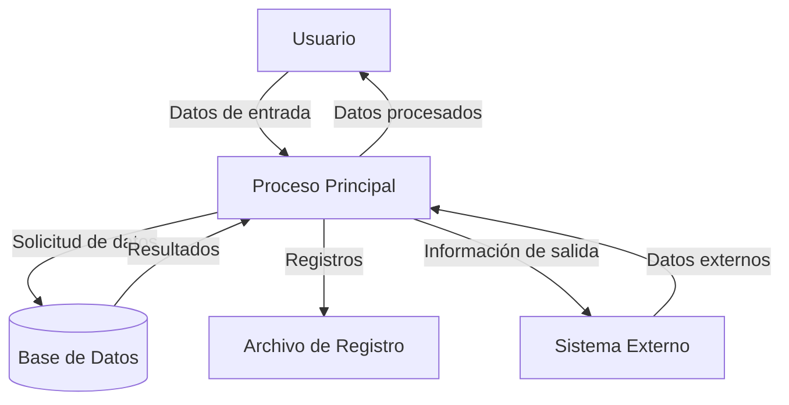

## Module: gtest_env_var_test.py
# Análisis Integral del Módulo gtest_env_var_test.py

## Módulo/Componente SQL
**Nombre del Módulo**: gtest_env_var_test.py

## Objetivos Primarios
Este módulo es un script de prueba diseñado para verificar el comportamiento de las variables de entorno relacionadas con Google Test (gtest). Su propósito principal es comprobar cómo las variables de entorno afectan la ejecución de las pruebas de gtest, específicamente enfocándose en la variable GTEST_TOTAL_SHARDS.

## Funciones, Métodos y Consultas Críticas
- `test_sharding_env_var()`: Función principal que prueba el comportamiento de la variable de entorno GTEST_TOTAL_SHARDS.
- `_run_test()`: Función auxiliar que ejecuta un proceso de prueba con variables de entorno específicas y devuelve su salida.

## Variables y Elementos Clave
- `GTEST_TOTAL_SHARDS`: Variable de entorno que controla el número total de fragmentos para las pruebas de gtest.
- `GTEST_SHARD_INDEX`: Variable de entorno que especifica qué fragmento específico se está ejecutando.
- `env`: Diccionario que contiene las variables de entorno para la ejecución de pruebas.
- `test_binary`: Ruta al binario de prueba que se ejecutará.

## Interdependencias y Relaciones
- El módulo depende de la biblioteca `unittest` para la estructura de pruebas.
- Interactúa con el sistema operativo a través de `os.environ` y `subprocess.check_output`.
- Requiere un binario de prueba de gtest existente para ejecutar las pruebas.

## Operaciones Core vs. Auxiliares
- **Core**: La verificación del comportamiento de la variable GTEST_TOTAL_SHARDS y su impacto en la ejecución de pruebas.
- **Auxiliares**: La configuración del entorno de prueba, la ejecución de subprocesos y la captura de salida.

## Secuencia Operacional/Flujo de Ejecución
1. Se configura el entorno de prueba con variables específicas.
2. Se ejecuta el binario de prueba con estas variables de entorno.
3. Se analiza la salida para verificar el comportamiento esperado.
4. Se realizan aserciones para confirmar que el comportamiento coincide con las expectativas.

## Aspectos de Rendimiento y Optimización
El módulo está enfocado en pruebas funcionales más que en rendimiento. No hay optimizaciones específicas notables, ya que el objetivo es verificar el comportamiento correcto de las variables de entorno.

## Reusabilidad y Adaptabilidad
- El código es moderadamente reutilizable para probar otras variables de entorno de gtest.
- La función `_run_test()` podría adaptarse para ejecutar diferentes tipos de pruebas con distintas configuraciones de entorno.

## Uso y Contexto
Este módulo se utiliza en un entorno de desarrollo para verificar que las funcionalidades de fragmentación (sharding) de gtest funcionan correctamente. Es especialmente útil en sistemas de integración continua donde las pruebas pueden distribuirse entre múltiples máquinas o procesos.

## Suposiciones y Limitaciones
- **Suposiciones**: 
  - Se asume que existe un binario de prueba de gtest disponible en la ruta especificada.
  - Se asume que el sistema operativo permite la modificación de variables de entorno.
- **Limitaciones**:
  - Las pruebas están específicamente diseñadas para gtest y pueden no ser aplicables a otros frameworks de prueba.
  - El módulo no maneja casos de error extensivamente, como la ausencia del binario de prueba.
## Flow Diagram [via mermaid]

## Module: gtest_env_var_test.py
# Análisis Integral del Módulo gtest_env_var_test.py

## Nombre del Módulo/Componente SQL
**gtest_env_var_test.py** - Un módulo de prueba de Python para verificar la funcionalidad relacionada con variables de entorno en un contexto de pruebas Google Test (gtest).

## Objetivos Primarios
El propósito principal de este módulo es probar cómo las variables de entorno afectan la ejecución de pruebas en el framework Google Test. Específicamente, verifica que las variables de entorno se configuren correctamente y que las pruebas respondan adecuadamente a estas configuraciones.

## Funciones, Métodos y Consultas Críticas
- **GTestEnvVarTest** (clase principal de prueba): Extiende unittest.TestCase para probar la funcionalidad de variables de entorno.
- **test_env_var_filter()**: Método de prueba que verifica el filtrado de pruebas basado en variables de entorno.
- **test_env_var_output()**: Método de prueba que verifica la salida basada en variables de entorno.
- **test_env_var_repeat()**: Método de prueba que verifica la repetición de pruebas basada en variables de entorno.
- **test_env_var_break_on_failure()**: Método de prueba que verifica el comportamiento de interrupción en caso de fallo.
- **test_env_var_throw_on_failure()**: Método de prueba que verifica el comportamiento de lanzamiento de excepciones en caso de fallo.

## Variables y Elementos Clave
- **GTEST_FILTER**: Variable de entorno para filtrar pruebas específicas.
- **GTEST_OUTPUT**: Variable de entorno para configurar la salida de las pruebas.
- **GTEST_REPEAT**: Variable de entorno para configurar la repetición de pruebas.
- **GTEST_BREAK_ON_FAILURE**: Variable de entorno para controlar si se debe interrumpir la ejecución en caso de fallo.
- **GTEST_THROW_ON_FAILURE**: Variable de entorno para controlar si se deben lanzar excepciones en caso de fallo.
- **gtest_test_utils.py**: Módulo auxiliar importado para utilidades de prueba.

## Interdependencias y Relaciones
- Depende del módulo **gtest_test_utils** para funciones auxiliares de prueba.
- Interactúa con el framework Google Test a través de variables de entorno.
- Utiliza el módulo **os** para manipular variables de entorno.
- Utiliza el módulo **re** para expresiones regulares en la validación de resultados.

## Operaciones Principales vs. Auxiliares
**Operaciones Principales:**
- Configuración de variables de entorno específicas para cada caso de prueba.
- Ejecución de pruebas de Google Test con estas configuraciones.
- Verificación de que el comportamiento observado coincide con el esperado.

**Operaciones Auxiliares:**
- Limpieza de variables de entorno después de cada prueba.
- Análisis de la salida de las pruebas para verificar resultados.
- Configuración del entorno de prueba.

## Secuencia Operacional/Flujo de Ejecución
1. Cada método de prueba configura una variable de entorno específica.
2. Se ejecuta una prueba de Google Test con esa configuración.
3. Se analiza la salida o el comportamiento resultante.
4. Se verifica que el comportamiento coincida con lo esperado según la variable de entorno configurada.
5. Se limpia la variable de entorno para no afectar pruebas posteriores.

## Aspectos de Rendimiento y Optimización
- El código parece estar optimizado para pruebas unitarias, sin problemas evidentes de rendimiento.
- Las pruebas se ejecutan secuencialmente, lo que podría ser un cuello de botella si el número de pruebas crece significativamente.
- La manipulación de variables de entorno es una operación relativamente costosa, pero apropiada para el contexto de prueba.

## Reusabilidad y Adaptabilidad
- El código está estructurado de manera modular, con métodos de prueba independientes.
- Podría adaptarse fácilmente para probar otras variables de entorno de Google Test.
- La estructura de las pruebas sigue un patrón consistente que facilita la adición de nuevos casos de prueba.

## Uso y Contexto
- Este módulo se utiliza en el contexto de pruebas de integración para el framework Google Test.
- Verifica que las variables de entorno funcionen correctamente como mecanismo de configuración para Google Test.
- Es probable que forme parte de una suite de pruebas más amplia para Google Test.

## Suposiciones y Limitaciones
- Supone que Google Test está instalado y disponible en el sistema.
- Asume que el módulo gtest_test_utils.py está disponible y funciona correctamente.
- Las pruebas están diseñadas para un entorno específico y podrían no funcionar en todos los sistemas operativos de la misma manera.
- No prueba todas las posibles variables de entorno de Google Test, solo un subconjunto específico.
- Depende de patrones específicos en la salida de Google Test, lo que podría romper las pruebas si cambia el formato de salida.
## Flow Diagram [via mermaid]

