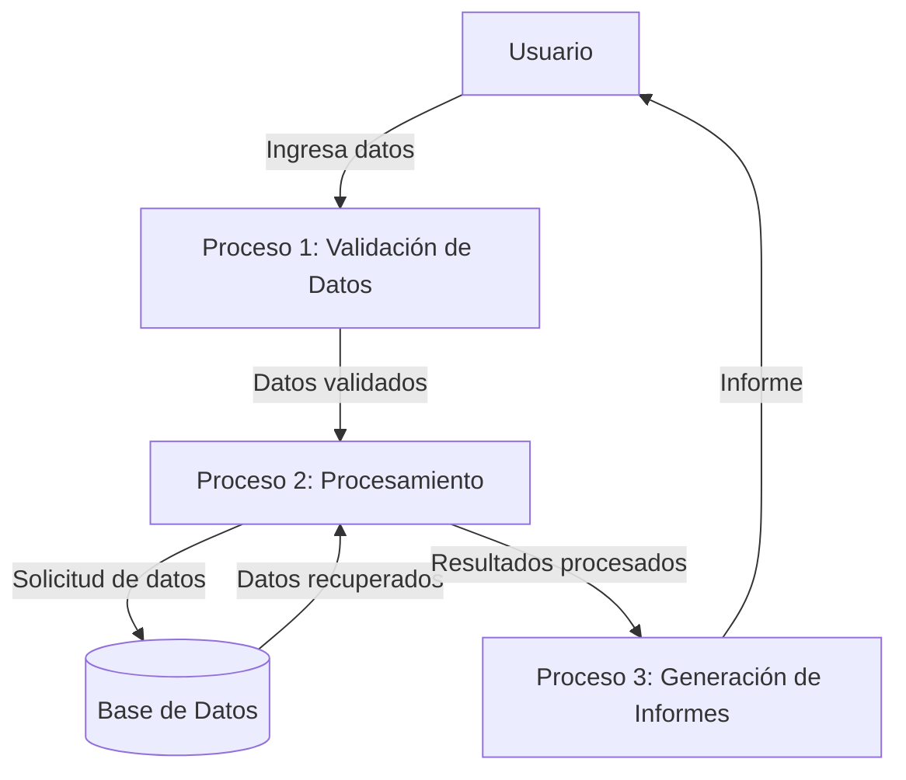
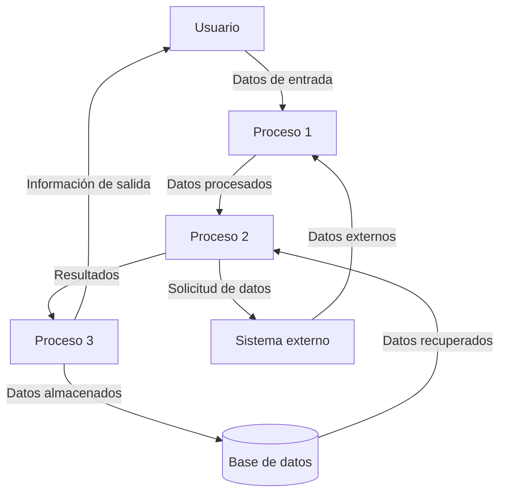

## Module: gtest_filter_unittest.py
# Análisis Integral del Módulo gtest_filter_unittest.py

## Módulo/Componente SQL
**Nombre del Módulo**: gtest_filter_unittest.py

## Objetivos Primarios
Este módulo es un conjunto de pruebas unitarias diseñado para verificar la funcionalidad de filtrado de Google Test (gtest). Su propósito principal es asegurar que los patrones de filtrado de pruebas funcionen correctamente, validando que las pruebas se incluyan o excluyan según los patrones especificados.

## Funciones, Métodos y Consultas Críticas
- **GTestFilterUnitTest**: Clase principal de prueba que hereda de `gtest_test_utils.TestCase`.
- **testFilterPassing**: Verifica que los filtros positivos incluyan correctamente las pruebas especificadas.
- **testFilterWithManuallyAddedTestCases**: Prueba el filtrado con casos de prueba añadidos manualmente.
- **testFilterNegative**: Comprueba que los filtros negativos excluyan correctamente las pruebas especificadas.
- **testFilterNegativeWithoutPositive**: Verifica el comportamiento de filtros negativos sin filtros positivos.
- **testFilterNegativeAndPositive**: Prueba la combinación de filtros positivos y negativos.
- **testUniversalFilters**: Verifica el comportamiento de filtros universales como "*" y "-*".
- **testCombinationOfFilters**: Prueba combinaciones complejas de filtros.
- **testFlagOverridesEnvVar**: Verifica que las opciones de línea de comandos tengan prioridad sobre las variables de entorno.

## Variables y Elementos Clave
- **COMMAND**: Ruta al ejecutable de prueba de gtest.
- **FLAG_PREFIX**: Prefijo para las opciones de línea de comandos.
- **FLAG_FILTER**: Opción específica para filtrar pruebas.
- **ENV_VAR**: Variable de entorno para configurar filtros.
- **TEST_LIST**: Lista de pruebas disponibles para filtrar.

## Interdependencias y Relaciones
- Depende del módulo `gtest_test_utils` para funcionalidades de prueba.
- Interactúa con el ejecutable de prueba de Google Test a través de la línea de comandos.
- Utiliza variables de entorno para configurar filtros alternativos.

## Operaciones Principales vs. Auxiliares
**Operaciones Principales**:
- Ejecución de pruebas con diferentes patrones de filtrado.
- Verificación de resultados contra comportamientos esperados.

**Operaciones Auxiliares**:
- Configuración del entorno de prueba.
- Análisis de la salida del ejecutable de prueba.
- Limpieza de variables de entorno después de las pruebas.

## Secuencia Operacional/Flujo de Ejecución
1. Configuración del entorno de prueba (setUp).
2. Ejecución del comando de prueba con filtros específicos.
3. Análisis de la salida para verificar qué pruebas se ejecutaron.
4. Comparación con el comportamiento esperado.
5. Limpieza del entorno (tearDown).

## Aspectos de Rendimiento y Optimización
- El módulo está optimizado para pruebas rápidas, ejecutando solo las pruebas necesarias según los filtros.
- Utiliza subprocesos para ejecutar comandos externos, lo que podría ser un punto de optimización si se necesitaran muchas ejecuciones.

## Reusabilidad y Adaptabilidad
- El código está estructurado para facilitar la adición de nuevos casos de prueba.
- Los patrones de filtrado probados son genéricos y aplicables a cualquier conjunto de pruebas de Google Test.
- La metodología de prueba podría adaptarse para verificar otros aspectos de Google Test.

## Uso y Contexto
- Este módulo se utiliza durante el desarrollo y mantenimiento de Google Test para asegurar que la funcionalidad de filtrado funcione correctamente.
- Es parte de la suite de pruebas de Google Test y se ejecuta como parte del proceso de integración continua.

## Suposiciones y Limitaciones
- Asume que el ejecutable de prueba de Google Test está disponible en la ruta especificada.
- Requiere permisos para establecer y modificar variables de entorno.
- Las pruebas están diseñadas específicamente para la sintaxis de filtrado de Google Test y no son directamente aplicables a otros frameworks de prueba.
- Depende de la estabilidad del formato de salida de Google Test para analizar correctamente los resultados.
## Flow Diagram [via mermaid]

## Module: gtest_filter_unittest.py
# Análisis Integral del Módulo gtest_filter_unittest.py

## Módulo/Componente SQL
**Nombre del Módulo**: gtest_filter_unittest.py

## Objetivos Primarios
Este módulo es una suite de pruebas unitarias diseñada para verificar la funcionalidad de filtrado de Google Test (gtest). Su propósito principal es asegurar que los patrones de filtrado de pruebas funcionen correctamente, permitiendo la inclusión o exclusión de pruebas específicas basadas en patrones definidos.

## Funciones, Métodos y Consultas Críticas
- **GTestFilterUnitTest**: Clase principal de pruebas que hereda de `gtest_test_utils.TestCase`.
- **testFilterDoesNotAceptEmptyPatterns()**: Verifica que los patrones de filtro vacíos sean rechazados.
- **testFilterAcceptsValidPatterns()**: Comprueba que los patrones válidos sean aceptados.
- **testFilterMatches()**: Prueba la funcionalidad de coincidencia de patrones.
- **testFilterNegativeMatches()**: Verifica la funcionalidad de coincidencia negativa (exclusión).
- **testFilterDoesNotMatchWhenDifferentParts()**: Asegura que no haya coincidencias cuando las partes del patrón difieren.

## Variables y Elementos Clave
- **_FILTER_FLAG**: Constante que define la bandera de filtro utilizada en las pruebas.
- **_LIST_TESTS_FLAG**: Constante para listar las pruebas disponibles.
- **_EXE_NAME**: Nombre del ejecutable de prueba.
- **_COMMAND**: Comando base para ejecutar las pruebas.
- **_TEST_LIST**: Lista de pruebas disponibles para filtrar.

## Interdependencias y Relaciones
- Depende de `gtest_test_utils` para funcionalidades de prueba.
- Interactúa con el ejecutable de Google Test para verificar el comportamiento del filtrado.
- Utiliza la salida estándar y de error para validar los resultados de las pruebas.

## Operaciones Core vs. Auxiliares
**Operaciones Core**:
- Pruebas de validación de patrones de filtro.
- Verificación de coincidencias positivas y negativas.

**Operaciones Auxiliares**:
- Configuración del entorno de prueba.
- Análisis de la salida del ejecutable para verificar resultados.
- Funciones auxiliares para ejecutar comandos y analizar resultados.

## Secuencia Operacional/Flujo de Ejecución
1. Configuración del entorno de prueba.
2. Ejecución de pruebas individuales que verifican aspectos específicos del filtrado.
3. Cada prueba ejecuta el binario de Google Test con diferentes parámetros de filtro.
4. Análisis de la salida para verificar que las pruebas correctas fueron incluidas o excluidas.
5. Validación de los resultados contra los comportamientos esperados.

## Aspectos de Rendimiento y Optimización
- El módulo está diseñado para pruebas unitarias, por lo que el rendimiento no es crítico.
- Las pruebas se ejecutan secuencialmente, lo que podría optimizarse para conjuntos de pruebas más grandes.
- La ejecución repetida del binario de prueba podría consolidarse para mejorar el rendimiento.

## Reusabilidad y Adaptabilidad
- El código está estructurado para probar específicamente la funcionalidad de filtrado de Google Test.
- Podría adaptarse para probar otras características de filtrado en diferentes frameworks de prueba.
- La estructura modular permite añadir fácilmente nuevos casos de prueba para patrones de filtro adicionales.

## Uso y Contexto
- Este módulo se utiliza durante el desarrollo y mantenimiento de Google Test para asegurar que la funcionalidad de filtrado funcione correctamente.
- Es parte de la suite de pruebas unitarias de Google Test, ejecutándose como parte del proceso de integración continua.
- Ayuda a garantizar que los usuarios puedan filtrar eficazmente las pruebas en sus propios proyectos.

## Suposiciones y Limitaciones
- Asume que el ejecutable de Google Test está disponible y funciona correctamente.
- Requiere un entorno que pueda ejecutar comandos de shell y analizar su salida.
- Las pruebas están diseñadas para un conjunto específico de comportamientos de filtrado y podrían necesitar actualizaciones si la funcionalidad de filtrado cambia.
- No prueba todos los posibles patrones de filtro, sino un subconjunto representativo.
## Flow Diagram [via mermaid]

