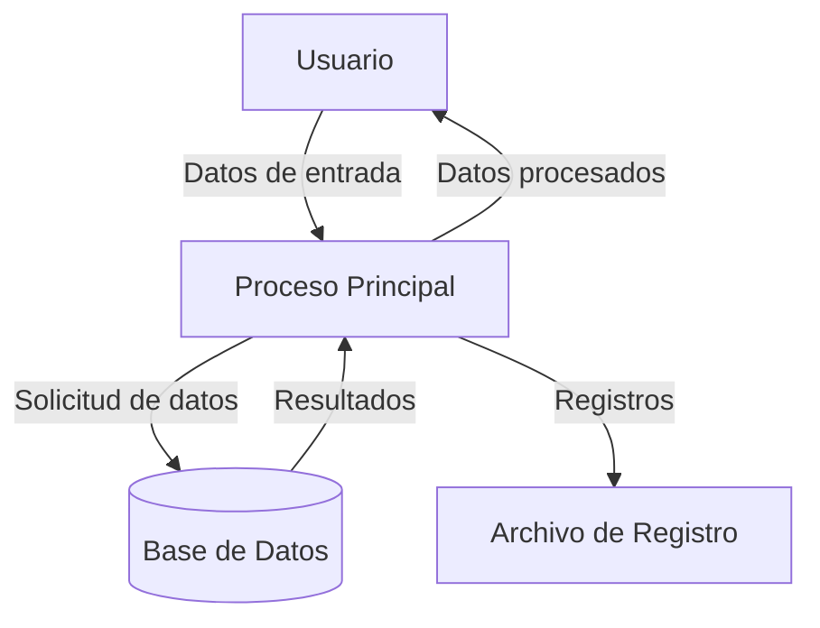
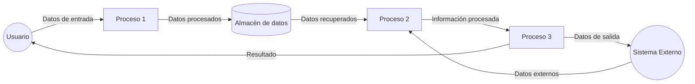

## Module: gtest_help_test.py
# Análisis Integral del Módulo gtest_help_test.py

## Nombre del Módulo/Componente SQL
**gtest_help_test.py** - Un módulo de prueba para la funcionalidad de ayuda de Google Test.

## Objetivos Primarios
Este módulo está diseñado para probar la funcionalidad de ayuda de Google Test (gtest), específicamente verificando que los mensajes de ayuda se muestren correctamente cuando se ejecutan comandos con banderas de ayuda. El propósito principal es asegurar que la interfaz de línea de comandos de gtest proporcione información útil y precisa a los usuarios.

## Funciones, Métodos y Consultas Críticas
- **HelpFlagTest**: Clase principal de prueba que hereda de `gtest_test_utils.TestCase`.
- **TestHelpFlag**: Método que prueba la bandera `--help`.
- **TestHelpshortFlag**: Método que prueba la bandera `-h`.
- **TestHelpshortFlagWithoutSpace**: Método que prueba la bandera `-h` sin espacio.
- **TestAllHelpFlags**: Método que prueba todas las banderas de ayuda juntas.

## Variables y Elementos Clave
- **COMMAND**: Variable que almacena el comando base para ejecutar gtest_help_test.
- **PROGRAM_PATH**: Ruta al programa de prueba.
- **FLAG_PREFIX**: Prefijo para las banderas (puede variar según la plataforma).
- **HELP_FLAG**: Bandera completa de ayuda (`--help`).
- **HELP_SHORT_FLAG**: Versión corta de la bandera de ayuda (`-h`).

## Interdependencias y Relaciones
- Depende del módulo `gtest_test_utils` para funcionalidades de prueba.
- Interactúa con el ejecutable `gtest_help_test_` para verificar su comportamiento.
- Utiliza funciones del sistema operativo para ejecutar comandos y capturar su salida.

## Operaciones Core vs. Auxiliares
**Operaciones Core:**
- Ejecución de comandos gtest con diferentes banderas de ayuda.
- Verificación de la salida para asegurar que contiene la información esperada.

**Operaciones Auxiliares:**
- Configuración del entorno de prueba.
- Manejo de diferencias entre plataformas (Windows vs. otros sistemas).

## Secuencia Operacional/Flujo de Ejecución
1. Inicialización de variables y configuración del entorno de prueba.
2. Ejecución de comandos gtest con diferentes combinaciones de banderas de ayuda.
3. Captura de la salida estándar de cada comando.
4. Verificación de que la salida contiene la información de ayuda esperada.
5. Comprobación de que el programa termina con código de salida 0 (éxito).

## Aspectos de Rendimiento y Optimización
- Las pruebas son relativamente ligeras y rápidas, ya que solo verifican la salida de texto.
- No hay operaciones intensivas que requieran optimización específica.
- El código está estructurado para minimizar la duplicación mediante el uso de métodos auxiliares.

## Reusabilidad y Adaptabilidad
- El código está bien estructurado y podría adaptarse fácilmente para probar otras banderas de línea de comandos.
- La separación de las pruebas en métodos distintos facilita la adición de nuevas pruebas para funcionalidades adicionales.
- El manejo de diferencias entre plataformas permite que las pruebas funcionen en diversos entornos.

## Uso y Contexto
- Este módulo forma parte del framework de pruebas de Google Test.
- Se utiliza durante el desarrollo y mantenimiento de gtest para asegurar que la funcionalidad de ayuda funcione correctamente.
- Probablemente se ejecuta como parte de una suite de pruebas más amplia para verificar la integridad de gtest.

## Suposiciones y Limitaciones
- Asume que el ejecutable `gtest_help_test_` está disponible y funciona correctamente.
- Depende de la estructura específica del mensaje de ayuda de gtest, lo que podría requerir actualizaciones si cambia el formato de ayuda.
- Las pruebas están diseñadas para funcionar en múltiples plataformas, pero podrían requerir ajustes para entornos específicos no contemplados.
- No prueba el contenido detallado del mensaje de ayuda, solo verifica que se muestra alguna información de ayuda.
## Flow Diagram [via mermaid]

## Module: gtest_help_test.py
# Análisis Integral del Módulo gtest_help_test.py

## Nombre del Módulo/Componente SQL
**gtest_help_test.py** - Un módulo de prueba para la funcionalidad de ayuda de Google Test.

## Objetivos Primarios
Este módulo está diseñado para probar la funcionalidad de ayuda de Google Test (gtest), específicamente verificando que los mensajes de ayuda se muestren correctamente cuando se ejecutan comandos con banderas de ayuda como `--help` y `-h`. El propósito principal es asegurar que la interfaz de línea de comandos de Google Test proporcione información adecuada a los usuarios.

## Funciones, Métodos y Consultas Críticas
- **HelpFlag** - Clase de prueba principal que hereda de `gtest_test_utils.GTestTestCase`.
- **testHelpFlag** - Método que prueba la bandera `--help`.
- **testHFlagAlsoWorks** - Método que prueba la bandera abreviada `-h`.
- **testAllHelpIsDisplayed** - Método que verifica que se muestre toda la información de ayuda.
- **testHelpIsDisplayedWithFilter** - Método que prueba la combinación de `--help` con filtros.

## Variables y Elementos Clave
- **COMMAND** - Constante que define el comando base para ejecutar las pruebas de Google Test.
- **help_regex** - Expresión regular para verificar el formato correcto de la salida de ayuda.
- **SetUpTestCase** y **TearDownTestCase** - Métodos estáticos para configuración y limpieza de las pruebas.
- **output** - Variable que almacena la salida de los comandos ejecutados para su análisis.

## Interdependencias y Relaciones
- Depende del módulo `gtest_test_utils` para la funcionalidad básica de pruebas.
- Interactúa con el ejecutable de Google Test a través de la línea de comandos.
- Utiliza la biblioteca `re` para el procesamiento de expresiones regulares.
- Depende de `os` y `sys` para operaciones del sistema y manejo de rutas.

## Operaciones Core vs. Auxiliares
**Operaciones Core:**
- Ejecución de comandos de Google Test con banderas de ayuda.
- Verificación de la salida mediante expresiones regulares.

**Operaciones Auxiliares:**
- Configuración del entorno de prueba.
- Limpieza después de las pruebas.
- Formateo y análisis de la salida de los comandos.

## Secuencia Operacional/Flujo de Ejecución
1. Configuración del entorno de prueba mediante `SetUpTestCase`.
2. Ejecución de comandos de Google Test con diferentes banderas de ayuda.
3. Captura de la salida de los comandos.
4. Verificación de que la salida contenga la información de ayuda esperada.
5. Limpieza del entorno mediante `TearDownTestCase`.

## Aspectos de Rendimiento y Optimización
- Las pruebas son relativamente ligeras ya que solo verifican la salida de texto.
- No hay operaciones intensivas que requieran optimización específica.
- El uso de expresiones regulares para validación es eficiente para este caso de uso.

## Reusabilidad y Adaptabilidad
- El código está estructurado para pruebas específicas de Google Test, pero el enfoque podría adaptarse para probar otras interfaces de línea de comandos.
- La metodología de prueba (ejecutar comando, capturar salida, verificar con regex) es reutilizable.
- Las pruebas están parametrizadas para facilitar modificaciones futuras.

## Uso y Contexto
- Este módulo forma parte del conjunto de pruebas de Google Test.
- Se utiliza durante el desarrollo y mantenimiento de Google Test para asegurar que la funcionalidad de ayuda funcione correctamente.
- Es especialmente útil después de cambios en la interfaz de línea de comandos o en los mensajes de ayuda.

## Suposiciones y Limitaciones
- Asume que el ejecutable de Google Test está disponible y es accesible.
- Requiere permisos para ejecutar comandos en el sistema.
- Las pruebas dependen de un formato específico de salida de ayuda, por lo que cambios en el formato requerirían actualizar las expresiones regulares.
- No prueba el contenido detallado de los mensajes de ayuda, solo su presencia y formato general.
## Flow Diagram [via mermaid]

