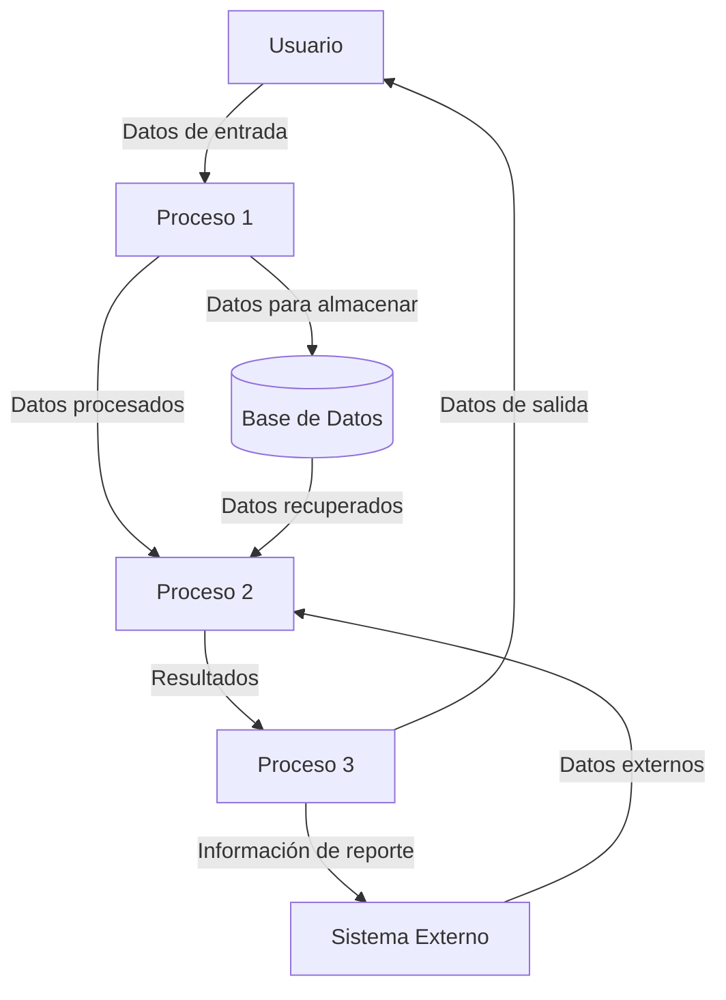
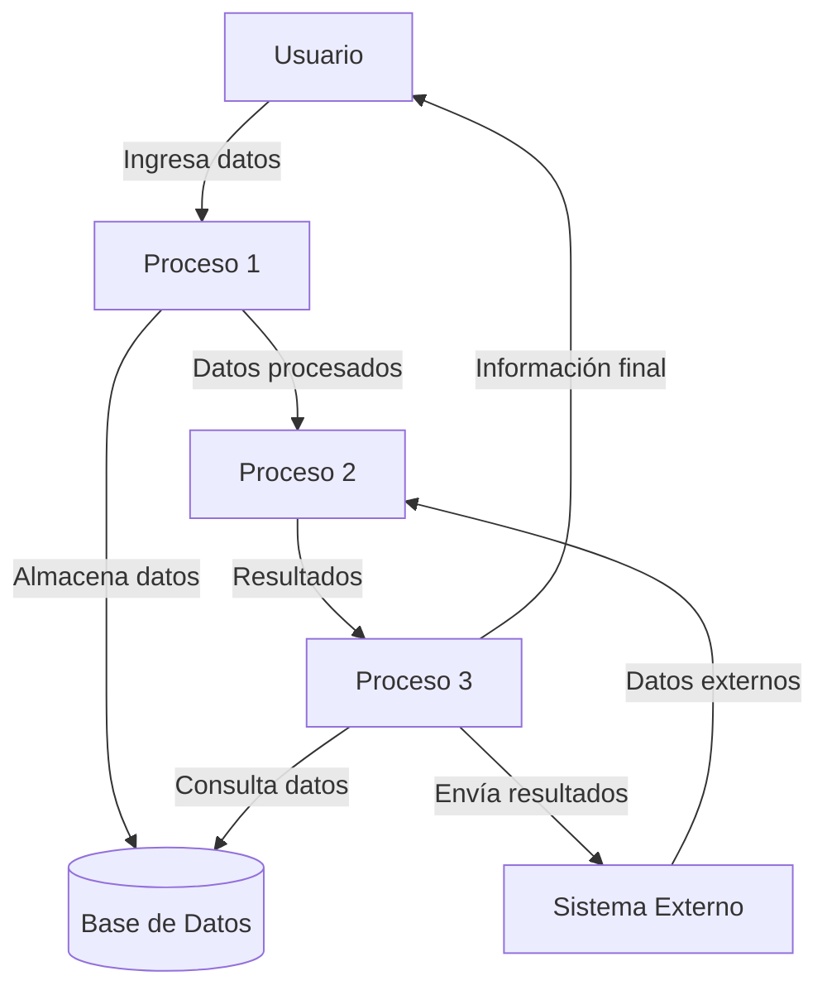

## Module: gtest_list_tests_unittest.py
# Análisis Integral del Módulo gtest_list_tests_unittest.py

## Nombre del Módulo/Componente SQL
**gtest_list_tests_unittest.py** - Un módulo de pruebas unitarias para la funcionalidad de listado de pruebas de Google Test.

## Objetivos Primarios
Este módulo está diseñado para probar la funcionalidad de listado de pruebas de Google Test (`gtest_list_tests`). Su propósito principal es verificar que la herramienta pueda analizar correctamente la salida del comando `--gtest_list_tests` de Google Test y extraer información sobre las pruebas disponibles.

## Funciones, Métodos y Consultas Críticas
- **GTestListTestsUnitTest**: Clase principal de pruebas que hereda de `gtest_test_utils.GTestTestCase`.
- **testCombinations()**: Método que prueba diferentes combinaciones de parámetros para el listado de pruebas.
- **testFlag()**: Método que prueba el comportamiento con diferentes banderas.
- **testFilteredTests()**: Método que verifica el filtrado de pruebas.
- **testShardStatusFileFormat()**: Método que prueba el formato del archivo de estado de fragmentación.
- **testShardStatusFile()**: Método que prueba la funcionalidad del archivo de estado de fragmentación.
- **testWithShardIndex()**: Método que prueba el comportamiento con índices de fragmentación.
- **testWithShardStatus()**: Método que prueba el comportamiento con estado de fragmentación.

## Variables y Elementos Clave
- **COMMAND**: Variable que almacena el comando base para ejecutar las pruebas.
- **TEST_LIST**: Lista de pruebas esperadas para verificación.
- **SHARDING_CONFIGURATIONS**: Configuraciones para pruebas de fragmentación.
- **temp_file**: Archivos temporales utilizados para pruebas.
- **flag_list**, **flag_prefix**: Variables para pruebas de banderas.

## Interdependencias y Relaciones
- Depende de `gtest_test_utils` para funcionalidades de prueba.
- Interactúa con el ejecutable `gtest_list_tests_unittest_` para realizar pruebas.
- Utiliza `os`, `re`, `sys` y `tempfile` para operaciones del sistema y manipulación de archivos.

## Operaciones Core vs. Auxiliares
**Operaciones Core:**
- Ejecución de comandos de Google Test con diferentes parámetros.
- Verificación de la salida contra resultados esperados.

**Operaciones Auxiliares:**
- Creación y gestión de archivos temporales.
- Formateo de comandos y parámetros.
- Análisis de texto mediante expresiones regulares.

## Secuencia Operacional/Flujo de Ejecución
1. Configuración del entorno de prueba.
2. Ejecución de comandos específicos de Google Test.
3. Captura y análisis de la salida.
4. Verificación de resultados contra valores esperados.
5. Limpieza de recursos temporales.

## Aspectos de Rendimiento y Optimización
- El código utiliza expresiones regulares para analizar la salida, lo que podría optimizarse para conjuntos de datos más grandes.
- La creación y eliminación frecuente de archivos temporales podría ser un punto de mejora para pruebas extensas.

## Reusabilidad y Adaptabilidad
- El código está estructurado en métodos de prueba independientes, facilitando la adición de nuevos casos.
- La parametrización de comandos y valores esperados permite adaptarse a cambios en la API de Google Test.
- Las utilidades de prueba podrían reutilizarse para probar otras funcionalidades de Google Test.

## Uso y Contexto
Este módulo se utiliza como parte del conjunto de pruebas unitarias para Google Test, específicamente para verificar la funcionalidad de listado de pruebas. Es ejecutado durante el desarrollo y las pruebas de integración continua para asegurar que los cambios en el código no rompan esta funcionalidad.

## Suposiciones y Limitaciones
- Asume que el ejecutable `gtest_list_tests_unittest_` está disponible y funciona correctamente.
- Requiere permisos para crear y eliminar archivos temporales.
- Las pruebas están diseñadas para un conjunto específico de casos de uso y podrían no cubrir todos los escenarios posibles.
- Depende de la estabilidad del formato de salida de Google Test; cambios en este formato podrían requerir actualizaciones en las pruebas.
## Flow Diagram [via mermaid]

## Module: gtest_list_tests_unittest.py
# Análisis Integral del Módulo gtest_list_tests_unittest.py

## Nombre del Módulo/Componente SQL
**gtest_list_tests_unittest.py** - Un módulo de prueba unitaria para la funcionalidad de listado de pruebas de Google Test.

## Objetivos Primarios
Este módulo está diseñado para probar la funcionalidad de listado de pruebas de Google Test (`gtest_list_tests`). Su propósito principal es verificar que la herramienta pueda analizar correctamente la salida del comando `--gtest_list_tests` de Google Test y extraer información sobre las pruebas disponibles.

## Funciones, Métodos y Consultas Críticas
- **GTestListTestsUnitTest** (clase): Clase principal de prueba que hereda de `gtest_test_utils.GTestTestCase`.
- **testCombinations**: Método que prueba la capacidad de analizar diferentes combinaciones de salidas de pruebas.
- **testParsing**: Método que verifica la funcionalidad de análisis de la salida de `--gtest_list_tests`.
- **testArtificialList**: Método que prueba el análisis con una lista artificial de pruebas.
- **testEmptyList**: Método que verifica el comportamiento con una lista vacía de pruebas.

## Variables y Elementos Clave
- **_TEST_LIST**: Variable que contiene una salida de ejemplo de `--gtest_list_tests`.
- **_PARSED_TEST_LIST**: Lista esperada después de analizar `_TEST_LIST`.
- **_ARTIFICIAL_LIST**: Lista artificial para pruebas adicionales.
- **_EMPTY_LIST**: Lista vacía para probar casos límite.

## Interdependencias y Relaciones
- Depende del módulo `gtest_test_utils` para la clase base de pruebas y utilidades.
- Importa el módulo `gtest_list_tests` que contiene la funcionalidad que se está probando.
- Utiliza la biblioteca estándar de Python `unittest` para el marco de pruebas.

## Operaciones Principales vs. Auxiliares
- **Operaciones Principales**:
  - Pruebas de análisis de la salida de `--gtest_list_tests`.
  - Verificación de la extracción correcta de nombres de pruebas.
- **Operaciones Auxiliares**:
  - Configuración de datos de prueba.
  - Aserciones para verificar resultados.

## Secuencia Operativa/Flujo de Ejecución
1. Cada método de prueba configura datos específicos para el escenario.
2. Se llama a la función `gtest_list_tests.ParseGTestListTestsOutput()` con los datos de prueba.
3. Se comparan los resultados obtenidos con los resultados esperados.
4. Se realizan aserciones para verificar la correctitud del análisis.

## Aspectos de Rendimiento y Optimización
- El código está optimizado para pruebas unitarias y no presenta problemas de rendimiento evidentes.
- Las operaciones son simples y directas, sin bucles complejos o procesamiento intensivo.

## Reutilización y Adaptabilidad
- El módulo está diseñado específicamente para probar la funcionalidad de `gtest_list_tests`.
- Los métodos de prueba son independientes y pueden ser ejecutados individualmente.
- La estructura de pruebas sigue el patrón estándar de unittest, facilitando su mantenimiento.

## Uso y Contexto
- Este módulo se utiliza como parte del conjunto de pruebas unitarias para Google Test.
- Verifica que la funcionalidad de listado de pruebas funcione correctamente antes de ser utilizada en entornos de producción.
- Es ejecutado como parte de la suite de pruebas de Google Test para garantizar la calidad del código.

## Suposiciones y Limitaciones
- **Suposiciones**:
  - Se asume que la salida de `--gtest_list_tests` sigue un formato específico.
  - Se espera que los nombres de pruebas y casos de prueba sigan las convenciones de Google Test.
- **Limitaciones**:
  - Las pruebas solo verifican el análisis de la salida, no la generación de la misma.
  - No prueba casos extremos como nombres de prueba muy largos o caracteres especiales.
## Flow Diagram [via mermaid]

