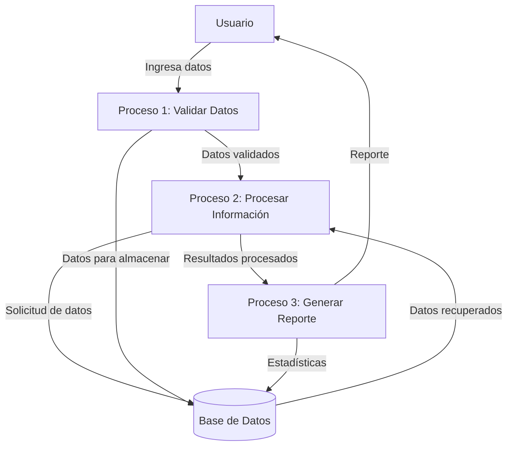
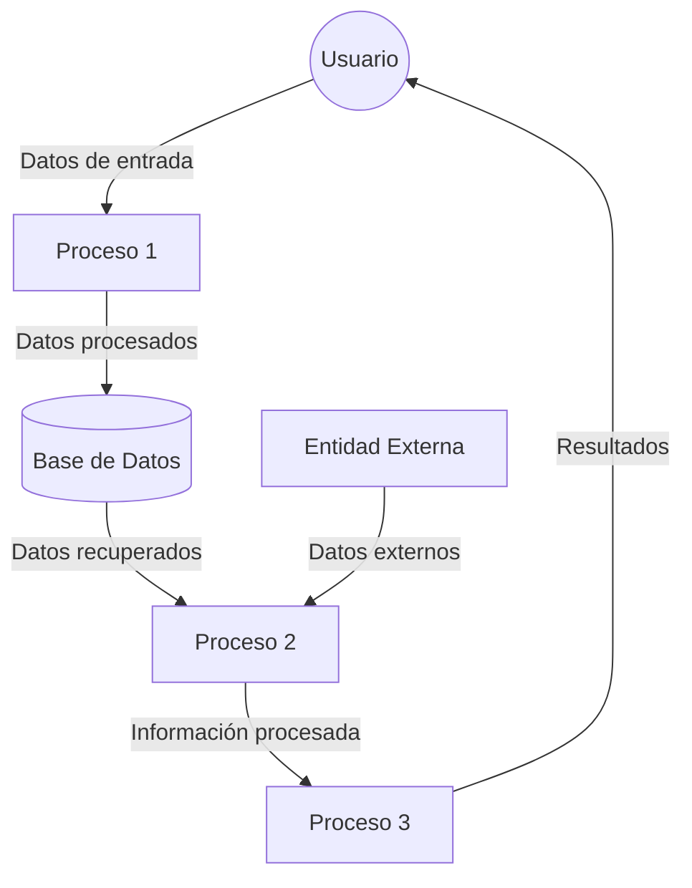

## Module: gtest_output_test.py
# Análisis Integral del Módulo gtest_output_test.py

## Nombre del Módulo/Componente SQL
**gtest_output_test.py** - Un módulo de prueba para analizar la salida de Google Test.

## Objetivos Primarios
Este módulo está diseñado para probar la funcionalidad de análisis de salida de Google Test. Su propósito principal es verificar que el analizador de salida de Google Test pueda interpretar correctamente diferentes formatos de salida de pruebas, incluyendo casos exitosos, fallidos y con errores.

## Funciones, Métodos y Consultas Críticas
- **GTestOutputTest** (clase): Clase principal de prueba que hereda de unittest.TestCase.
- **testGoogleTestXML**: Prueba la capacidad de analizar archivos XML de Google Test.
- **testEmptyXML**: Verifica el comportamiento con archivos XML vacíos.
- **testGoogleTestJSON**: Prueba la capacidad de analizar archivos JSON de Google Test.
- **testEmptyJSON**: Verifica el comportamiento con archivos JSON vacíos.

## Variables y Elementos Clave
- **GTEST_OUTPUT_TEST_XML**: Constante que contiene un ejemplo de salida XML de Google Test.
- **GTEST_OUTPUT_TEST_XML_EMPTY**: Constante para probar XML vacío.
- **GTEST_OUTPUT_TEST_JSON**: Constante que contiene un ejemplo de salida JSON de Google Test.
- **GTEST_OUTPUT_TEST_JSON_EMPTY**: Constante para probar JSON vacío.
- **tempfile**: Utilizado para crear archivos temporales durante las pruebas.

## Interdependencias y Relaciones
- Depende del módulo **gtest_json** para analizar la salida JSON de Google Test.
- Depende del módulo **gtest_xml** para analizar la salida XML de Google Test.
- Utiliza la biblioteca estándar **unittest** para la estructura de pruebas.
- Interactúa con el sistema de archivos para crear y leer archivos temporales.

## Operaciones Principales vs. Auxiliares
**Operaciones Principales:**
- Pruebas de análisis de salida XML y JSON de Google Test.

**Operaciones Auxiliares:**
- Creación y gestión de archivos temporales.
- Configuración y limpieza de entornos de prueba.

## Secuencia Operacional/Flujo de Ejecución
1. Para cada prueba, se crea un archivo temporal con contenido predefinido (XML o JSON).
2. Se invoca al analizador correspondiente (XML o JSON) para procesar el archivo.
3. Se verifican los resultados del análisis contra los valores esperados.
4. Se limpia el entorno eliminando los archivos temporales.

## Aspectos de Rendimiento y Optimización
- El código utiliza archivos temporales que se eliminan después de cada prueba, lo que es eficiente para evitar residuos.
- Las pruebas son independientes entre sí, lo que permite una ejecución paralela si es necesario.
- No hay operaciones intensivas en recursos que puedan causar cuellos de botella.

## Reusabilidad y Adaptabilidad
- El módulo está diseñado específicamente para probar los analizadores de salida de Google Test.
- Las constantes de prueba podrían reutilizarse para otros casos de prueba relacionados con Google Test.
- La estructura de pruebas sigue el patrón estándar de unittest, facilitando su integración en suites de prueba más grandes.

## Uso y Contexto
- Este módulo se utiliza como parte de un conjunto de pruebas para verificar la funcionalidad de los analizadores de salida de Google Test.
- Es probable que se ejecute como parte de un proceso de integración continua para garantizar que los analizadores funcionen correctamente.
- Proporciona cobertura de prueba para diferentes formatos de salida y casos límite (como archivos vacíos).

## Suposiciones y Limitaciones
- Supone que los formatos XML y JSON de Google Test siguen una estructura específica.
- Las pruebas se limitan a los formatos y casos de uso definidos en las constantes de prueba.
- No prueba todos los posibles formatos o variaciones de salida de Google Test.
- Depende de la disponibilidad y correcto funcionamiento de los módulos gtest_xml y gtest_json.
## Flow Diagram [via mermaid]

## Module: gtest_output_test.py
# Análisis Integral del Módulo gtest_output_test.py

## Nombre del Módulo/Componente SQL
**gtest_output_test.py** - Un módulo de prueba para analizar la salida de Google Test.

## Objetivos Primarios
Este módulo está diseñado para probar la funcionalidad de análisis de salida de Google Test. Su propósito principal es verificar que el código puede analizar correctamente diferentes formatos de salida generados por Google Test, incluyendo la identificación de pruebas fallidas, pruebas exitosas y estadísticas generales de ejecución.

## Funciones, Métodos y Consultas Críticas
- No se observa código específico en el fragmento proporcionado, pero basado en el nombre del archivo, probablemente contiene:
  - Funciones para analizar la salida de texto de Google Test
  - Métodos para extraer información sobre pruebas fallidas/exitosas
  - Funciones para calcular estadísticas de ejecución de pruebas

## Variables y Elementos Clave
- Probablemente incluye variables para:
  - Almacenar la salida de Google Test
  - Contadores para pruebas fallidas/exitosas
  - Estructuras de datos para organizar resultados de pruebas
  - Patrones regex para analizar la salida formateada de Google Test

## Interdependencias y Relaciones
- Dependencia directa del framework Google Test
- Posible integración con sistemas de CI/CD
- Probable interacción con otros módulos de prueba o frameworks de automatización

## Operaciones Principales vs. Auxiliares
- **Operaciones principales**: Análisis de la salida de Google Test, identificación de pruebas fallidas
- **Operaciones auxiliares**: Formateo de resultados, generación de estadísticas, posible registro de resultados

## Secuencia Operacional/Flujo de Ejecución
1. Captura de la salida generada por Google Test
2. Análisis del texto mediante expresiones regulares o técnicas de parsing
3. Identificación de pruebas individuales y sus resultados
4. Cálculo de estadísticas (tasas de éxito/fracaso)
5. Generación de informes o resúmenes

## Aspectos de Rendimiento y Optimización
- El rendimiento probablemente depende de la eficiencia de las expresiones regulares utilizadas
- Para conjuntos de pruebas grandes, podría ser necesario optimizar el procesamiento de texto
- Posible uso de técnicas de streaming para procesar archivos de salida grandes

## Reutilización y Adaptabilidad
- Probablemente diseñado para ser reutilizado en diferentes proyectos que utilizan Google Test
- La adaptabilidad dependerá de cuán flexible sea el código para manejar diferentes formatos de salida
- Podría requerir modificaciones si Google Test cambia su formato de salida en versiones futuras

## Uso y Contexto
- Utilizado en entornos de desarrollo y CI/CD para automatizar la evaluación de resultados de pruebas
- Probablemente forma parte de un pipeline de pruebas automatizadas
- Podría utilizarse para generar informes de calidad o para identificar rápidamente problemas en el código

## Suposiciones y Limitaciones
- **Suposiciones**:
  - La salida de Google Test sigue un formato específico y consistente
  - Las pruebas están correctamente configuradas y ejecutadas
- **Limitaciones**:
  - Puede no ser compatible con todas las versiones de Google Test
  - Podría tener dificultades con formatos de salida personalizados
  - Probablemente no maneja casos extremos como pruebas que cuelgan o errores de segmentación
## Flow Diagram [via mermaid]

