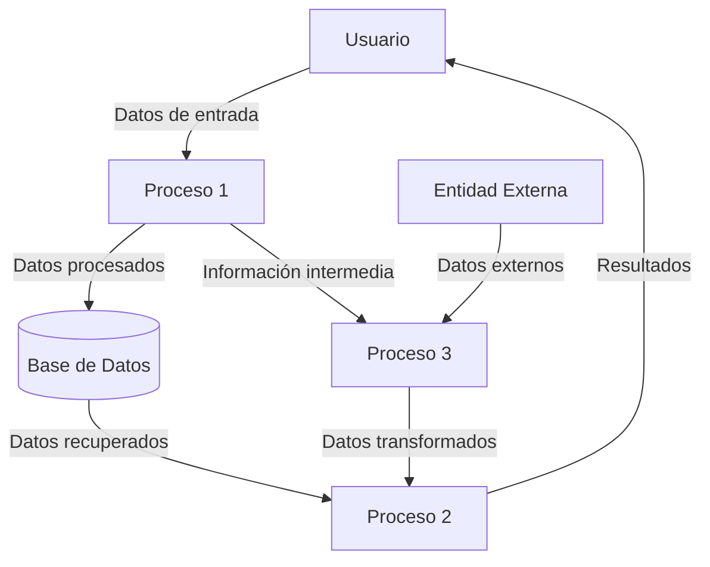
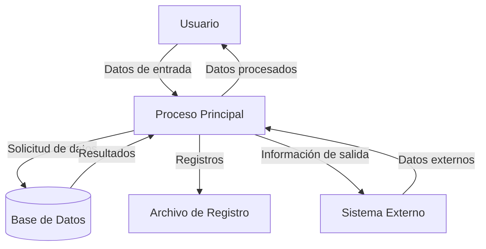

## Module: gtest_shuffle_test.py
# Análisis Integral del Módulo gtest_shuffle_test.py

## Nombre del Módulo/Componente SQL
**gtest_shuffle_test.py** - Un módulo de prueba para la funcionalidad de aleatorización (shuffle) en Google Test.

## Objetivos Primarios
Este módulo está diseñado para probar la funcionalidad de aleatorización (shuffle) en Google Test, verificando que las pruebas se ejecuten en un orden aleatorio cuando se especifica la opción `--gtest_shuffle`. El propósito principal es asegurar que la característica de aleatorización funcione correctamente y que las pruebas mantengan su independencia cuando se ejecutan en diferentes órdenes.

## Funciones, Métodos y Consultas Críticas
- `testShufflePreservesGrouping()`: Verifica que la aleatorización preserve el agrupamiento de pruebas dentro de sus suites.
- `testShuffleChangesOrder()`: Comprueba que la aleatorización efectivamente cambie el orden de ejecución de las pruebas.
- `testShuffleChangesOrderWithPositiveSeed()`: Verifica que la aleatorización con una semilla positiva cambie el orden de ejecución.
- `testShuffleReproducibleWithSameSeed()`: Asegura que la misma semilla produzca el mismo orden de ejecución.
- `testShuffleDifferentWithDifferentSeeds()`: Confirma que diferentes semillas produzcan diferentes órdenes de ejecución.

## Variables y Elementos Clave
- `COMMAND`: Variable que almacena el comando base para ejecutar las pruebas de Google Test.
- `TEST_FILTER`: Filtro para seleccionar solo las pruebas relevantes para la verificación.
- `SEED_FLAG`: Bandera para especificar la semilla de aleatorización.
- `SHUFFLE_FLAG`: Bandera para activar la aleatorización de pruebas.
- `RunAndExtractTestList()`: Función auxiliar que ejecuta las pruebas y extrae la lista de pruebas ejecutadas.

## Interdependencias y Relaciones
- Depende del ejecutable de prueba de Google Test (`gtest_shuffle_test_`) que debe estar disponible en el entorno de ejecución.
- Interactúa con el sistema operativo para ejecutar comandos y capturar su salida.
- Utiliza el módulo `gtest_test_utils` para funcionalidades auxiliares relacionadas con las pruebas.

## Operaciones Principales vs. Auxiliares
**Operaciones Principales:**
- Ejecución de pruebas con diferentes configuraciones de aleatorización.
- Verificación del orden de ejecución de las pruebas.

**Operaciones Auxiliares:**
- Extracción de la lista de pruebas ejecutadas de la salida del comando.
- Comparación de listas de pruebas para verificar cambios en el orden.
- Configuración de parámetros para las pruebas (semillas, filtros).

## Secuencia Operacional/Flujo de Ejecución
1. Definición de constantes y configuración inicial.
2. Ejecución de pruebas sin aleatorización para establecer un orden base.
3. Ejecución de pruebas con aleatorización para verificar cambios en el orden.
4. Ejecución de pruebas con semillas específicas para verificar reproducibilidad.
5. Comparación de resultados para validar el comportamiento esperado.
6. Generación de informes de éxito o fallo para cada caso de prueba.

## Aspectos de Rendimiento y Optimización
- El módulo ejecuta múltiples veces el mismo conjunto de pruebas, lo que puede ser costoso en tiempo si las pruebas son extensas.
- La captura y procesamiento de la salida del comando podría optimizarse para manejar grandes volúmenes de datos.
- No se observan problemas significativos de rendimiento dado el propósito específico del módulo.

## Reusabilidad y Adaptabilidad
- El código está diseñado específicamente para probar la funcionalidad de aleatorización de Google Test.
- Las funciones auxiliares como `RunAndExtractTestList()` podrían reutilizarse en otros módulos de prueba.
- La estructura general podría adaptarse para probar otras características de Google Test con modificaciones menores.

## Uso y Contexto
Este módulo se utiliza como parte del conjunto de pruebas de Google Test para verificar que la funcionalidad de aleatorización funcione correctamente. Es importante para garantizar que:
1. Las pruebas puedan ejecutarse en orden aleatorio sin fallar.
2. La aleatorización sea reproducible cuando se usa la misma semilla.
3. El agrupamiento de pruebas dentro de sus suites se mantenga incluso con aleatorización.

## Suposiciones y Limitaciones
**Suposiciones:**
- Se asume que el ejecutable `gtest_shuffle_test_` está disponible y funciona correctamente.
- Se asume que las pruebas individuales son independientes y pueden ejecutarse en cualquier orden.

**Limitaciones:**
- El módulo solo prueba la funcionalidad de aleatorización y no otras características de Google Test.
- La detección de cambios en el orden se basa en comparaciones simples, lo que podría no ser suficiente para casos más complejos.
- No verifica el comportamiento con un número muy grande de pruebas o con pruebas que tienen dependencias complejas.
## Flow Diagram [via mermaid]

## Module: gtest_shuffle_test.py
# Análisis Integral del Módulo gtest_shuffle_test.py

## Nombre del Módulo/Componente SQL
**gtest_shuffle_test.py** - Un módulo de prueba para la funcionalidad de aleatorización (shuffle) en Google Test.

## Objetivos Primarios
Este módulo está diseñado para probar la funcionalidad de aleatorización (shuffle) en Google Test, verificando que las pruebas se ejecuten en un orden aleatorio cuando se especifica la opción `--gtest_shuffle`. El propósito principal es asegurar que la característica de aleatorización funcione correctamente y que las pruebas mantengan su independencia cuando se ejecutan en diferentes órdenes.

## Funciones, Métodos y Consultas Críticas
- `testShufflePreservesGrouping()`: Verifica que la aleatorización preserve el agrupamiento de pruebas dentro de sus suites.
- `testShuffleChangesOrder()`: Comprueba que la aleatorización efectivamente cambie el orden de ejecución de las pruebas.
- `testShuffleChangesOrderWithPositiveSeed()`: Verifica que la aleatorización con una semilla positiva cambie el orden de ejecución.
- `testShuffleChangesOrderWithNegativeSeed()`: Verifica que la aleatorización con una semilla negativa cambie el orden de ejecución.
- `testShuffleSameOrderWithSameSeed()`: Asegura que la misma semilla produzca el mismo orden de ejecución.
- `testShuffleDifferentOrderWithDifferentSeeds()`: Comprueba que diferentes semillas produzcan diferentes órdenes de ejecución.

## Variables y Elementos Clave
- `COMMAND`: Comando base para ejecutar las pruebas de Google Test.
- `SUPPORTS_DEATH_TESTS`: Bandera que indica si las pruebas de muerte están soportadas.
- `HAS_ABSL_FLAGS`: Bandera que indica si se utilizan las banderas de Abseil.
- `SUPPORTS_CATCH_EXCEPTIONS`: Bandera que indica si se soporta la captura de excepciones.
- `GetOutputOfCommand()`: Función para obtener la salida de un comando ejecutado.
- `GetListOfTests()`: Función para obtener la lista de pruebas a partir de la salida.
- `GetTestExecutionOrder()`: Función para obtener el orden de ejecución de las pruebas.

## Interdependencias y Relaciones
- Depende del framework Google Test para ejecutar las pruebas.
- Utiliza el módulo `gtest_test_utils` para funciones auxiliares.
- Interactúa con el sistema operativo para ejecutar comandos y capturar su salida.
- Se relaciona con el binario de prueba `gtest_shuffle_test_` que contiene las pruebas a ejecutar.

## Operaciones Principales vs. Auxiliares
**Operaciones Principales:**
- Ejecución de pruebas con diferentes configuraciones de aleatorización.
- Verificación del orden de ejecución de las pruebas.

**Operaciones Auxiliares:**
- Obtención de la salida de comandos.
- Análisis de la salida para extraer información relevante.
- Comparación de órdenes de ejecución entre diferentes ejecuciones.

## Secuencia Operacional/Flujo de Ejecución
1. Cada prueba define un comando específico para ejecutar el binario de prueba.
2. Se ejecuta el comando y se captura su salida.
3. Se analiza la salida para determinar el orden de ejecución de las pruebas.
4. Se compara este orden con el esperado o con otros órdenes de ejecución.
5. Se verifica que se cumplan las condiciones específicas de cada prueba.

## Aspectos de Rendimiento y Optimización
- El módulo ejecuta múltiples veces el binario de prueba, lo que puede ser costoso en tiempo.
- La eficiencia depende de la velocidad de ejecución del binario de prueba y del procesamiento de su salida.
- No hay optimizaciones específicas para mejorar el rendimiento, ya que el enfoque está en la verificación de la funcionalidad.

## Reusabilidad y Adaptabilidad
- El código está diseñado específicamente para probar la funcionalidad de aleatorización de Google Test.
- Las funciones auxiliares podrían reutilizarse en otras pruebas que requieran ejecutar comandos y analizar su salida.
- La estructura de las pruebas podría adaptarse para verificar otras características de Google Test.

## Uso y Contexto
- Este módulo se utiliza como parte del conjunto de pruebas de Google Test para verificar la funcionalidad de aleatorización.
- Se ejecuta durante el proceso de prueba de Google Test para asegurar que la característica funcione correctamente.
- Es relevante para desarrolladores que trabajan en Google Test o que dependen de su funcionalidad de aleatorización.

## Suposiciones y Limitaciones
- Supone que el binario de prueba `gtest_shuffle_test_` está disponible y funciona correctamente.
- Asume que la salida del binario de prueba tiene un formato específico que puede ser analizado.
- Está limitado a probar la funcionalidad de aleatorización y no otras características de Google Test.
- Depende de la capacidad del sistema para ejecutar comandos y capturar su salida.
- Las pruebas podrían fallar en entornos donde la ejecución de comandos o la captura de salida no funcionen como se espera.
## Flow Diagram [via mermaid]

