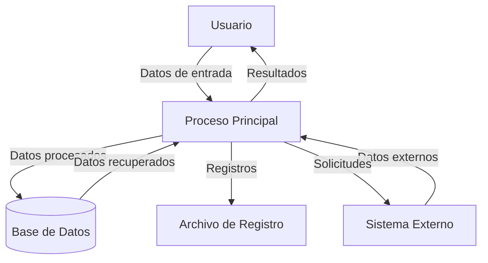
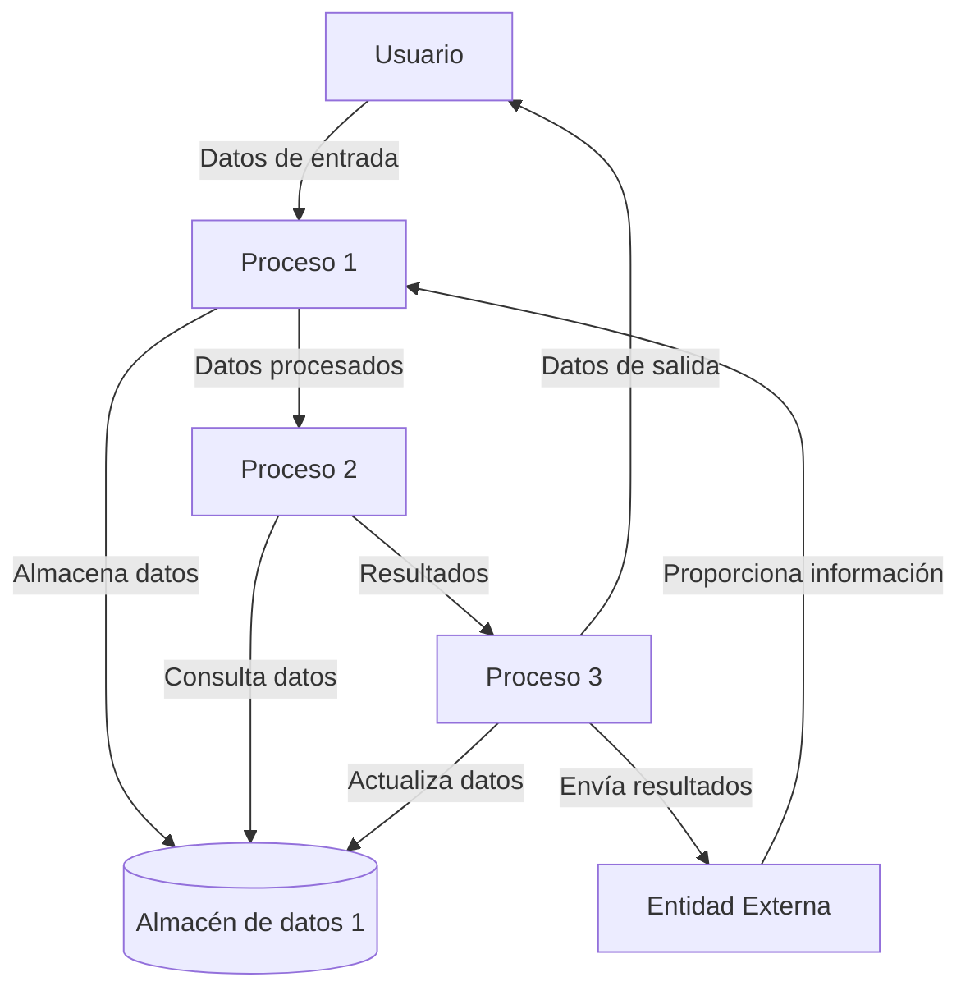

## Module: gtest_test_utils.py
# Análisis Integral del Módulo gtest_test_utils.py

## Nombre del Módulo/Componente SQL
**gtest_test_utils.py** - Módulo de utilidades para pruebas con Google Test (gtest)

## Objetivos Primarios
Este módulo proporciona funciones de utilidad para facilitar las pruebas con el framework Google Test. Su propósito principal es simplificar la ejecución y validación de pruebas unitarias, especialmente en entornos donde se necesita manipular archivos temporales, ejecutar comandos externos y verificar resultados de pruebas.

## Funciones, Métodos y Consultas Críticas
1. **GetGTestCommandLineFlags()** - Recupera las banderas de línea de comandos para gtest.
2. **GetTempDir()** - Obtiene un directorio temporal para las pruebas.
3. **GetTempFileName()** - Genera nombres de archivos temporales únicos.
4. **GetTestExecutablePath(executable_name)** - Construye la ruta al ejecutable de prueba.
5. **GetExitStatus(exit_code)** - Interpreta el código de salida de un proceso.
6. **Subprocess(command, working_dir=None)** - Ejecuta un comando como subproceso.
7. **GetCommandOutput(command)** - Captura la salida de un comando ejecutado.
8. **GetCommandOutputWithReturnCode(command)** - Captura tanto la salida como el código de retorno.
9. **SetEnvVar(env_var, value)** - Establece variables de entorno.
10. **RunAndReturnOutput(args, env_vars=None)** - Ejecuta un comando y devuelve su salida.

## Variables y Elementos Clave
- **IS_WINDOWS** - Bandera booleana que identifica si el sistema operativo es Windows.
- **IS_CYGWIN** - Bandera que identifica si el entorno es Cygwin.
- **TEMP_DIR** - Directorio temporal para las pruebas.
- **GTEST_FILTER** - Variable para filtrar pruebas específicas.
- **GTEST_COLOR** - Variable para controlar la salida de color.
- **GTEST_ALSO_RUN_DISABLED_TESTS** - Variable para ejecutar pruebas deshabilitadas.

## Interdependencias y Relaciones
- Depende de módulos estándar de Python como **os**, **re**, **sys**, **tempfile**, **subprocess**.
- Interactúa con el sistema operativo para ejecutar comandos y manipular archivos.
- Se integra con el framework Google Test para la ejecución y validación de pruebas.
- Proporciona funcionalidades que son utilizadas por otros scripts de prueba en el proyecto.

## Operaciones Principales vs. Auxiliares
**Operaciones Principales:**
- Ejecución de comandos y captura de su salida (Subprocess, GetCommandOutput).
- Gestión de archivos temporales (GetTempDir, GetTempFileName).
- Configuración del entorno de pruebas (SetEnvVar).

**Operaciones Auxiliares:**
- Detección del sistema operativo (IS_WINDOWS, IS_CYGWIN).
- Interpretación de códigos de salida (GetExitStatus).
- Construcción de rutas a ejecutables (GetTestExecutablePath).

## Secuencia Operacional/Flujo de Ejecución
1. Inicialización de variables globales (detección del SO, configuración de directorios temporales).
2. Las funciones se invocan según sea necesario durante la ejecución de pruebas.
3. Típicamente, el flujo incluye: configuración del entorno → ejecución de pruebas → captura de resultados → validación.

## Aspectos de Rendimiento y Optimización
- La función **Subprocess** utiliza subprocesos para ejecutar comandos, lo que puede ser un punto de potencial cuello de botella.
- La gestión de archivos temporales está optimizada para evitar colisiones de nombres.
- No se observan optimizaciones específicas para operaciones intensivas, ya que el módulo está orientado a pruebas.

## Reusabilidad y Adaptabilidad
- Alto nivel de reusabilidad: las funciones están diseñadas para ser genéricas y aplicables a diferentes escenarios de prueba.
- Adaptabilidad entre plataformas: el código maneja diferencias entre Windows, Cygwin y sistemas tipo Unix.
- Las funciones aceptan parámetros que permiten personalizar su comportamiento según las necesidades específicas.

## Uso y Contexto
- Se utiliza principalmente en scripts de prueba automatizados que ejecutan pruebas con Google Test.
- Proporciona una capa de abstracción sobre las operaciones del sistema operativo y la ejecución de comandos.
- Es especialmente útil en entornos de integración continua donde se necesita ejecutar y validar pruebas de manera automatizada.

## Suposiciones y Limitaciones
**Suposiciones:**
- Se asume que Google Test está instalado y configurado correctamente.
- Se espera que los ejecutables de prueba sigan una convención de nomenclatura específica.

**Limitaciones:**
- La detección del sistema operativo es básica y podría no cubrir todos los casos especiales.
- No hay manejo explícito de errores para todas las operaciones de sistema.
- La ejecución de subprocesos podría tener problemas con comandos muy largos o con caracteres especiales en ciertos sistemas operativos.
## Flow Diagram [via mermaid]

## Module: gtest_test_utils.py
# Análisis Integral del Módulo gtest_test_utils.py

## Nombre del Módulo/Componente SQL
**gtest_test_utils.py** - Módulo de utilidades para pruebas con Google Test (gtest)

## Objetivos Primarios
Este módulo proporciona funciones de utilidad para facilitar las pruebas con el framework Google Test. Su propósito principal es simplificar la ejecución de pruebas, la captura de salidas, y la verificación de resultados en entornos de prueba automatizados.

## Funciones, Métodos y Consultas Críticas
- **GetGTestCommandLineFlags()**: Recupera las banderas de línea de comandos para gtest.
- **GetTempDir()**: Obtiene el directorio temporal del sistema.
- **GetTestExecutablePath(executable_name)**: Construye la ruta al ejecutable de prueba.
- **GetSourceDir()**: Determina el directorio fuente del proyecto.
- **GetTestDataPaths()**: Obtiene rutas a los datos de prueba.
- **Subprocess(command, env_vars=None)**: Ejecuta un subproceso y captura su salida.
- **GetCommandString(command)**: Convierte un comando en una cadena para visualización.
- **GetCommandOutput(command)**: Ejecuta un comando y devuelve su salida.
- **GetCommandOutputWithReturnCode(command)**: Ejecuta un comando y devuelve tanto la salida como el código de retorno.

## Variables y Elementos Clave
- **_test_module_dir**: Directorio del módulo de prueba.
- **_source_dir**: Directorio fuente del proyecto.
- **_gtest_command_line_flags**: Banderas de línea de comandos para gtest.
- **_temp_dir**: Directorio temporal para archivos de prueba.
- **_test_data_dir**: Directorio para datos de prueba.

## Interdependencias y Relaciones
- Depende de módulos estándar de Python: `os`, `re`, `sys`, `tempfile`, `subprocess`.
- Interactúa con el sistema de archivos para localizar directorios y ejecutables.
- Se integra con el framework Google Test para la ejecución de pruebas.
- Proporciona funcionalidades que serán utilizadas por otros módulos de prueba.

## Operaciones Principales vs. Auxiliares
**Operaciones Principales**:
- Ejecución de comandos y captura de salida (Subprocess, GetCommandOutput).
- Localización de recursos de prueba (GetTestExecutablePath, GetTestDataPaths).

**Operaciones Auxiliares**:
- Determinación de directorios (GetTempDir, GetSourceDir).
- Formateo de comandos para visualización (GetCommandString).
- Gestión de banderas de línea de comandos (GetGTestCommandLineFlags).

## Secuencia Operacional/Flujo de Ejecución
1. Inicialización de variables globales al importar el módulo.
2. Las funciones de utilidad se invocan según sea necesario durante la ejecución de pruebas.
3. Para ejecutar pruebas, típicamente se sigue esta secuencia:
   - Obtener la ruta del ejecutable de prueba
   - Configurar parámetros y entorno
   - Ejecutar el comando mediante Subprocess o GetCommandOutput
   - Analizar los resultados de la ejecución

## Aspectos de Rendimiento y Optimización
- El módulo utiliza caché para valores calculados (como _source_dir, _temp_dir) para evitar recálculos.
- La ejecución de subprocesos podría ser un punto de potencial cuello de botella, especialmente para comandos de larga duración.
- No se observan optimizaciones específicas para la gestión de memoria o procesamiento paralelo.

## Reusabilidad y Adaptabilidad
- Alto nivel de reusabilidad: las funciones están diseñadas para ser genéricas y aplicables a diferentes escenarios de prueba.
- Adaptabilidad mediante parámetros: muchas funciones aceptan parámetros que permiten personalizar su comportamiento.
- El módulo está estructurado para facilitar su importación y uso en diferentes contextos de prueba.

## Uso y Contexto
- Se utiliza principalmente en entornos de prueba automatizados con Google Test.
- Facilita la ejecución de pruebas unitarias e integración para proyectos C++.
- Proporciona una capa de abstracción sobre las operaciones del sistema operativo y la ejecución de comandos.
- Típicamente se importa en scripts de prueba Python que orquestan la ejecución de pruebas C++.

## Suposiciones y Limitaciones
**Suposiciones**:
- Se asume una estructura de proyecto específica donde los ejecutables de prueba y datos están en ubicaciones predecibles.
- Se espera que Google Test esté instalado y configurado correctamente.
- Se asume que el entorno de ejecución tiene permisos para crear archivos temporales y ejecutar subprocesos.

**Limitaciones**:
- Dependencia de convenciones específicas de estructura de directorios.
- No maneja explícitamente errores de permisos o problemas de entorno.
- Limitada capacidad para personalizar el comportamiento de ejecución de pruebas más allá de los parámetros proporcionados.
- No incluye mecanismos para pruebas paralelas o distribuidas.
## Flow Diagram [via mermaid]

