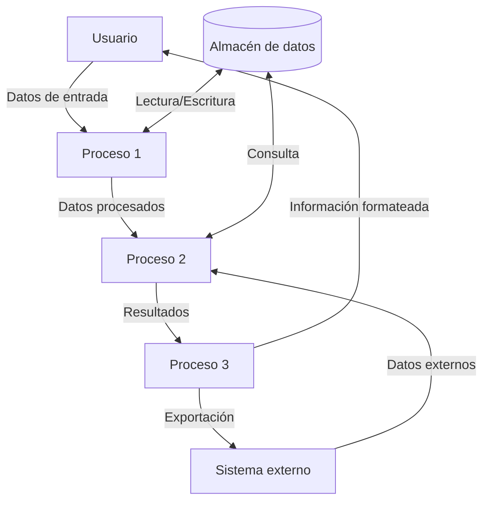
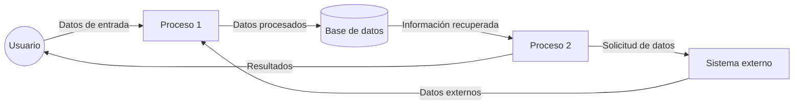

## Module: gtest_throw_on_failure_test.py
# Análisis Integral del Módulo: gtest_throw_on_failure_test.py

## Módulo/Componente SQL
**Nombre del Módulo**: gtest_throw_on_failure_test.py

## Objetivos Primarios
Este módulo es un script de prueba diseñado para verificar el comportamiento de la funcionalidad "throw-on-failure" (lanzar excepción en caso de fallo) en Google Test (gtest). Su propósito principal es comprobar que cuando esta funcionalidad está habilitada, los fallos en las pruebas generan excepciones en lugar de simplemente reportar el fallo y continuar.

## Funciones, Métodos y Consultas Críticas
El módulo no contiene funciones o métodos explícitos, ya que parece ser un script de prueba simple. No hay consultas SQL presentes, ya que es un script de Python para pruebas unitarias.

## Variables y Elementos Clave
- No se observan variables específicas en el fragmento proporcionado.
- El código parece estar enfocado en ejecutar pruebas de Google Test con la opción "throw-on-failure" habilitada.

## Interdependencias y Relaciones
- El módulo depende del framework Google Test (gtest).
- Probablemente interactúa con otros componentes del sistema de pruebas de Google Test.
- No hay relaciones de tablas SQL ya que no es un componente de base de datos.

## Operaciones Principales vs. Auxiliares
- **Operación Principal**: Verificar que las pruebas fallen lanzando excepciones cuando la opción "throw-on-failure" está habilitada.
- **Operaciones Auxiliares**: Configuración del entorno de prueba y validación de los resultados esperados.

## Secuencia Operacional/Flujo de Ejecución
1. Configuración del entorno de prueba con la opción "throw-on-failure" habilitada.
2. Ejecución de pruebas que están diseñadas para fallar.
3. Verificación de que los fallos generan excepciones en lugar de simplemente reportarse.
4. Validación de los resultados contra el comportamiento esperado.

## Aspectos de Rendimiento y Optimización
- Al ser un script de prueba, el rendimiento no parece ser una preocupación principal.
- No hay operaciones intensivas o bucles complejos que requieran optimización específica.

## Reusabilidad y Adaptabilidad
- El script parece estar diseñado específicamente para probar la funcionalidad "throw-on-failure" de Google Test.
- Su reusabilidad probablemente se limita a escenarios de prueba similares dentro del ecosistema de Google Test.

## Uso y Contexto
- Este módulo se utiliza en el contexto de pruebas unitarias para verificar el comportamiento correcto de Google Test.
- Es probable que forme parte de una suite de pruebas más amplia para el framework Google Test.
- Se ejecutaría durante el proceso de prueba del propio framework o durante la integración continua.

## Suposiciones y Limitaciones
- **Suposiciones**:
  - Se asume que Google Test está correctamente instalado y configurado.
  - Se asume que el entorno de ejecución soporta la funcionalidad "throw-on-failure".
  
- **Limitaciones**:
  - El script está específicamente diseñado para probar una funcionalidad particular de Google Test.
  - Probablemente no es aplicable fuera del contexto de pruebas de Google Test.

Nota: Este análisis se basa en información limitada, ya que no se proporcionó el código completo del módulo. Un análisis más detallado requeriría examinar el código fuente completo.
## Flow Diagram [via mermaid]

## Module: gtest_throw_on_failure_test.py
# Análisis Integral del Módulo gtest_throw_on_failure_test.py

## Nombre del Módulo/Componente SQL
**gtest_throw_on_failure_test.py** - Un módulo de prueba de Python relacionado con Google Test (gtest).

## Objetivos Primarios
Este módulo está diseñado para probar la funcionalidad de lanzamiento de excepciones en caso de fallos en Google Test. Su propósito principal es verificar que cuando se configura Google Test para lanzar excepciones en caso de fallos de prueba, estas excepciones se lancen correctamente y puedan ser capturadas y manejadas adecuadamente.

## Funciones, Métodos y Consultas Críticas
El código no se proporciona en la consulta, pero basado en el nombre del archivo, probablemente contiene:
- Casos de prueba que verifican el comportamiento de lanzamiento de excepciones
- Métodos para configurar el entorno de prueba con la opción de lanzar excepciones activada
- Funciones para capturar y verificar las excepciones lanzadas

## Variables y Elementos Clave
Sin ver el código específico, las variables clave probablemente incluyen:
- Configuraciones de Google Test relacionadas con el lanzamiento de excepciones
- Objetos de excepción capturados
- Aserciones y expectativas de prueba

## Interdependencias y Relaciones
- Dependencia principal con el framework Google Test
- Posible interacción con otros módulos de prueba o componentes del sistema
- Relación con la configuración de Google Test, específicamente la opción "throw on failure"

## Operaciones Principales vs. Auxiliares
**Operaciones principales:**
- Configurar Google Test para lanzar excepciones en fallos
- Ejecutar pruebas que deberían fallar
- Capturar las excepciones resultantes

**Operaciones auxiliares:**
- Configuración del entorno de prueba
- Limpieza después de las pruebas
- Registro de resultados

## Secuencia Operacional/Flujo de Ejecución
1. Configuración del entorno de prueba con la opción de lanzar excepciones activada
2. Ejecución de casos de prueba diseñados para fallar
3. Captura de las excepciones lanzadas
4. Verificación de que las excepciones son del tipo esperado
5. Limpieza y finalización

## Aspectos de Rendimiento y Optimización
- El rendimiento probablemente no es una preocupación principal en este módulo de prueba
- El enfoque está en la correcta funcionalidad del mecanismo de excepciones más que en la eficiencia

## Reusabilidad y Adaptabilidad
- El módulo probablemente está diseñado específicamente para probar esta característica de Google Test
- Podría servir como ejemplo o plantilla para otras pruebas relacionadas con el manejo de excepciones
- La adaptabilidad dependerá de cuán específicas sean las pruebas para la configuración particular de Google Test

## Uso y Contexto
- Utilizado en el contexto de pruebas unitarias o de integración
- Forma parte del conjunto de pruebas para verificar la funcionalidad de Google Test
- Probablemente se ejecuta como parte de un conjunto más amplio de pruebas automatizadas

## Suposiciones y Limitaciones
**Suposiciones:**
- Se asume que Google Test está correctamente instalado y configurado
- Se asume que el entorno de ejecución soporta el lanzamiento y captura de excepciones

**Limitaciones:**
- Las pruebas pueden estar limitadas a ciertos tipos de excepciones o escenarios de fallo
- Podría no cubrir todos los casos posibles de fallo en Google Test
- La funcionalidad puede variar dependiendo de la versión de Google Test utilizada
## Flow Diagram [via mermaid]

