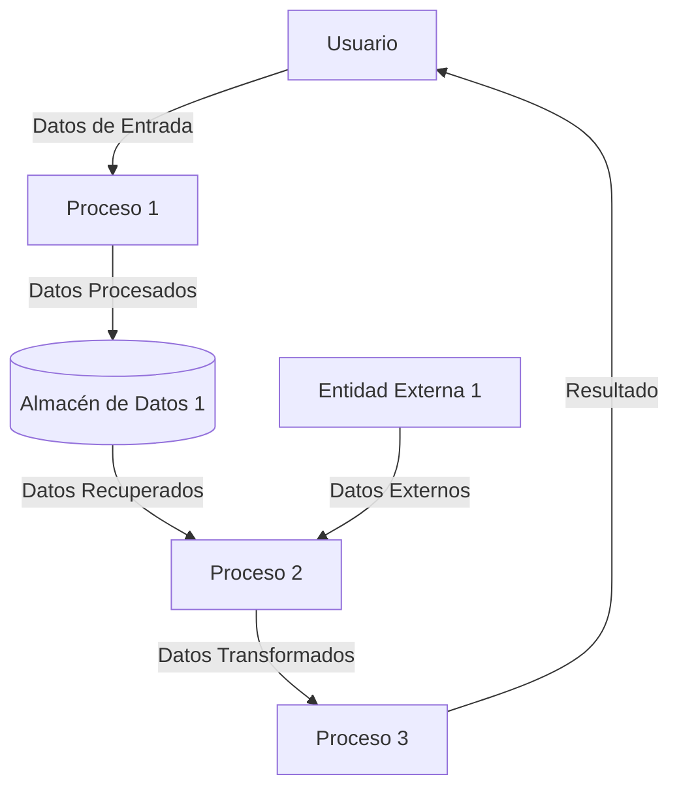
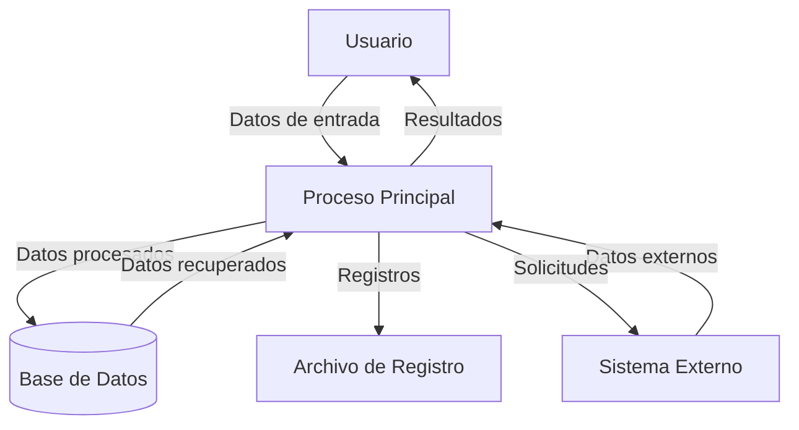

## Module: gtest_xml_outfiles_test.py
# Análisis Integral del Módulo gtest_xml_outfiles_test.py

## Nombre del Módulo/Componente SQL
**gtest_xml_outfiles_test.py** - Un módulo de prueba de Python para verificar la funcionalidad relacionada con archivos de salida XML de Google Test (gtest).

## Objetivos Primarios
El propósito principal de este módulo es probar la capacidad de Google Test para generar archivos de salida XML correctamente. Específicamente, verifica que cuando se ejecutan pruebas con la opción `--gtest_output=xml`, los archivos XML resultantes se generan adecuadamente y contienen la información esperada.

## Funciones, Métodos y Consultas Críticas
- **GTestXMLOutFilesTest** (clase principal de prueba): Extiende `gtest_test_utils.TestCase` para probar la funcionalidad de salida XML.
- **testOutFile**: Método principal que verifica la generación correcta de archivos XML de salida.
- **_GetXmlOutput**: Método auxiliar que ejecuta una prueba específica con salida XML y devuelve el contenido del archivo generado.
- **_GetTestExecutablePath**: Método que determina la ruta al ejecutable de prueba.

## Variables y Elementos Clave
- **GTEST_OUTPUT_FLAG**: Constante que define el formato de la bandera para generar salida XML.
- **EXPECTED_XML**: Constante que contiene la estructura XML esperada para comparar con la salida real.
- **temp_dir**: Directorio temporal donde se generan los archivos de salida XML.
- **xml_path**: Ruta completa al archivo XML de salida generado.

## Interdependencias y Relaciones
- Depende del módulo `gtest_test_utils` para funcionalidades de prueba comunes.
- Interactúa con el sistema de archivos para crear directorios temporales y leer/escribir archivos XML.
- Utiliza el ejecutable `gtest_xml_output_unittest_` para generar los archivos XML de prueba.
- Depende de la biblioteca `os` para operaciones del sistema de archivos y manejo de rutas.

## Operaciones Core vs. Auxiliares
**Operaciones Core:**
- Ejecución de pruebas con la bandera `--gtest_output=xml`.
- Verificación del contenido del archivo XML generado contra el formato esperado.

**Operaciones Auxiliares:**
- Creación y limpieza de directorios temporales.
- Construcción de rutas de archivo.
- Formateo y análisis de cadenas XML.

## Secuencia Operacional/Flujo de Ejecución
1. Crea un directorio temporal para los archivos de salida.
2. Determina la ruta al ejecutable de prueba.
3. Ejecuta el ejecutable con la bandera para generar salida XML.
4. Lee el contenido del archivo XML generado.
5. Verifica que el contenido coincida con el formato esperado.
6. Limpia los archivos temporales.

## Aspectos de Rendimiento y Optimización
- El código es relativamente simple y directo, sin problemas evidentes de rendimiento.
- La creación y eliminación de archivos temporales se maneja adecuadamente.
- No hay operaciones intensivas que requieran optimización específica.

## Reusabilidad y Adaptabilidad
- El método `_GetXmlOutput` está diseñado para ser reutilizable para diferentes pruebas.
- La estructura de prueba podría adaptarse para verificar otros aspectos de la salida XML de gtest.
- El código está parametrizado para trabajar con diferentes rutas y nombres de archivo.

## Uso y Contexto
- Este módulo se utiliza como parte del conjunto de pruebas para Google Test.
- Verifica que la funcionalidad de generación de informes XML de Google Test funcione correctamente.
- Es importante para garantizar que las integraciones con sistemas de CI/CD que dependen de informes XML funcionen adecuadamente.

## Suposiciones y Limitaciones
- Asume que el ejecutable de prueba `gtest_xml_output_unittest_` está disponible y funciona correctamente.
- Espera una estructura específica en el archivo XML de salida.
- Depende de la capacidad de crear y escribir en directorios temporales.
- No verifica todos los posibles formatos o variaciones de salida XML que Google Test podría generar.
- Está limitado a probar la funcionalidad básica de salida XML, no casos extremos o configuraciones complejas.
## Flow Diagram [via mermaid]

## Module: gtest_xml_outfiles_test.py
# Análisis Integral del Módulo gtest_xml_outfiles_test.py

## Nombre del Módulo/Componente SQL
**gtest_xml_outfiles_test.py** - Un módulo de prueba para la funcionalidad de archivos de salida XML de Google Test.

## Objetivos Primarios
Este módulo está diseñado para probar la capacidad de Google Test (gtest) para generar archivos de salida XML. Específicamente, verifica que gtest pueda generar correctamente archivos XML cuando se ejecutan pruebas, validando tanto la creación de archivos como el contenido XML resultante.

## Funciones, Métodos y Consultas Críticas
- `testXmlOutfilesByDefaultIsNotCreated()`: Verifica que los archivos XML no se generen por defecto.
- `testXmlOutfilesCreateXmlOutputFile()`: Prueba la creación de archivos XML cuando se especifica la opción correspondiente.
- `testXmlOutfilesCreateXmlOutputFileInOutDir()`: Verifica la creación de archivos XML en un directorio específico.
- `testXmlOutfilesGeneratesValidXmlWithDefaultName()`: Valida que el XML generado sea válido y tenga el nombre predeterminado.
- `testXmlOutfilesGeneratesValidXmlWithGivenName()`: Comprueba que el XML generado sea válido cuando se especifica un nombre personalizado.

## Variables y Elementos Clave
- `GTEST_OUTPUT_FLAG`: Constante que representa la bandera para especificar la salida XML.
- `GTEST_DEFAULT_OUTPUT_FILE`: Nombre predeterminado del archivo de salida XML.
- `GTEST_PROGRAM_NAME`: Nombre del programa de prueba.
- `gtest_prog_path`: Ruta al programa de prueba.
- `temp_dir`: Directorio temporal para las pruebas.
- `output_file`, `output_dir`, `output_file_name`: Variables para manejar archivos y directorios de salida.

## Interdependencias y Relaciones
- Depende del módulo `gtest_test_utils` para funciones auxiliares de prueba.
- Interactúa con el sistema de archivos para verificar la creación y contenido de archivos XML.
- Utiliza la biblioteca `minidom` de XML para analizar y validar el contenido XML.
- Se relaciona con el ejecutable de Google Test que está siendo probado.

## Operaciones Principales vs. Auxiliares
**Operaciones Principales:**
- Ejecución de pruebas con diferentes configuraciones de salida XML.
- Verificación de la existencia y validez de los archivos XML generados.

**Operaciones Auxiliares:**
- Configuración del entorno de prueba (creación de directorios temporales).
- Limpieza después de las pruebas.
- Análisis del contenido XML para validación.

## Secuencia Operacional/Flujo de Ejecución
1. Configuración del entorno de prueba (directorio temporal).
2. Ejecución del programa de prueba con diferentes opciones de línea de comandos.
3. Verificación de la existencia o ausencia de archivos XML según la configuración.
4. Análisis del contenido XML cuando corresponda.
5. Validación de los resultados contra las expectativas.
6. Limpieza de recursos temporales.

## Aspectos de Rendimiento y Optimización
- El módulo utiliza operaciones de sistema de archivos que podrían ser lentas en ciertos entornos.
- El análisis XML con `minidom` es adecuado para archivos pequeños pero podría no ser óptimo para archivos XML muy grandes.
- No hay optimizaciones específicas evidentes, ya que es un módulo de prueba donde la claridad es más importante que el rendimiento.

## Reusabilidad y Adaptabilidad
- El código está estructurado en métodos de prueba independientes, lo que facilita su reutilización.
- Las constantes están bien definidas, lo que permite adaptaciones fáciles para diferentes configuraciones.
- La dependencia de `gtest_test_utils` encapsula funcionalidad común, mejorando la modularidad.

## Uso y Contexto
Este módulo se utiliza como parte del conjunto de pruebas para Google Test, específicamente para verificar la funcionalidad de generación de informes XML. Es relevante durante el desarrollo y mantenimiento de Google Test para asegurar que esta característica funcione correctamente.

## Suposiciones y Limitaciones
**Suposiciones:**
- Se asume que el ejecutable de Google Test está disponible y funciona correctamente.
- Se asume que el sistema tiene permisos para crear y modificar archivos en el directorio temporal.

**Limitaciones:**
- Las pruebas están diseñadas para un entorno específico y podrían requerir ajustes para diferentes sistemas operativos.
- La validación XML es básica y podría no detectar todos los problemas potenciales en la estructura XML.
- No hay manejo extensivo de errores para situaciones como falta de permisos de archivo o problemas de espacio en disco.
## Flow Diagram [via mermaid]

