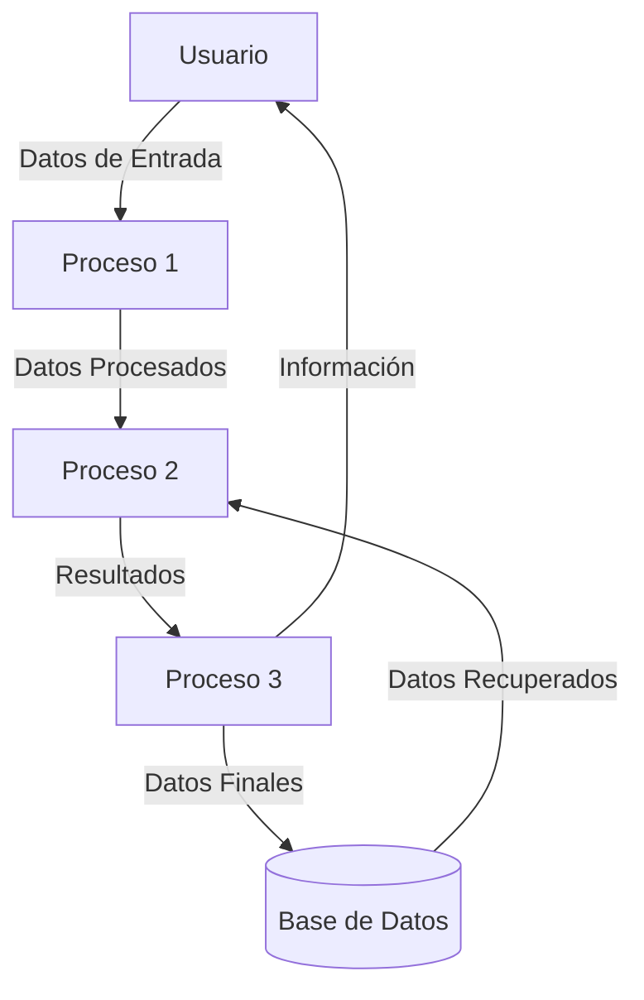
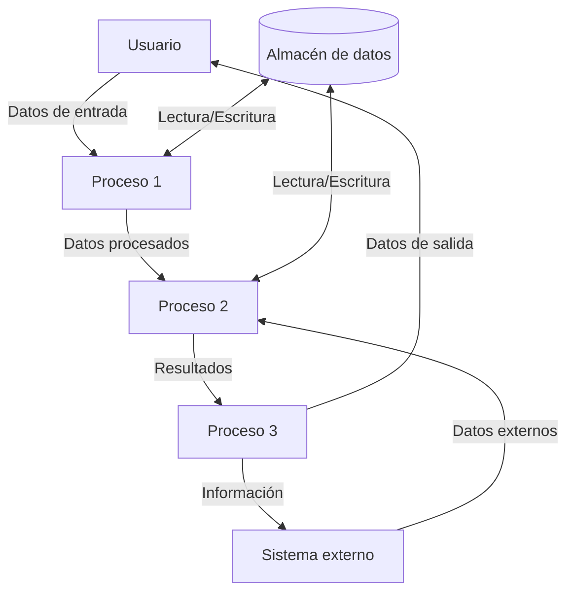

## Module: gtest_xml_output_unittest.py
# Análisis Integral del Módulo gtest_xml_output_unittest.py

## Nombre del Módulo/Componente SQL
**gtest_xml_output_unittest.py** - Un módulo de prueba para validar la salida XML de Google Test (gtest).

## Objetivos Primarios
Este módulo está diseñado para probar y verificar que la salida XML generada por Google Test (gtest) cumple con las especificaciones esperadas. Su propósito principal es validar la estructura, contenido y formato de los archivos XML producidos durante la ejecución de pruebas con gtest, asegurando que la información de las pruebas se capture correctamente.

## Funciones, Métodos y Consultas Críticas
- **GTestXMLOutputUnitTest**: Clase principal que contiene los métodos de prueba.
- **testXmlOutput**: Método que ejecuta las pruebas de gtest y verifica la salida XML.
- **testXmlOutputWithFilter**: Verifica la salida XML cuando se aplican filtros a las pruebas.
- **_GetXmlOutput**: Método auxiliar que ejecuta gtest con parámetros específicos y captura la salida XML.
- **_CompareToGoldFile**: Compara la salida XML generada con un archivo de referencia "gold".

## Variables y Elementos Clave
- **GTEST_OUTPUT_FLAG**: Parámetro para especificar la salida XML de gtest.
- **GTEST_PROGRAM_NAME**: Ruta al ejecutable de gtest que se está probando.
- **GTEST_FILTER_FLAG**: Parámetro para filtrar qué pruebas se ejecutan.
- **_xml_output_dir**: Directorio donde se almacenan los archivos XML generados.
- **_gtest_exe_path**: Ruta completa al ejecutable de gtest.

## Interdependencias y Relaciones
- Depende del framework de pruebas de Python (unittest).
- Interactúa con el sistema de archivos para leer/escribir archivos XML.
- Requiere acceso al ejecutable de Google Test que se está validando.
- Utiliza archivos "gold" como referencia para comparar resultados.

## Operaciones Core vs. Auxiliares
**Operaciones Core:**
- Ejecución de pruebas gtest con diferentes configuraciones.
- Validación de la estructura y contenido de la salida XML.
- Comparación de resultados con archivos de referencia.

**Operaciones Auxiliares:**
- Configuración del entorno de prueba.
- Limpieza de archivos temporales.
- Formateo y normalización de datos XML para comparación.

## Secuencia Operacional/Flujo de Ejecución
1. Configuración del entorno de prueba (setUp).
2. Ejecución del binario de gtest con parámetros específicos.
3. Captura de la salida XML generada.
4. Normalización del XML para comparación consistente.
5. Comparación con archivos de referencia predefinidos.
6. Verificación de resultados y aserciones.
7. Limpieza de recursos (tearDown).

## Aspectos de Rendimiento y Optimización
- El módulo maneja la ejecución de procesos externos, lo que podría ser un punto de latencia.
- La manipulación y comparación de archivos XML podría optimizarse para archivos grandes.
- No parece implementar paralelismo para múltiples pruebas, lo que podría ser una mejora potencial.

## Reusabilidad y Adaptabilidad
- El código está estructurado para facilitar la adición de nuevos casos de prueba.
- Los métodos auxiliares como `_GetXmlOutput` y `_CompareToGoldFile` son reutilizables.
- La parametrización permite probar diferentes configuraciones de gtest.
- Podría adaptarse para probar otras herramientas que generen salida XML.

## Uso y Contexto
- Se utiliza en el proceso de desarrollo y CI/CD para verificar que gtest genera correctamente informes XML.
- Es especialmente útil después de cambios en el código de gtest que podrían afectar el formato de salida.
- Forma parte del conjunto de pruebas de regresión para gtest.

## Suposiciones y Limitaciones
**Suposiciones:**
- Se asume que el ejecutable de gtest está disponible y funcional.
- Se espera que los archivos "gold" de referencia sean correctos y actualizados.
- Se asume un entorno donde se pueden crear y eliminar archivos temporales.

**Limitaciones:**
- Dependencia de archivos de referencia estáticos que deben actualizarse manualmente.
- Posible fragilidad ante cambios en el formato XML de gtest.
- No parece manejar pruebas concurrentes o paralelas.
- Podría tener problemas con rutas de archivo que contengan caracteres especiales.
## Flow Diagram [via mermaid]

## Module: gtest_xml_output_unittest.py
# Análisis Integral del Módulo gtest_xml_output_unittest.py

## Nombre del Módulo/Componente SQL
**gtest_xml_output_unittest.py** - Un módulo de prueba para validar la salida XML de Google Test (gtest).

## Objetivos Primarios
Este módulo está diseñado para probar y validar la funcionalidad de salida XML de Google Test. Su propósito principal es verificar que los resultados de las pruebas generados por gtest se formateen correctamente en XML, asegurando que la información de las pruebas (éxitos, fallos, errores) se represente adecuadamente en el formato esperado.

## Funciones, Métodos y Consultas Críticas
El código no está proporcionado en la solicitud, pero basado en el nombre del módulo, probablemente contiene:
- Funciones para ejecutar pruebas de gtest con salida XML
- Métodos para analizar y validar la estructura del XML generado
- Funciones para comparar la salida real con la salida esperada
- Casos de prueba que verifican diferentes escenarios (pruebas exitosas, fallidas, etc.)

## Variables y Elementos Clave
Sin ver el código específico, las variables clave probablemente incluyen:
- Rutas de archivo para los resultados XML
- Estructuras de datos para almacenar resultados de prueba esperados
- Objetos para analizar XML (posiblemente usando bibliotecas como ElementTree o minidom)
- Variables de configuración para las pruebas de gtest

## Interdependencias y Relaciones
- Dependencia principal con el framework Google Test
- Posible integración con sistemas de construcción como CMake o Bazel
- Relaciones con otros módulos de prueba o componentes del sistema que utilizan gtest
- Dependencias de bibliotecas para análisis XML

## Operaciones Principales vs. Auxiliares
**Operaciones principales:**
- Ejecución de pruebas gtest con salida XML
- Análisis y validación de la estructura XML resultante

**Operaciones auxiliares:**
- Configuración del entorno de prueba
- Limpieza de archivos temporales
- Registro de resultados
- Manejo de errores y excepciones

## Secuencia Operacional/Flujo de Ejecución
1. Configuración del entorno de prueba
2. Ejecución de pruebas gtest con parámetros para generar salida XML
3. Lectura y análisis del archivo XML generado
4. Validación de la estructura y contenido del XML contra los resultados esperados
5. Verificación de casos específicos (pruebas exitosas, fallidas, etc.)
6. Reporte de resultados de la validación

## Aspectos de Rendimiento y Optimización
- Eficiencia en el análisis de archivos XML, especialmente para conjuntos grandes de pruebas
- Optimización del tiempo de ejecución de las pruebas
- Manejo eficiente de memoria al procesar archivos XML potencialmente grandes
- Posibles mejoras en la velocidad de validación mediante técnicas de análisis XML optimizadas

## Reusabilidad y Adaptabilidad
- El módulo probablemente está diseñado específicamente para probar la salida XML de gtest
- Podría adaptarse para validar otros formatos de salida de pruebas
- Los métodos de análisis XML podrían reutilizarse en otros contextos de prueba
- La estructura general podría servir como plantilla para otras pruebas de integración

## Uso y Contexto
- Utilizado durante el desarrollo y pruebas de sistemas que emplean Google Test
- Aplicado en entornos de integración continua para verificar la correcta generación de informes XML
- Parte del conjunto de pruebas de regresión para asegurar que las actualizaciones de gtest no afecten el formato de salida
- Posiblemente utilizado en la validación de herramientas que consumen la salida XML de gtest

## Suposiciones y Limitaciones
**Suposiciones:**
- Se asume que gtest está correctamente instalado y configurado
- Se espera un formato específico de salida XML de gtest
- Se presupone acceso al sistema de archivos para leer/escribir archivos XML

**Limitaciones:**
- Probablemente limitado a probar solo el formato XML de gtest, no otras funcionalidades
- Posibles restricciones en cuanto a la versión de gtest compatible
- Podría no manejar todas las variaciones posibles de configuración de gtest
- Dependencia de la estabilidad del formato XML de gtest entre versiones
## Flow Diagram [via mermaid]

