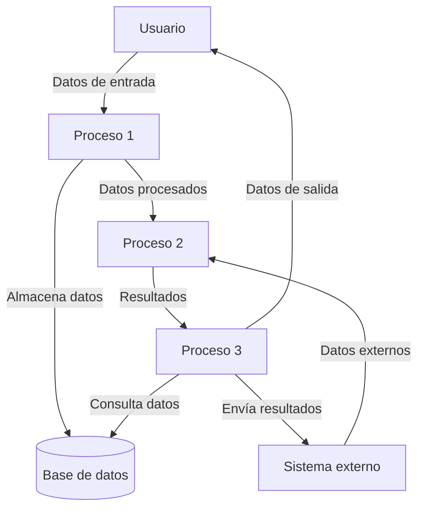
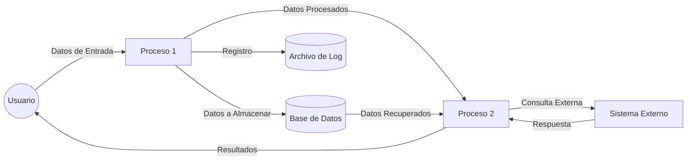

## Module: gtest_xml_test_utils.py
# Análisis Integral del Módulo gtest_xml_test_utils.py

## Nombre del Módulo/Componente SQL
**gtest_xml_test_utils.py** - Módulo de utilidades para pruebas XML de Google Test

## Objetivos Primarios
Este módulo proporciona funciones de utilidad para analizar y manipular archivos XML generados por Google Test. Su propósito principal es facilitar la extracción y validación de información de resultados de pruebas desde archivos XML, permitiendo la verificación programática de los resultados de pruebas unitarias.

## Funciones, Métodos y Consultas Críticas
1. **GetFailures** - Extrae información sobre pruebas fallidas de un archivo XML.
2. **GetFailureMessages** - Obtiene solo los mensajes de error de las pruebas fallidas.
3. **GetTestList** - Recupera una lista de todas las pruebas ejecutadas.
4. **ParseGTestXMLOutput** - Función principal que analiza el archivo XML y devuelve un objeto ElementTree.
5. **NormalizeXml** - Normaliza el contenido XML para facilitar comparaciones.

## Variables y Elementos Clave
- **xml_path** - Ruta al archivo XML que se va a analizar.
- **root** - Elemento raíz del árbol XML analizado.
- **testsuites/testsuite/testcase** - Elementos XML jerárquicos que contienen información sobre las pruebas.
- **failure** - Elemento XML que contiene detalles sobre pruebas fallidas.
- **name, status, time, classname** - Atributos importantes en los elementos XML que proporcionan metadatos sobre las pruebas.

## Interdependencias y Relaciones
- Depende de la biblioteca **xml.etree.ElementTree** para el análisis de XML.
- Está diseñado para trabajar con archivos XML generados específicamente por el framework Google Test.
- Probablemente es utilizado por scripts de automatización de pruebas o sistemas de integración continua.

## Operaciones Core vs. Auxiliares
**Operaciones Core:**
- Análisis de archivos XML de Google Test (ParseGTestXMLOutput).
- Extracción de información sobre pruebas fallidas (GetFailures).

**Operaciones Auxiliares:**
- Normalización de contenido XML (NormalizeXml).
- Filtrado de mensajes específicos de error (GetFailureMessages).
- Recopilación de listas de pruebas (GetTestList).

## Secuencia Operacional/Flujo de Ejecución
1. Se invoca una función principal (como GetFailures o GetTestList).
2. La función llama a ParseGTestXMLOutput para analizar el archivo XML.
3. Se navega por la estructura XML para extraer la información requerida.
4. Se procesa y formatea la información según sea necesario.
5. Se devuelven los resultados al llamador.

## Aspectos de Rendimiento y Optimización
- El módulo utiliza ElementTree para el análisis XML, que es eficiente para archivos de tamaño moderado.
- No hay optimizaciones específicas para archivos XML extremadamente grandes.
- La función NormalizeXml podría ser costosa para documentos XML grandes debido a las operaciones de reemplazo de cadenas.

## Reusabilidad y Adaptabilidad
- El módulo está diseñado específicamente para archivos XML de Google Test, lo que limita su reusabilidad general.
- Las funciones son modulares y pueden ser importadas individualmente.
- Podría adaptarse para otros formatos XML similares con modificaciones en las rutas XPath y la lógica de extracción.

## Uso y Contexto
- Se utiliza principalmente en entornos de pruebas automatizadas donde Google Test genera resultados XML.
- Probablemente forma parte de un sistema más grande de integración continua o verificación de calidad.
- Facilita la validación programática de resultados de pruebas y la generación de informes.

## Suposiciones y Limitaciones
**Suposiciones:**
- Los archivos XML siguen el formato estándar de salida de Google Test.
- Los archivos XML son válidos y bien formados.
- Los archivos XML son accesibles y legibles por el script.

**Limitaciones:**
- Solo funciona con el formato XML específico de Google Test.
- No maneja errores de análisis XML de manera robusta.
- No proporciona funcionalidad para modificar o crear archivos XML de Google Test.
## Flow Diagram [via mermaid]

## Module: gtest_xml_test_utils.py
# Análisis Integral del Módulo gtest_xml_test_utils.py

## Nombre del Módulo/Componente SQL
**gtest_xml_test_utils.py** - Módulo de utilidades para pruebas XML de Google Test

## Objetivos Primarios
Este módulo está diseñado para proporcionar funciones de utilidad que facilitan el análisis y manipulación de archivos XML generados por Google Test. Su propósito principal es ayudar en la interpretación y procesamiento de resultados de pruebas unitarias, permitiendo extraer información específica de los informes XML para su posterior análisis o visualización.

## Funciones, Métodos y Consultas Críticas
- **GetFailures**: Extrae información sobre pruebas fallidas de un archivo XML de Google Test.
- **GetFailureLabels**: Obtiene etiquetas específicas de las pruebas fallidas.
- **GetTestList**: Recupera una lista completa de pruebas desde un archivo XML.
- **GetTestNames**: Extrae los nombres de las pruebas desde un archivo XML.
- **ParseGTestXMLOutput**: Función fundamental que analiza el archivo XML de salida de Google Test y lo convierte en un objeto ElementTree para su manipulación.

## Variables y Elementos Clave
- **ElementTree**: Utilizado para el análisis y manipulación de datos XML.
- **Elementos XML**: 'testsuites', 'testsuite', 'testcase', 'failure' - Estructuras jerárquicas clave en los archivos XML de Google Test.
- **Atributos XML**: 'name', 'classname', 'message' - Atributos importantes para identificar y categorizar pruebas.

## Interdependencias y Relaciones
- El módulo depende de la biblioteca **xml.etree.ElementTree** para el análisis de XML.
- Existe una relación implícita con el framework Google Test, ya que el módulo está diseñado específicamente para procesar su formato de salida XML.
- Probablemente se utiliza en conjunto con otros módulos de prueba o sistemas de integración continua que requieren análisis de resultados de pruebas.

## Operaciones Core vs. Auxiliares
- **Operaciones Core**: 
  - ParseGTestXMLOutput: Análisis fundamental del XML.
  - GetFailures: Extracción de información crítica sobre fallos.
- **Operaciones Auxiliares**:
  - GetFailureLabels: Procesamiento secundario para categorización.
  - GetTestList y GetTestNames: Funciones de conveniencia para listar pruebas.

## Secuencia Operacional/Flujo de Ejecución
1. Se inicia con el análisis del archivo XML mediante ParseGTestXMLOutput.
2. Se navega por la estructura jerárquica del XML para localizar elementos específicos.
3. Se extraen datos relevantes según la función utilizada (fallos, nombres de pruebas, etc.).
4. Se procesan y devuelven los datos en formatos útiles (listas, diccionarios) para su posterior uso.

## Aspectos de Rendimiento y Optimización
- El módulo utiliza ElementTree, que es eficiente para archivos XML de tamaño moderado.
- Potencial cuello de botella: El procesamiento de archivos XML muy grandes podría consumir memoria significativa.
- Área de optimización: Implementar análisis incremental o streaming para archivos XML extensos.

## Reusabilidad y Adaptabilidad
- Alta reusabilidad dentro de ecosistemas que utilizan Google Test.
- Las funciones están bien encapsuladas y pueden ser importadas individualmente.
- Adaptabilidad limitada a otros frameworks de prueba debido a la dependencia del formato XML específico de Google Test.
- Podría extenderse para soportar formatos XML adicionales con modificaciones moderadas.

## Uso y Contexto
- Se utiliza principalmente en entornos de integración continua y sistemas de pruebas automatizadas.
- Aplicaciones típicas incluyen:
  - Generación de informes de pruebas.
  - Análisis post-ejecución de resultados de pruebas.
  - Identificación y categorización de fallos para su resolución.
  - Integración con dashboards o sistemas de notificación.

## Suposiciones y Limitaciones
- **Suposiciones**:
  - El archivo XML sigue estrictamente el formato de salida de Google Test.
  - Los archivos XML son válidos y bien formados.
  - Los nombres de pruebas y mensajes de error contienen información significativa.
- **Limitaciones**:
  - No maneja formatos XML de otros frameworks de prueba.
  - Posible ineficiencia con archivos XML extremadamente grandes.
  - No incluye capacidades para modificar o generar archivos XML de Google Test.
  - Dependencia de la estructura específica del XML de Google Test, lo que podría requerir actualizaciones si el formato cambia.
## Flow Diagram [via mermaid]

