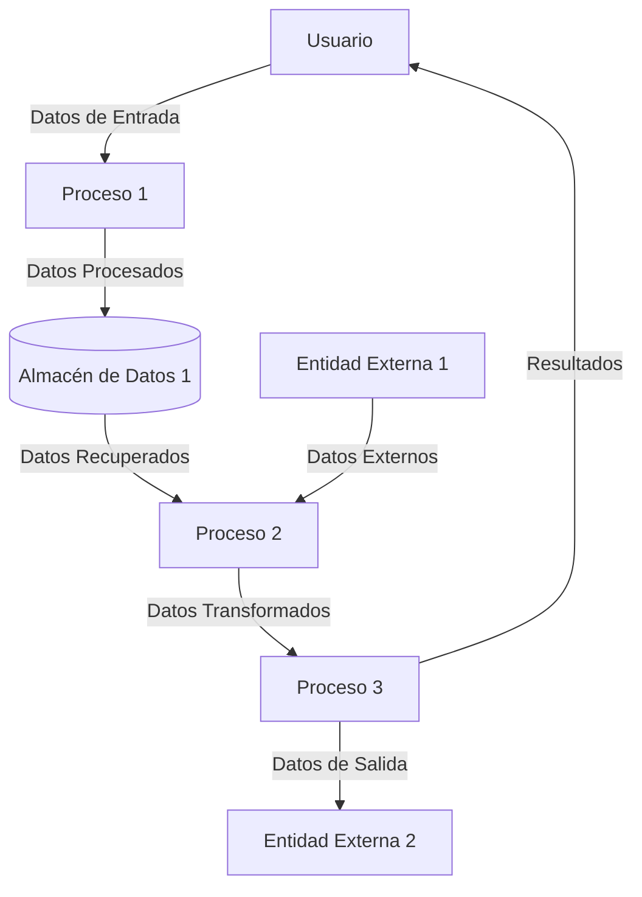

## Module: jsoncpp.cpp
# Análisis Integral del Módulo jsoncpp.cpp

## Nombre del Componente
**jsoncpp.cpp** - Biblioteca de manipulación de JSON en C++

## Objetivos Primarios
Este módulo proporciona una implementación completa para analizar, manipular y serializar datos en formato JSON en aplicaciones C++. Su propósito principal es ofrecer una interfaz robusta y eficiente para trabajar con estructuras de datos JSON, permitiendo la conversión bidireccional entre objetos C++ y representaciones JSON.

## Funciones, Métodos y Consultas Críticas
- **Reader::parse()**: Analiza cadenas JSON y las convierte en objetos Value
- **Writer::write()**: Serializa objetos Value a formato JSON
- **Value::operator[]**: Acceso a elementos de objetos y arrays JSON
- **Value::asXXX()** (asString, asInt, asDouble, etc.): Conversión tipada de valores JSON
- **FastWriter/StyledWriter**: Clases para formatear la salida JSON con diferentes estilos
- **CharReader/CharReaderBuilder**: Análisis optimizado de JSON desde fuentes de caracteres

## Variables y Elementos Clave
- **Value**: Clase central que representa cualquier valor JSON (objeto, array, string, número, booleano, null)
- **ValueIterator**: Iteradores para recorrer objetos y arrays JSON
- **Path**: Representación de rutas para acceder a elementos anidados
- **Features**: Configuración de opciones de análisis y serialización
- **Errors/Exceptions**: Estructuras para manejo de errores durante el análisis

## Interdependencias y Relaciones
- Depende de bibliotecas estándar de C++ (string, vector, map)
- Puede integrarse con sistemas de E/S estándar (std::istream, std::ostream)
- Diseñado para funcionar como componente independiente sin dependencias externas
- Proporciona interfaces para integración con otros sistemas de serialización

## Operaciones Principales vs. Auxiliares
**Operaciones Principales:**
- Análisis (parsing) de JSON a estructuras de datos en memoria
- Serialización de estructuras de datos a formato JSON
- Acceso y manipulación de elementos JSON

**Operaciones Auxiliares:**
- Validación de formato JSON
- Manejo de errores y excepciones
- Formateo de salida (indentación, espaciado)
- Optimizaciones de rendimiento y memoria

## Secuencia Operacional/Flujo de Ejecución
1. Inicialización de objetos Reader/Writer según configuración deseada
2. Para análisis: lectura de entrada JSON → tokenización → construcción de árbol de objetos Value
3. Para serialización: recorrido recursivo del árbol Value → generación de salida formateada
4. Manipulación de datos mediante acceso directo a la estructura Value
5. Gestión de errores y excepciones durante todo el proceso

## Aspectos de Rendimiento y Optimización
- Implementa análisis en una sola pasada para mayor eficiencia
- Ofrece opciones para análisis sin asignación de memoria (in-situ)
- Utiliza técnicas de optimización como la reserva previa de memoria
- Permite configurar el nivel de validación para equilibrar rendimiento y seguridad
- Posibles cuellos de botella en documentos JSON muy grandes o profundamente anidados

## Reusabilidad y Adaptabilidad
- Diseño modular que permite usar componentes individuales
- Altamente parametrizable mediante objetos de configuración
- Interfaces claras que facilitan la extensión o personalización
- Puede adaptarse a diferentes estilos de codificación y requisitos de formato

## Uso y Contexto
- Utilizado en aplicaciones que requieren intercambio de datos con servicios web
- Aplicable en configuraciones de aplicaciones, almacenamiento de datos estructurados
- Común en implementaciones de APIs REST y comunicación cliente-servidor
- Útil para serialización/deserialización de objetos en aplicaciones C++

## Suposiciones y Limitaciones
- Asume conformidad con el estándar JSON (RFC 8259)
- Puede tener limitaciones de rendimiento con documentos extremadamente grandes
- No está optimizado específicamente para JSON binario o formatos comprimidos
- Requiere manejo manual de memoria en algunos casos (aunque proporciona herramientas para facilitarlo)
- Asume codificación UTF-8 para cadenas de texto
## Flow Diagram [via mermaid]

