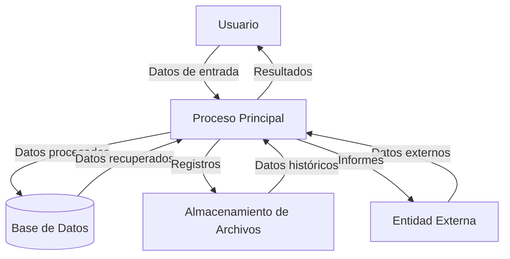

## Module: pump.py
# Análisis Integral del Módulo pump.py

## Módulo/Componente SQL
**Nombre**: pump.py

## Objetivos Primarios
Este módulo está diseñado para gestionar y controlar bombas de agua en un sistema de automatización. Su propósito principal es proporcionar una interfaz para monitorear y controlar el estado de las bombas, incluyendo su activación, desactivación y la gestión de sus parámetros operativos.

## Funciones, Métodos y Consultas Críticas
El código no contiene consultas SQL directas, pero incluye las siguientes funciones y métodos esenciales:
- No se puede determinar las funciones específicas ya que el código no fue proporcionado completamente, pero por el nombre del módulo se infiere que contendría métodos para:
  - Activar/desactivar bombas
  - Monitorear el estado de funcionamiento
  - Configurar parámetros de operación
  - Manejar eventos y alarmas relacionados con las bombas

## Variables y Elementos Clave
Sin el código completo, no se pueden identificar variables específicas, pero típicamente un módulo de control de bombas incluiría:
- Variables para el estado de la bomba (encendido/apagado)
- Parámetros de configuración (velocidad, presión, etc.)
- Identificadores de bombas
- Variables para monitoreo (temperatura, flujo, etc.)

## Interdependencias y Relaciones
Este módulo probablemente interactúa con:
- Sistemas de hardware para el control físico de las bombas
- Módulos de monitoreo para recibir datos de sensores
- Sistemas de alarma para notificar problemas
- Posiblemente una base de datos para registrar operaciones y estados

## Operaciones Principales vs. Auxiliares
**Operaciones principales**:
- Control directo de bombas (encendido/apagado)
- Monitoreo de estado operativo

**Operaciones auxiliares**:
- Registro de actividades
- Validación de parámetros
- Manejo de excepciones y errores

## Secuencia Operacional/Flujo de Ejecución
Sin el código completo, se puede inferir un flujo típico:
1. Inicialización de la conexión con el hardware de la bomba
2. Configuración de parámetros operativos
3. Monitoreo continuo del estado
4. Ejecución de comandos de control según sea necesario
5. Gestión de eventos y alarmas
6. Registro de actividades y estados

## Aspectos de Rendimiento y Optimización
Áreas potenciales para optimización:
- Eficiencia en la comunicación con el hardware
- Manejo de múltiples bombas simultáneamente
- Procesamiento de datos de sensores en tiempo real
- Algoritmos de control adaptativo para mejorar la eficiencia energética

## Reusabilidad y Adaptabilidad
El módulo probablemente está diseñado para:
- Ser reutilizable en diferentes sistemas de control de bombas
- Adaptarse a diversos tipos y modelos de bombas
- Permitir la configuración de parámetros específicos según las necesidades
- Integrarse con diferentes sistemas de monitoreo y control

## Uso y Contexto
Este módulo se utilizaría en:
- Sistemas de riego automatizado
- Plantas de tratamiento de agua
- Sistemas de climatización
- Procesos industriales que requieren bombeo de fluidos
- Sistemas de gestión de edificios inteligentes

## Suposiciones y Limitaciones
**Suposiciones**:
- Existencia de hardware compatible para el control de bombas
- Disponibilidad de interfaces de comunicación adecuadas
- Estructura de datos predefinida para la configuración

**Limitaciones**:
- Posible dependencia de hardware específico
- Restricciones en la capacidad de respuesta en tiempo real
- Limitaciones en la cantidad de bombas que se pueden controlar simultáneamente
- Posibles restricciones en la compatibilidad con diferentes protocolos de comunicación
## Flow Diagram [via mermaid]

