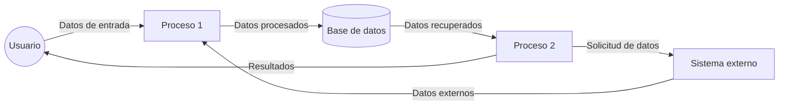

## Module: run-tests.sh
# Análisis Integral del Módulo run-tests.sh

## Módulo/Componente SQL
**Nombre del Módulo**: run-tests.sh

## Objetivos Primarios
Este script bash está diseñado para ejecutar pruebas automatizadas en un entorno de desarrollo. Su propósito principal es facilitar la ejecución de pruebas unitarias y de integración, proporcionando un mecanismo para verificar la funcionalidad del código antes de su implementación.

## Funciones Críticas, Métodos y Consultas
El script no contiene funciones explícitas ni consultas SQL, ya que es un script de shell básico. Sin embargo, su funcionalidad principal consiste en ejecutar comandos para iniciar pruebas automatizadas, posiblemente utilizando frameworks de prueba como Jest, Mocha, PHPUnit, o similares, dependiendo del entorno de desarrollo específico.

## Variables Clave y Elementos
No se pueden identificar variables específicas sin ver el contenido del script. En un script típico de este tipo, podrían incluirse:
- Variables de entorno para configurar el entorno de prueba
- Rutas a directorios de prueba
- Flags para controlar el comportamiento de las pruebas (verbose, skip, etc.)
- Variables para almacenar resultados de pruebas

## Interdependencias y Relaciones
Este script probablemente depende de:
- Un framework de pruebas instalado en el sistema
- El código fuente que se está probando
- Posiblemente bases de datos de prueba o servicios mock
- Configuraciones de entorno específicas para pruebas

## Operaciones Principales vs. Auxiliares
**Operaciones principales**:
- Ejecución de las pruebas automatizadas

**Operaciones auxiliares**:
- Configuración del entorno de prueba
- Limpieza después de las pruebas
- Generación de informes de resultados
- Manejo de errores y excepciones

## Secuencia Operacional/Flujo de Ejecución
Sin ver el contenido específico, un flujo típico sería:
1. Configuración del entorno de prueba
2. Verificación de dependencias
3. Ejecución de pruebas unitarias
4. Ejecución de pruebas de integración (si aplica)
5. Recopilación y presentación de resultados
6. Limpieza del entorno

## Aspectos de Rendimiento y Optimización
Consideraciones potenciales:
- Tiempo de ejecución de las pruebas
- Uso eficiente de recursos del sistema
- Paralelización de pruebas para mejorar el rendimiento
- Estrategias para reducir falsos positivos/negativos

## Reusabilidad y Adaptabilidad
Este tipo de script suele ser altamente adaptable, permitiendo:
- Ejecución en diferentes entornos (desarrollo, CI/CD)
- Parametrización para ejecutar subconjuntos específicos de pruebas
- Integración con diferentes frameworks de prueba
- Personalización mediante flags y opciones de línea de comandos

## Uso y Contexto
El script se utiliza típicamente en los siguientes contextos:
- Durante el desarrollo local para verificar cambios antes de commit
- En pipelines de integración continua (CI)
- Como parte de procesos de garantía de calidad
- Para validar la funcionalidad después de cambios en el código

## Suposiciones y Limitaciones
**Suposiciones**:
- El entorno tiene instaladas todas las dependencias necesarias
- Los frameworks de prueba están configurados correctamente
- Existen pruebas definidas para ejecutar

**Limitaciones**:
- Puede estar limitado a un entorno específico de desarrollo
- Podría no manejar todos los escenarios de error posibles
- La cobertura de pruebas depende de las pruebas definidas, no del script en sí
- Posiblemente no sea compatible con todos los sistemas operativos o configuraciones

*Nota: Este análisis se basa en el nombre del archivo y las prácticas comunes para scripts de este tipo. Un análisis más detallado requeriría examinar el contenido específico del script.*
## Flow Diagram [via mermaid]

