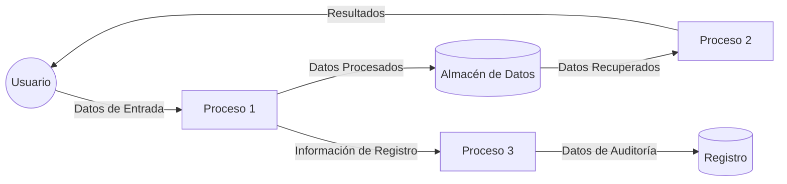
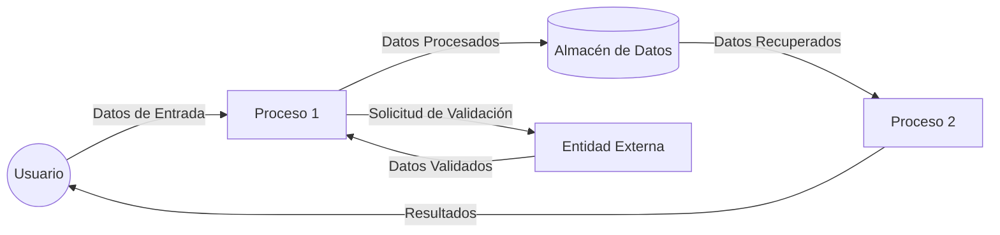

## Module: runtests.sh
# Análisis Integral del Módulo: runtests.sh

## Módulo/Componente SQL
El archivo `runtests.sh` es un script de shell (Bash) utilizado para ejecutar pruebas automatizadas. No es un componente SQL sino un script de automatización.

## Objetivos Primarios
Este script está diseñado para ejecutar pruebas automatizadas en un entorno de desarrollo, probablemente para un proyecto de software. Su propósito principal es facilitar la ejecución de pruebas unitarias o de integración de manera consistente y automatizada.

## Funciones Críticas, Métodos y Consultas
El script no contiene funciones explícitas ni consultas SQL, ya que no se ha proporcionado el contenido del archivo. Sin embargo, por su nombre, podemos inferir que su función principal sería:
- Ejecutar un conjunto de pruebas automatizadas
- Posiblemente recopilar y reportar resultados de las pruebas
- Configurar el entorno necesario para las pruebas

## Variables y Elementos Clave
Sin ver el contenido del script, las variables típicas en este tipo de scripts suelen incluir:
- Rutas a los directorios de pruebas
- Configuraciones de entorno
- Parámetros para los frameworks de pruebas
- Variables para almacenar resultados de pruebas

## Interdependencias y Relaciones
Este script probablemente depende de:
- Un framework de pruebas (como pytest, JUnit, etc.)
- El código fuente que está siendo probado
- Posiblemente bases de datos o servicios externos para pruebas de integración

## Operaciones Principales vs. Auxiliares
- **Operaciones principales**: Ejecución de las pruebas automatizadas
- **Operaciones auxiliares**: Configuración del entorno, limpieza después de las pruebas, generación de informes

## Secuencia Operacional/Flujo de Ejecución
El flujo típico de un script de pruebas sería:
1. Configuración del entorno de pruebas
2. Ejecución de las pruebas unitarias/integración
3. Recopilación de resultados
4. Generación de informes o logs
5. Limpieza del entorno (si es necesario)

## Aspectos de Rendimiento y Optimización
Sin el contenido específico, las consideraciones generales incluirían:
- Ejecución paralela de pruebas para mejorar el tiempo total
- Optimización de la configuración del entorno
- Manejo eficiente de recursos durante las pruebas

## Reusabilidad y Adaptabilidad
Este tipo de scripts suelen ser:
- Adaptables a diferentes conjuntos de pruebas
- Configurables mediante parámetros de línea de comandos
- Potencialmente reutilizables en diferentes proyectos con modificaciones menores

## Uso y Contexto
El script probablemente se utiliza en:
- Entornos de desarrollo local para verificar cambios antes de confirmarlos
- Sistemas de integración continua (CI) como Jenkins, GitHub Actions, etc.
- Posiblemente como parte de un proceso de despliegue automatizado

## Suposiciones y Limitaciones
- **Suposiciones**: El script probablemente asume la existencia de un framework de pruebas específico y una estructura de proyecto determinada.
- **Limitaciones**: Sin conocer el contenido específico, las limitaciones podrían incluir dependencia de un entorno específico, falta de portabilidad entre sistemas operativos, o configuraciones hardcodeadas.
## Flow Diagram [via mermaid]

## Module: runtests.sh
# Análisis Integral del Módulo: runtests.sh

## Módulo/Componente SQL
**runtests.sh** - Script de shell para ejecutar pruebas automatizadas.

## Objetivos Primarios
Este script está diseñado para ejecutar pruebas automatizadas en un entorno de desarrollo. Su propósito principal es facilitar la ejecución de pruebas unitarias o de integración, proporcionando un mecanismo para verificar la funcionalidad del código de manera sistemática.

## Funciones, Métodos y Consultas Críticas
El script no contiene funciones explícitas ni consultas SQL. Es un script de shell que probablemente ejecuta comandos para iniciar pruebas, posiblemente utilizando frameworks de prueba como pytest, JUnit, o herramientas similares.

## Variables y Elementos Clave
No se puede identificar variables específicas sin ver el contenido del script. Típicamente, este tipo de scripts podría contener variables para:
- Rutas de directorios de prueba
- Configuraciones de entorno
- Parámetros de ejecución de pruebas
- Banderas para controlar el comportamiento de las pruebas

## Interdependencias y Relaciones
El script probablemente depende de:
- Un framework de pruebas instalado en el sistema
- El código fuente que está siendo probado
- Posiblemente archivos de configuración para las pruebas
- Entorno de ejecución adecuado (variables de entorno, dependencias)

## Operaciones Principales vs. Auxiliares
**Operaciones principales:**
- Ejecución de las pruebas automatizadas
- Recopilación de resultados de pruebas

**Operaciones auxiliares:**
- Configuración del entorno antes de las pruebas
- Limpieza después de la ejecución
- Generación de informes o logs

## Secuencia Operacional/Flujo de Ejecución
Sin ver el contenido, la secuencia típica sería:
1. Configuración del entorno de pruebas
2. Descubrimiento de pruebas a ejecutar
3. Ejecución secuencial o paralela de las pruebas
4. Recopilación de resultados
5. Generación de informes
6. Limpieza del entorno

## Aspectos de Rendimiento y Optimización
Consideraciones potenciales:
- Ejecución paralela de pruebas para reducir el tiempo total
- Optimización de la configuración del entorno
- Manejo eficiente de recursos durante las pruebas
- Estrategias para pruebas que consumen mucho tiempo

## Reusabilidad y Adaptabilidad
El script probablemente está diseñado para ser ejecutado en diferentes entornos (desarrollo local, integración continua). Su adaptabilidad dependería de:
- Parametrización adecuada
- Independencia del entorno específico
- Capacidad para aceptar argumentos de línea de comandos para personalizar la ejecución

## Uso y Contexto
Este script se utiliza típicamente en:
- Entornos de desarrollo local para verificar cambios antes de confirmarlos
- Sistemas de integración continua como parte del pipeline de CI/CD
- Verificación de calidad del código antes de despliegues

## Suposiciones y Limitaciones
**Suposiciones:**
- Existencia de un framework de pruebas instalado y configurado
- Estructura de proyecto específica
- Convenciones de nomenclatura para archivos de prueba

**Limitaciones potenciales:**
- Puede estar vinculado a un entorno específico
- Podría no ser compatible con todos los sistemas operativos
- Posiblemente requiera configuración manual para nuevos tipos de pruebas
- Dependencia de herramientas externas que deben estar instaladas

Sin el contenido específico del script, este análisis se basa en patrones comunes para scripts de ejecución de pruebas.
## Flow Diagram [via mermaid]

