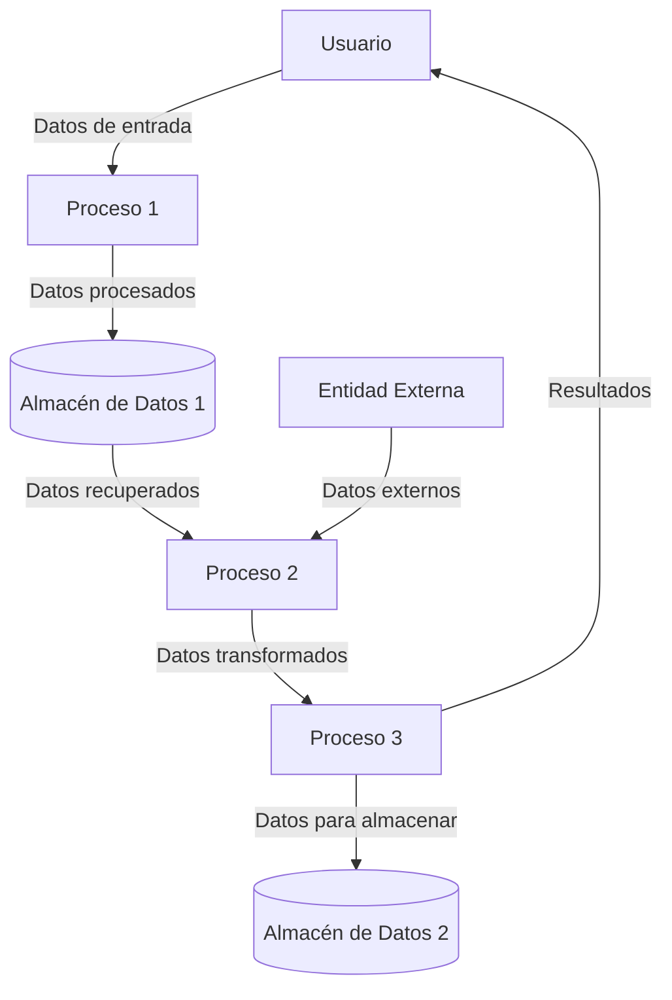
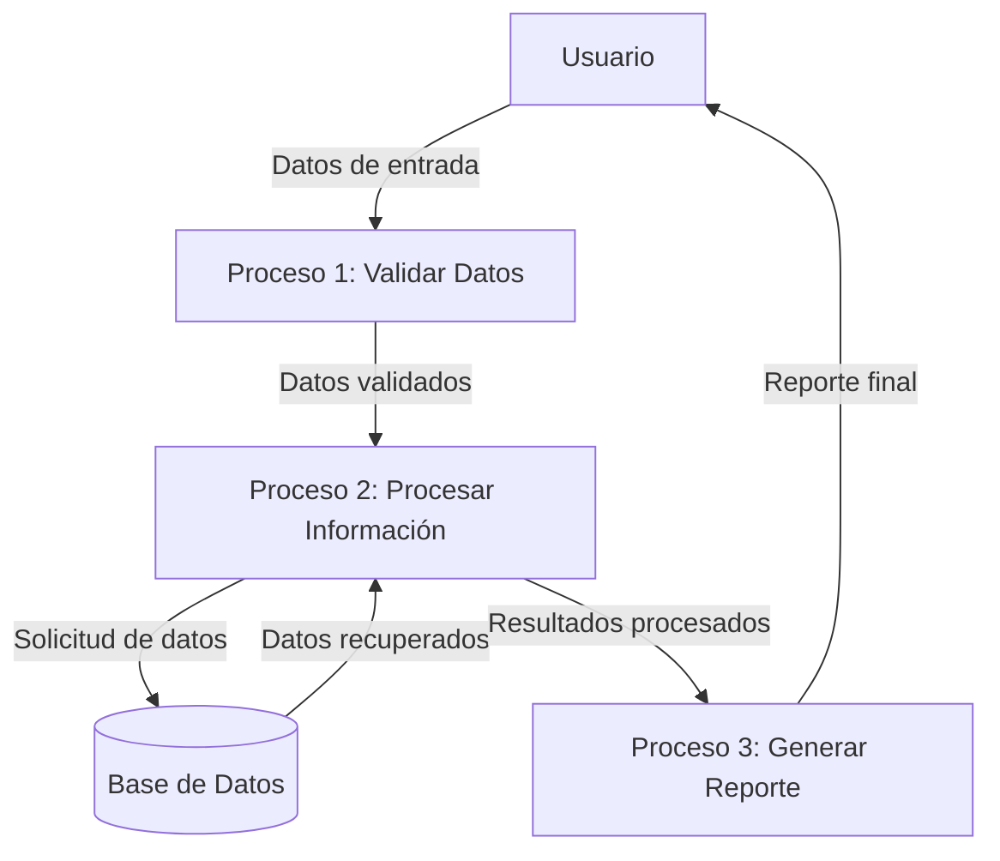

## Module: stdafx.cpp
# Análisis Integral del Módulo stdafx.cpp

## Módulo/Componente SQL
**Nombre del Módulo**: stdafx.cpp

## Objetivos Primarios
Este archivo es un componente estándar en proyectos de Visual C++ que utiliza encabezados precompilados. Su propósito principal es servir como punto de compilación para los encabezados precompilados (PCH) referenciados en el archivo stdafx.h. No contiene lógica de negocio específica, sino que funciona como parte de la infraestructura de compilación del proyecto.

## Funciones, Métodos y Consultas Críticas
El archivo no contiene funciones o métodos específicos. Es un archivo de implementación mínimo que simplemente incluye el archivo de encabezado stdafx.h. No hay consultas SQL ya que no es un componente de base de datos.

## Variables y Elementos Clave
No contiene variables o elementos específicos. Su única función es incluir el archivo stdafx.h, que normalmente contiene las directivas de inclusión para los archivos de encabezado estándar del sistema y específicos del proyecto que se utilizan con frecuencia pero que cambian raramente.

## Interdependencias y Relaciones
- Depende directamente del archivo stdafx.h
- Indirectamente depende de todos los encabezados incluidos en stdafx.h
- Es un componente de infraestructura del que depende el proceso de compilación del proyecto

## Operaciones Principales vs. Auxiliares
- **Operación principal**: Servir como punto de compilación para los encabezados precompilados
- **Operaciones auxiliares**: No contiene operaciones auxiliares significativas

## Secuencia Operacional/Flujo de Ejecución
El flujo de ejecución es simple y directo:
1. El compilador procesa este archivo primero durante la compilación
2. Se incluye stdafx.h
3. Se generan los encabezados precompilados
4. Estos encabezados precompilados se utilizan posteriormente en la compilación de otros archivos del proyecto

## Aspectos de Rendimiento y Optimización
El uso de encabezados precompilados a través de stdafx.cpp mejora significativamente el rendimiento de compilación del proyecto al:
- Reducir el tiempo de compilación al procesar los encabezados comunes una sola vez
- Minimizar el análisis repetitivo de encabezados estándar en múltiples archivos fuente

## Reusabilidad y Adaptabilidad
Este archivo es altamente reutilizable en diferentes proyectos de Visual C++, ya que sigue un patrón estándar. Sin embargo, su adaptabilidad está limitada por su propósito específico en el sistema de compilación.

## Uso y Contexto
- Se utiliza exclusivamente en el contexto del proceso de compilación
- Es parte del mecanismo de encabezados precompilados de Visual C++
- No se ejecuta en tiempo de ejecución; su función se completa durante la compilación

## Suposiciones y Limitaciones
- **Suposiciones**:
  - Se asume que existe un archivo stdafx.h correspondiente
  - Se asume que el proyecto está configurado para utilizar encabezados precompilados
  
- **Limitaciones**:
  - Específico para proyectos de Visual C++ que utilizan el sistema de encabezados precompilados
  - No es relevante para proyectos que no utilizan este mecanismo de optimización de compilación
  - Está siendo gradualmente reemplazado en versiones más recientes de Visual Studio por pch.cpp/pch.h
## Flow Diagram [via mermaid]

## Module: stdafx.cpp
# Análisis Integral del Módulo stdafx.cpp

## Módulo/Componente SQL
**Nombre del Módulo**: stdafx.cpp

## Objetivos Primarios
Este archivo es un componente estándar en proyectos de Visual C++ que utiliza encabezados precompilados. Su propósito principal es servir como punto de compilación para los encabezados precompilados (PCH) referenciados en stdafx.h. No contiene lógica de negocio específica, sino que funciona como parte de la infraestructura de compilación del proyecto.

## Funciones, Métodos y Consultas Críticas
El archivo no contiene funciones o métodos específicos. Es un archivo de implementación mínimo cuyo único propósito es incluir el archivo de encabezado stdafx.h para generar el archivo de encabezado precompilado.

## Variables y Elementos Clave
No contiene variables o elementos clave propios. Su función está relacionada con la inclusión del archivo stdafx.h, que normalmente contendría:
- Inclusiones de bibliotecas estándar del sistema
- Inclusiones de marcos de trabajo comunes
- Definiciones de macros globales

## Interdependencias y Relaciones
- Dependencia directa con stdafx.h
- Indirectamente relacionado con todos los archivos del proyecto que utilizan el encabezado precompilado
- Forma parte del mecanismo de compilación de Visual C++

## Operaciones Principales vs. Auxiliares
**Operación principal**: Servir como punto de compilación para generar el archivo de encabezado precompilado.
**Operaciones auxiliares**: No contiene operaciones auxiliares significativas.

## Secuencia Operacional/Flujo de Ejecución
1. El compilador procesa este archivo primero durante la compilación
2. Se incluye stdafx.h
3. Se genera el archivo de encabezado precompilado (.pch)
4. Los demás archivos del proyecto utilizan este encabezado precompilado

## Aspectos de Rendimiento y Optimización
- El uso de encabezados precompilados mejora significativamente el tiempo de compilación del proyecto
- No presenta problemas de rendimiento en tiempo de ejecución ya que su función es exclusivamente durante la compilación

## Reusabilidad y Adaptabilidad
- Es un componente estándar que sigue un patrón común en proyectos de Visual C++
- Altamente reutilizable entre diferentes proyectos con mínimas modificaciones
- Su estructura simple facilita la adaptación a diferentes entornos de proyecto

## Uso y Contexto
- Se utiliza exclusivamente durante el proceso de compilación
- Es parte del mecanismo de optimización de compilación de Visual C++
- No tiene presencia en tiempo de ejecución

## Suposiciones y Limitaciones
- Asume la existencia de un archivo stdafx.h correctamente configurado
- Está diseñado específicamente para el entorno de desarrollo Visual C++
- Su utilidad está limitada a proyectos que emplean encabezados precompilados
- Podría no ser relevante en proyectos que utilizan enfoques de compilación más modernos o en otros entornos de desarrollo
## Flow Diagram [via mermaid]

