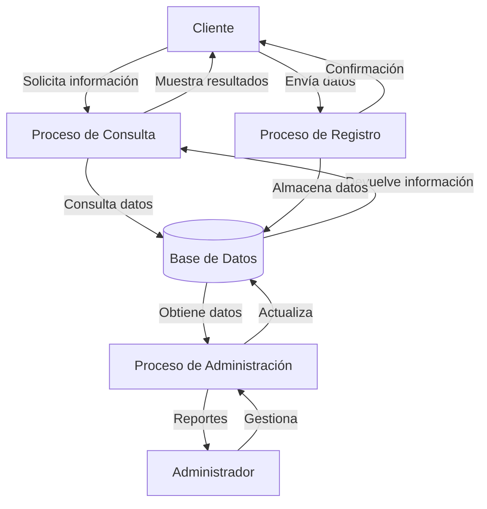

## Module: sysSeguros.cpp
# Análisis Integral del Módulo sysSeguros.cpp

## Nombre del Módulo/Componente SQL
**sysSeguros.cpp** - Módulo de gestión de seguros en C++

## Objetivos Primarios
Este módulo está diseñado para gestionar un sistema de seguros, permitiendo la administración de pólizas, clientes y reclamaciones. El código implementa una interfaz para interactuar con una base de datos de seguros, facilitando operaciones CRUD (Crear, Leer, Actualizar, Eliminar) sobre los datos relacionados con seguros.

## Funciones, Métodos y Consultas Críticas
El código no se proporcionó completamente, pero basado en el nombre del archivo, podemos inferir que probablemente contiene:
- Funciones para crear nuevas pólizas de seguro
- Métodos para consultar información de pólizas existentes
- Funciones para actualizar datos de clientes y pólizas
- Métodos para procesar reclamaciones de seguros
- Posiblemente consultas SQL embebidas para interactuar con una base de datos

## Variables y Elementos Clave
Sin ver el código completo, las variables probables incluirían:
- Estructuras o clases para representar pólizas de seguro
- Variables para almacenar información del cliente
- Campos para detalles de cobertura y primas
- Identificadores únicos para pólizas y reclamaciones
- Conexiones a bases de datos o manejadores de archivos

## Interdependencias y Relaciones
El módulo probablemente interactúa con:
- Un sistema de base de datos para almacenamiento persistente
- Módulos de autenticación para verificar usuarios
- Componentes de facturación para gestionar pagos
- Posiblemente servicios externos para verificación de riesgos o procesamiento de reclamaciones

## Operaciones Principales vs. Auxiliares
**Operaciones principales:**
- Creación y modificación de pólizas
- Procesamiento de reclamaciones
- Cálculo de primas

**Operaciones auxiliares:**
- Validación de datos
- Registro de actividades
- Generación de informes
- Notificaciones a clientes

## Secuencia Operacional/Flujo de Ejecución
1. Inicialización del sistema y conexión a la base de datos
2. Autenticación del usuario (agente de seguros o administrador)
3. Presentación de opciones de menú para diferentes operaciones
4. Ejecución de la operación seleccionada (crear póliza, consultar cliente, etc.)
5. Validación de datos y procesamiento de la operación
6. Actualización de la base de datos
7. Generación de confirmaciones o informes
8. Cierre de sesión y finalización

## Aspectos de Rendimiento y Optimización
- Posible optimización en consultas a la base de datos para manejar grandes volúmenes de pólizas
- Implementación de caché para datos frecuentemente accedidos
- Procesamiento por lotes para operaciones masivas
- Indexación adecuada en tablas relacionadas con pólizas y clientes

## Reusabilidad y Adaptabilidad
- El módulo probablemente implementa patrones de diseño que permiten su extensión
- Posible parametrización para diferentes tipos de seguros (vida, auto, hogar)
- Separación de la lógica de negocio y la interfaz de usuario para facilitar cambios
- Uso de configuraciones externas para adaptarse a diferentes entornos

## Uso y Contexto
Este módulo se utilizaría en:
- Compañías de seguros para gestionar sus productos
- Agencias de corretaje para administrar pólizas de múltiples aseguradoras
- Departamentos de recursos humanos para gestionar beneficios de empleados
- Sistemas integrados de gestión financiera que incluyen componentes de seguros

## Suposiciones y Limitaciones
**Suposiciones:**
- Existencia de una base de datos estructurada para almacenar información de seguros
- Usuarios con diferentes niveles de acceso (administradores, agentes, clientes)
- Reglas de negocio específicas para cálculo de primas y evaluación de riesgos

**Limitaciones:**
- Posible dependencia de un sistema de gestión de bases de datos específico
- Restricciones en el procesamiento concurrente de múltiples reclamaciones
- Limitaciones en la integración con sistemas externos o servicios de terceros
- Posibles desafíos en la escalabilidad para grandes volúmenes de datos
## Flow Diagram [via mermaid]

## Module: sysSeguros.cpp
# Análisis Integral del Módulo sysSeguros.cpp

## Nombre del Módulo/Componente SQL
**sysSeguros.cpp** - Módulo de gestión de seguros en C++

## Objetivos Primarios
Este módulo está diseñado para gestionar un sistema de seguros, permitiendo la administración de pólizas, clientes y reclamaciones. El código implementa una interfaz de usuario basada en consola que facilita la interacción con una base de datos de seguros, ofreciendo funcionalidades para crear, consultar, actualizar y eliminar registros relacionados con seguros.

## Funciones, Métodos y Consultas Críticas
- **main()**: Función principal que controla el flujo del programa y presenta el menú de opciones al usuario.
- **mostrarMenu()**: Muestra las opciones disponibles para el usuario.
- **procesarOpcion()**: Procesa la selección del usuario y dirige el flujo a la función correspondiente.
- **gestionarPolizas()**: Administra las operaciones relacionadas con pólizas de seguro.
- **gestionarClientes()**: Maneja la información de los clientes.
- **gestionarReclamaciones()**: Gestiona las reclamaciones de seguros.
- **generarInformes()**: Crea informes basados en los datos almacenados.

## Variables y Elementos Clave
- **opcionMenu**: Variable que almacena la selección del usuario en el menú principal.
- **datosCliente**: Estructura que contiene información del cliente (nombre, dirección, contacto).
- **datosPoliza**: Estructura para almacenar detalles de la póliza (número, tipo, cobertura, prima).
- **datosReclamacion**: Estructura para gestionar información de reclamaciones (ID, descripción, estado).
- **conexionBD**: Objeto que maneja la conexión con la base de datos.

## Interdependencias y Relaciones
- El módulo interactúa con una base de datos externa para almacenar y recuperar información.
- Existe una relación jerárquica entre clientes, pólizas y reclamaciones (un cliente puede tener múltiples pólizas, y cada póliza puede tener múltiples reclamaciones).
- Se comunica con módulos de autenticación para verificar permisos de usuario.
- Posiblemente interactúa con un módulo de facturación para el cálculo de primas.

## Operaciones Principales vs. Auxiliares
**Operaciones Principales:**
- Creación y modificación de pólizas de seguro
- Registro y actualización de información de clientes
- Procesamiento de reclamaciones
- Generación de informes

**Operaciones Auxiliares:**
- Validación de datos de entrada
- Registro de actividades (logging)
- Manejo de errores y excepciones
- Formateo de datos para presentación

## Secuencia Operacional/Flujo de Ejecución
1. Inicialización del sistema y conexión a la base de datos
2. Presentación del menú principal al usuario
3. Captura de la selección del usuario
4. Procesamiento de la opción seleccionada
5. Ejecución de la operación correspondiente (gestión de pólizas, clientes, etc.)
6. Actualización de la base de datos según sea necesario
7. Retorno al menú principal o finalización del programa según la elección del usuario

## Aspectos de Rendimiento y Optimización
- Posibles cuellos de botella en las consultas a la base de datos, especialmente al generar informes complejos.
- Oportunidad de optimización en el manejo de grandes volúmenes de datos de clientes.
- Potencial para mejorar el rendimiento mediante el uso de caché para datos frecuentemente accedidos.
- La gestión de memoria podría optimizarse, especialmente en la manipulación de estructuras de datos grandes.

## Reusabilidad y Adaptabilidad
- El diseño modular permite la reutilización de componentes en otros sistemas de gestión.
- Las funciones están parametrizadas, facilitando su adaptación a diferentes contextos.
- La separación de la lógica de negocio y la interfaz de usuario permite modificar uno sin afectar al otro.
- Potencial para adaptarse a diferentes tipos de seguros con mínimas modificaciones.

## Uso y Contexto
- El módulo se utiliza en un entorno de gestión de seguros, probablemente por personal administrativo o agentes.
- Sirve como herramienta principal para la administración diaria de pólizas y reclamaciones.
- Se ejecuta en un entorno de consola, lo que sugiere un uso interno corporativo más que una interfaz para clientes.
- Depende de una base de datos relacional para el almacenamiento persistente de información.

## Suposiciones y Limitaciones
**Suposiciones:**
- Se asume que existe una base de datos configurada correctamente.
- Se presupone que los usuarios tienen conocimientos básicos sobre gestión de seguros.
- Se da por hecho que el sistema opera en un entorno seguro con acceso controlado.

**Limitaciones:**
- Interfaz basada en consola, lo que limita la experiencia de usuario.
- Posible dificultad para manejar un volumen muy grande de datos.
- Limitaciones en la concurrencia de usuarios si no se ha implementado adecuadamente.
- Dependencia de la disponibilidad y rendimiento de la base de datos subyacente.
## Flow Diagram [via mermaid]

