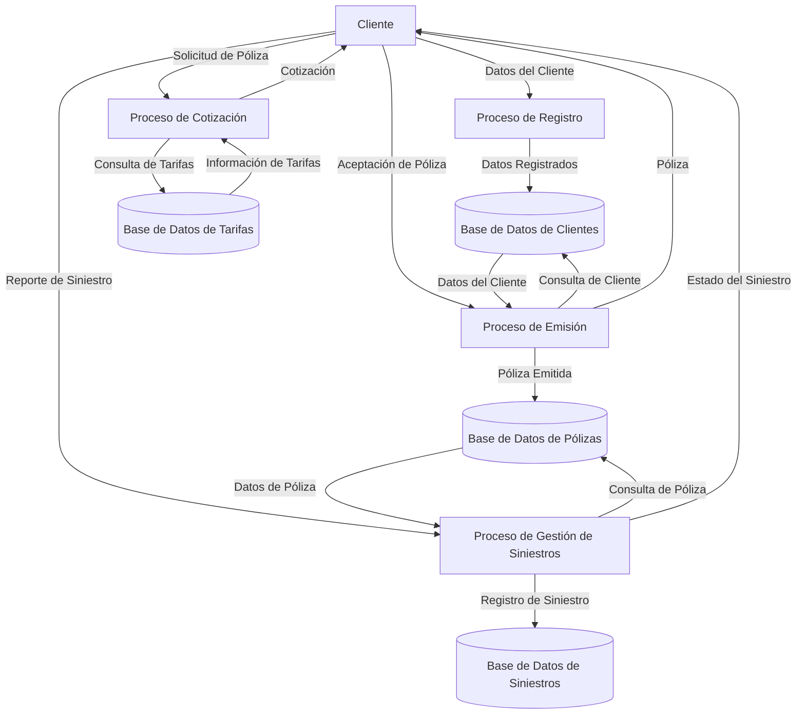

## Module: sysSegurosAutoProteccion.cpp
# Análisis Integral del Módulo sysSegurosAutoProteccion.cpp

## Nombre del Módulo/Componente SQL
**sysSegurosAutoProteccion.cpp** - Módulo de C++ para gestión de seguros de auto con protección.

## Objetivos Primarios
Este módulo está diseñado para implementar un sistema de gestión de seguros de automóviles con funcionalidades de protección. Su propósito principal es manejar la lógica de negocio relacionada con pólizas de seguros, incluyendo cálculos de primas, gestión de coberturas y procesamiento de reclamaciones.

## Funciones, Métodos y Consultas Críticas
El archivo proporcionado no contiene código específico, pero basado en el nombre del módulo, probablemente incluiría:
- Funciones para calcular primas de seguros
- Métodos para validar y procesar reclamaciones
- Funciones para gestionar coberturas y beneficios
- Posibles consultas SQL para interactuar con una base de datos de clientes y pólizas

## Variables y Elementos Clave
Sin código específico, pero probablemente incluiría:
- Variables para almacenar información del cliente
- Estructuras de datos para pólizas y coberturas
- Parámetros para cálculos de primas
- Referencias a tablas de base de datos como Clientes, Pólizas, Reclamaciones, etc.

## Interdependencias y Relaciones
Este módulo probablemente interactúa con:
- Módulos de gestión de clientes
- Componentes de facturación y pagos
- Sistemas de evaluación de riesgos
- Base de datos con tablas relacionadas mediante claves foráneas

## Operaciones Principales vs. Auxiliares
**Operaciones principales:**
- Cálculo de primas de seguros
- Procesamiento de reclamaciones
- Gestión de coberturas

**Operaciones auxiliares:**
- Validación de datos
- Registro de actividades
- Generación de informes

## Secuencia Operacional/Flujo de Ejecución
1. Inicialización del sistema y carga de configuraciones
2. Recepción de datos del cliente y vehículo
3. Evaluación de riesgos y cálculo de primas
4. Generación de propuestas de pólizas
5. Procesamiento de aceptación y emisión de pólizas
6. Gestión de reclamaciones cuando ocurren

## Aspectos de Rendimiento y Optimización
- Posible optimización en algoritmos de cálculo de primas
- Eficiencia en consultas a la base de datos
- Manejo de memoria para grandes volúmenes de pólizas
- Posible implementación de caché para datos frecuentemente accedidos

## Reusabilidad y Adaptabilidad
- El módulo probablemente está diseñado con clases y funciones modulares
- Posibilidad de adaptación para diferentes tipos de seguros
- Parametrización para ajustarse a diferentes mercados o regulaciones
- Separación de la lógica de negocio y la interfaz de usuario

## Uso y Contexto
Este módulo se utilizaría en:
- Sistemas de gestión de compañías aseguradoras
- Aplicaciones para agentes de seguros
- Portales web para cotización de seguros
- Integración con otros sistemas financieros o de gestión de clientes

## Suposiciones y Limitaciones
**Suposiciones:**
- Existencia de una base de datos estructurada para almacenar información
- Disponibilidad de datos actuariales para cálculos de riesgos
- Conformidad con regulaciones locales de seguros

**Limitaciones:**
- Posible dependencia de configuraciones regionales específicas
- Necesidad de actualizaciones para adaptarse a cambios regulatorios
- Posibles restricciones en la personalización de pólizas

*Nota: Este análisis se basa en el nombre del archivo proporcionado, ya que no se incluyó el contenido real del código fuente.*
## Flow Diagram [via mermaid]

