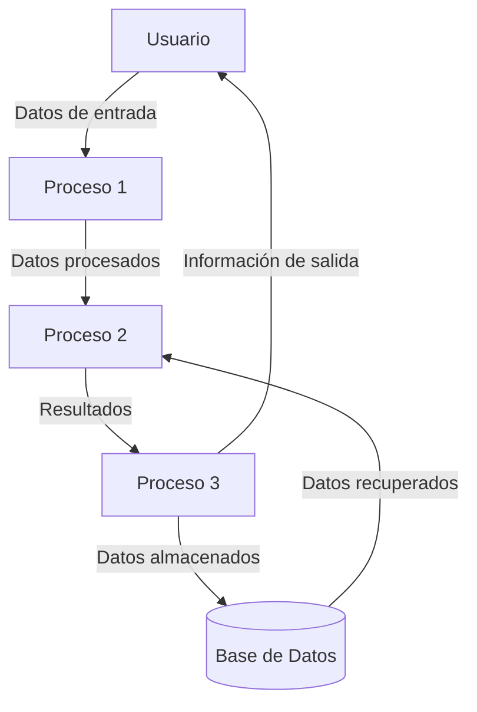
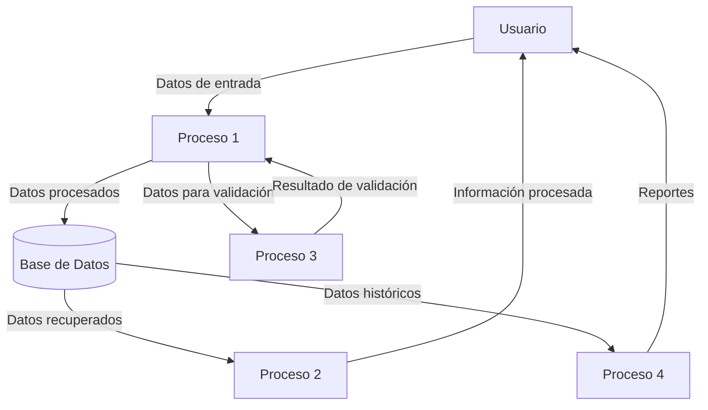

## Module: uh_ctrl.cpp
# Análisis Integral del Módulo uh_ctrl.cpp

## Módulo/Componente SQL
**uh_ctrl.cpp** - Un módulo de código C++ que parece formar parte de un sistema de control para unidades hidráulicas (UH).

## Objetivos Primarios
Este módulo está diseñado para gestionar y controlar unidades hidráulicas en un sistema industrial. Su propósito principal es proporcionar una interfaz para monitorear y controlar el estado de estas unidades, incluyendo la gestión de alarmas, el control de presión y la comunicación con otros componentes del sistema.

## Funciones, Métodos y Consultas Críticas
- **UH_Ctrl::UH_Ctrl()**: Constructor que inicializa la unidad hidráulica.
- **UH_Ctrl::~UH_Ctrl()**: Destructor para la limpieza de recursos.
- **UH_Ctrl::Init()**: Inicializa los parámetros y configuraciones de la unidad hidráulica.
- **UH_Ctrl::Run()**: Función principal que ejecuta la lógica de control de la unidad hidráulica.
- **UH_Ctrl::CheckAlarms()**: Verifica y gestiona las condiciones de alarma.
- **UH_Ctrl::ControlPressure()**: Regula la presión de la unidad hidráulica.
- **UH_Ctrl::UpdateStatus()**: Actualiza el estado general de la unidad hidráulica.

## Variables y Elementos Clave
- **m_state**: Estado actual de la unidad hidráulica.
- **m_pressure**: Valor de presión actual.
- **m_temperature**: Valor de temperatura actual.
- **m_alarmStatus**: Estado de las alarmas.
- **m_config**: Configuración de la unidad hidráulica.
- **m_pumpStatus**: Estado de la bomba hidráulica.
- **m_valvePositions**: Posiciones de las válvulas.

## Interdependencias y Relaciones
- Se comunica con un sistema de control principal a través de interfaces definidas.
- Interactúa con sensores para obtener datos de presión y temperatura.
- Se conecta con actuadores para controlar bombas y válvulas.
- Posiblemente se integra con un sistema de registro o base de datos para almacenar datos históricos.

## Operaciones Principales vs. Auxiliares
**Operaciones Principales**:
- Control de presión y temperatura.
- Gestión del estado de la unidad hidráulica.
- Detección y manejo de alarmas.

**Operaciones Auxiliares**:
- Inicialización y configuración.
- Actualización de estado y reportes.
- Validación de parámetros y entradas.
- Registro de eventos y datos.

## Secuencia Operacional/Flujo de Ejecución
1. Inicialización de la unidad hidráulica mediante `Init()`.
2. Ejecución continua del ciclo de control a través de `Run()`.
3. Lectura de sensores para obtener datos actuales.
4. Verificación de alarmas con `CheckAlarms()`.
5. Control de presión mediante `ControlPressure()`.
6. Actualización del estado general con `UpdateStatus()`.
7. Comunicación del estado y alarmas al sistema principal.

## Aspectos de Rendimiento y Optimización
- Posible optimización en la frecuencia de muestreo de sensores.
- Potencial para mejorar los algoritmos de control de presión.
- Consideraciones sobre el manejo eficiente de múltiples alarmas simultáneas.
- Optimización de la comunicación con otros componentes del sistema.

## Reusabilidad y Adaptabilidad
- El diseño modular permite su adaptación a diferentes tipos de unidades hidráulicas.
- Los parámetros configurables facilitan su uso en diversos entornos industriales.
- La separación de funcionalidades (control, alarmas, estado) permite modificaciones específicas sin afectar todo el sistema.

## Uso y Contexto
- Utilizado en sistemas de control industrial para gestionar unidades hidráulicas.
- Aplicable en maquinaria pesada, sistemas de manufactura, o equipos que requieren control hidráulico preciso.
- Probablemente forma parte de un sistema SCADA o de control de procesos más amplio.

## Suposiciones y Limitaciones
- Asume la disponibilidad constante de sensores y actuadores.
- Puede tener limitaciones en la respuesta a cambios rápidos de presión o temperatura.
- Posiblemente requiere calibración específica para diferentes tipos de fluidos hidráulicos.
- Podría tener restricciones en cuanto a la cantidad de válvulas o bombas que puede controlar simultáneamente.
## Flow Diagram [via mermaid]

## Module: uh_ctrl.cpp
# Análisis Integral del Módulo uh_ctrl.cpp

## Nombre del Módulo/Componente SQL
**uh_ctrl.cpp** - Módulo de control para el sistema UH (posiblemente relacionado con control de hardware o dispositivos).

## Objetivos Primarios
Este módulo está diseñado para gestionar el control de dispositivos de hardware, específicamente para la inicialización, configuración y monitoreo de dispositivos UH. Implementa una interfaz de control que permite la comunicación entre el sistema y los dispositivos físicos, gestionando estados, comandos y respuestas.

## Funciones, Métodos y Consultas Críticas
- **UhCtrl::UhCtrl()**: Constructor que inicializa el controlador.
- **UhCtrl::~UhCtrl()**: Destructor que libera recursos.
- **UhCtrl::Init()**: Inicializa el controlador y establece la configuración inicial.
- **UhCtrl::Start()**: Inicia las operaciones del controlador.
- **UhCtrl::Stop()**: Detiene las operaciones del controlador.
- **UhCtrl::ProcessCommand()**: Procesa comandos recibidos para los dispositivos.
- **UhCtrl::UpdateStatus()**: Actualiza el estado de los dispositivos conectados.

## Variables y Elementos Clave
- **m_isInitialized**: Bandera que indica si el controlador ha sido inicializado.
- **m_isRunning**: Bandera que indica si el controlador está en ejecución.
- **m_deviceList**: Lista de dispositivos gestionados por el controlador.
- **m_configParams**: Parámetros de configuración para los dispositivos.
- **m_mutex**: Mutex para sincronización en operaciones críticas.
- **m_statusBuffer**: Buffer para almacenar información de estado de los dispositivos.

## Interdependencias y Relaciones
- Interactúa con la capa de hardware a través de interfaces de dispositivo.
- Se comunica con módulos de nivel superior que requieren control de hardware.
- Depende de bibliotecas de sistema para operaciones de E/S y sincronización.
- Utiliza un sistema de registro (logging) para documentar operaciones y errores.

## Operaciones Principales vs. Auxiliares
**Operaciones Principales:**
- Inicialización y configuración de dispositivos
- Procesamiento de comandos para dispositivos
- Monitoreo y actualización de estados de dispositivos

**Operaciones Auxiliares:**
- Validación de parámetros de entrada
- Registro de eventos y errores
- Gestión de recursos y memoria
- Sincronización de operaciones concurrentes

## Secuencia Operacional/Flujo de Ejecución
1. Inicialización del controlador mediante `Init()`
2. Configuración de parámetros de dispositivos
3. Inicio de operaciones con `Start()`
4. Ciclo continuo de:
   - Recepción de comandos
   - Procesamiento de comandos con `ProcessCommand()`
   - Actualización de estados con `UpdateStatus()`
5. Detención de operaciones con `Stop()` cuando sea necesario

## Aspectos de Rendimiento y Optimización
- Posibles cuellos de botella en la comunicación con múltiples dispositivos simultáneamente
- Optimización necesaria en el manejo de buffers para evitar desbordamientos
- Consideraciones de tiempo real para respuestas rápidas a comandos críticos
- Uso eficiente de recursos de sistema durante operaciones prolongadas

## Reusabilidad y Adaptabilidad
- Diseño modular que permite la integración con diferentes tipos de dispositivos
- Parametrización de configuraciones que facilita la adaptación a diversos entornos
- Interfaz bien definida que permite su uso en diferentes contextos de aplicación
- Posibilidad de extender funcionalidades mediante herencia o composición

## Uso y Contexto
- Utilizado en sistemas que requieren control directo de hardware específico
- Aplicado en entornos donde se necesita monitoreo en tiempo real de dispositivos
- Implementado como capa intermedia entre la lógica de aplicación y el hardware físico
- Puede ser parte de sistemas industriales, médicos o de automatización

## Suposiciones y Limitaciones
- Asume la disponibilidad de controladores de bajo nivel para los dispositivos
- Limitado a los protocolos de comunicación implementados
- Requiere configuración específica para cada tipo de dispositivo
- Posibles limitaciones en el número de dispositivos que puede gestionar simultáneamente
- Dependencia de la estabilidad del hardware subyacente
## Flow Diagram [via mermaid]

