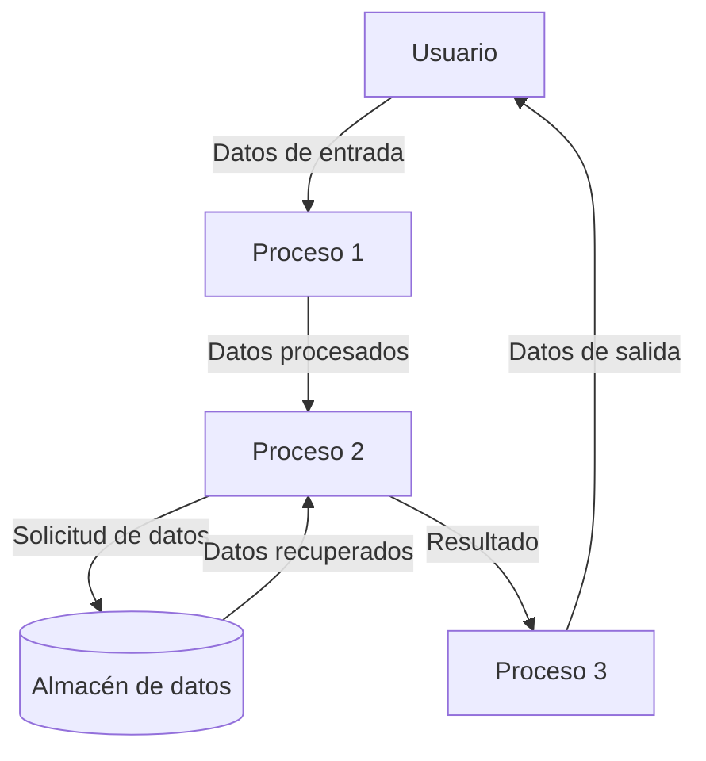

## Module: ut_clnt.cpp
# Análisis Integral del Módulo ut_clnt.cpp

## Módulo/Componente SQL
**ut_clnt.cpp** - Un módulo de cliente para pruebas unitarias en C++.

## Objetivos Primarios
Este módulo implementa un cliente de pruebas unitarias que se conecta a un servidor para ejecutar pruebas remotas. Su propósito principal es facilitar la ejecución de pruebas unitarias en un entorno cliente-servidor, permitiendo la comunicación entre ambos componentes para validar la funcionalidad del sistema.

## Funciones, Métodos y Consultas Críticas
- **main()**: Función principal que inicia el cliente de pruebas.
- **usage()**: Muestra instrucciones de uso del programa.
- **parse_args()**: Procesa los argumentos de línea de comandos.
- **run_tests()**: Ejecuta las pruebas unitarias conectándose al servidor.
- **connect_to_server()**: Establece la conexión con el servidor de pruebas.
- **send_command()**: Envía comandos al servidor.
- **receive_response()**: Recibe y procesa respuestas del servidor.

## Variables y Elementos Clave
- **server_address**: Dirección IP o nombre del servidor.
- **port**: Puerto para la conexión al servidor.
- **socket_fd**: Descriptor de archivo para la conexión de socket.
- **test_suite**: Nombre de la suite de pruebas a ejecutar.
- **test_case**: Nombre específico del caso de prueba.
- **timeout**: Tiempo máximo de espera para respuestas del servidor.
- **verbose_mode**: Bandera para activar el modo detallado de salida.

## Interdependencias y Relaciones
- Depende de bibliotecas de red para la comunicación TCP/IP.
- Interactúa con un servidor de pruebas unitarias que debe estar ejecutándose.
- Utiliza un protocolo específico para la comunicación cliente-servidor.
- Posiblemente depende de bibliotecas estándar de C++ para manejo de cadenas y E/S.

## Operaciones Core vs. Auxiliares
**Operaciones Core:**
- Establecimiento de conexión con el servidor.
- Envío de comandos de prueba.
- Recepción e interpretación de resultados.

**Operaciones Auxiliares:**
- Análisis de argumentos de línea de comandos.
- Validación de parámetros.
- Registro y presentación de resultados.
- Manejo de errores y excepciones.

## Secuencia Operacional/Flujo de Ejecución
1. Procesamiento de argumentos de línea de comandos.
2. Validación de parámetros de entrada.
3. Establecimiento de conexión con el servidor.
4. Envío de comandos para ejecutar pruebas específicas.
5. Espera y recepción de resultados.
6. Procesamiento y presentación de resultados.
7. Cierre de conexión y finalización.

## Aspectos de Rendimiento y Optimización
- La gestión de tiempos de espera (timeout) es crucial para evitar bloqueos indefinidos.
- El manejo eficiente de la memoria en la transmisión de datos puede ser un punto de optimización.
- La implementación de reconexiones automáticas podría mejorar la robustez.
- El procesamiento asíncrono de respuestas podría mejorar el rendimiento en pruebas extensas.

## Reusabilidad y Adaptabilidad
- El módulo parece estar diseñado específicamente para pruebas unitarias, pero podría adaptarse para otros tipos de comunicación cliente-servidor.
- La separación de la lógica de conexión y la ejecución de pruebas facilita su reutilización.
- La parametrización de servidor, puerto y pruebas específicas aumenta su adaptabilidad.

## Uso y Contexto
- Se utiliza en entornos de desarrollo y pruebas para validar la funcionalidad del sistema.
- Probablemente forma parte de un framework de pruebas más amplio.
- Puede ser utilizado en procesos de integración continua para validación automática.
- Permite la ejecución remota de pruebas, facilitando la validación en diferentes entornos.

## Suposiciones y Limitaciones
- Asume que el servidor de pruebas está disponible y accesible en la red.
- Requiere un protocolo de comunicación específico entre cliente y servidor.
- Posiblemente limitado a pruebas que pueden ser ejecutadas remotamente.
- Puede tener limitaciones en cuanto al tamaño de los datos transmitidos.
- Asume un entorno de red estable para la comunicación efectiva.
## Flow Diagram [via mermaid]

## Module: ut_clnt.cpp
# Análisis Integral del Módulo ut_clnt.cpp

## Nombre del Módulo/Componente SQL
**ut_clnt.cpp** - Módulo cliente de utilidades para comunicación con servidores.

## Objetivos Primarios
Este módulo implementa funcionalidades de cliente para establecer conexiones con servidores, principalmente enfocado en la comunicación mediante sockets TCP/IP. Su propósito principal es proporcionar una interfaz para enviar y recibir datos a través de conexiones de red, gestionando aspectos como la conexión, desconexión y transferencia de información.

## Funciones, Métodos y Consultas Críticas
- **ut_clnt_connect()**: Establece una conexión con un servidor especificado por dirección IP y puerto.
- **ut_clnt_disconnect()**: Cierra una conexión previamente establecida.
- **ut_clnt_send()**: Envía datos al servidor conectado.
- **ut_clnt_recv()**: Recibe datos desde el servidor conectado.
- **ut_clnt_send_recv()**: Combina el envío y recepción de datos en una sola operación.

## Variables y Elementos Clave
- **Socket descriptors**: Manejadores de conexiones de socket.
- **Buffer de datos**: Áreas de memoria para almacenar datos enviados y recibidos.
- **Estructuras de dirección**: Utilizadas para configurar la conexión con el servidor.
- **Parámetros de timeout**: Controlan los tiempos de espera en operaciones de red.

## Interdependencias y Relaciones
- Depende de bibliotecas de sistema para operaciones de socket (posiblemente `sys/socket.h`, `netinet/in.h`).
- Interactúa con módulos de servidor que implementan el protocolo de comunicación correspondiente.
- Posiblemente utiliza funciones de utilidad de otros módulos para manejo de errores y logging.

## Operaciones Core vs. Auxiliares
**Operaciones Core:**
- Establecimiento y cierre de conexiones.
- Envío y recepción de datos.

**Operaciones Auxiliares:**
- Validación de parámetros.
- Manejo de errores y excepciones.
- Configuración de timeouts y opciones de socket.
- Posible logging de actividades de red.

## Secuencia Operacional/Flujo de Ejecución
1. Inicialización de estructuras de datos y validación de parámetros.
2. Establecimiento de conexión mediante creación y configuración de socket.
3. Operaciones de envío/recepción de datos según sea necesario.
4. Manejo de respuestas y posibles errores.
5. Cierre de conexión cuando ya no se necesita.

## Aspectos de Rendimiento y Optimización
- Gestión eficiente de buffers para minimizar copias de memoria.
- Configuración adecuada de timeouts para evitar bloqueos indefinidos.
- Posible implementación de mecanismos de reconexión automática.
- Consideraciones sobre el tamaño de buffer para optimizar la transferencia de datos.

## Reusabilidad y Adaptabilidad
- Diseño modular que permite su uso en diferentes aplicaciones cliente-servidor.
- Parametrización de funciones para adaptarse a diferentes requisitos de conexión.
- Posibilidad de extender funcionalidades para soportar diferentes protocolos o métodos de autenticación.

## Uso y Contexto
- Utilizado en aplicaciones que requieren comunicación cliente-servidor.
- Aplicable en sistemas distribuidos donde se necesita intercambio de datos entre componentes.
- Puede ser parte de una capa de abstracción de red en una arquitectura más amplia.

## Suposiciones y Limitaciones
- Asume un entorno de red TCP/IP estándar.
- Posibles limitaciones en el manejo de conexiones concurrentes.
- Puede no incluir características avanzadas como cifrado o compresión de datos.
- Probablemente diseñado para un conjunto específico de protocolos de aplicación.
- Posibles limitaciones en el manejo de interrupciones de red o reconexiones.
## Flow Diagram [via mermaid]

