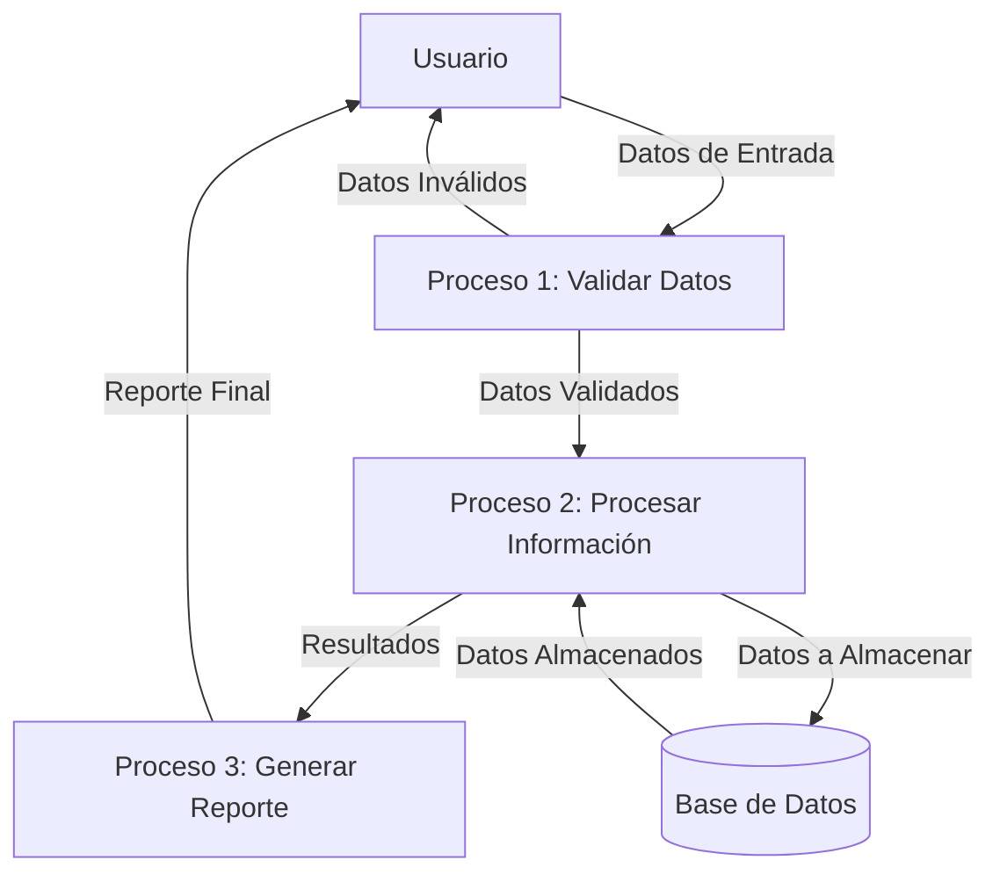
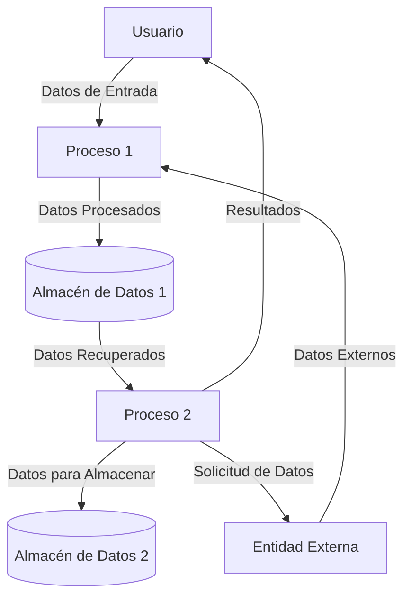

## Module: utfile.cpp
# Análisis Integral del Módulo utfile.cpp

## Módulo/Componente SQL
**utfile.cpp** - Un módulo de utilidad en C++ para operaciones de archivos.

## Objetivos Primarios
Este módulo proporciona funciones utilitarias para manipular archivos y directorios en sistemas operativos Windows y Unix. Su propósito principal es ofrecer una capa de abstracción para operaciones comunes de archivos como verificación de existencia, creación de directorios, manipulación de rutas y gestión de archivos temporales.

## Funciones, Métodos y Consultas Críticas
1. **FileExists** - Verifica si un archivo existe en el sistema.
2. **DirExists** - Comprueba la existencia de un directorio.
3. **MakeDir** - Crea un directorio nuevo.
4. **MakePath** - Crea una estructura de directorios completa.
5. **GetTempFileName** - Genera nombres de archivos temporales únicos.
6. **GetFileSize** - Obtiene el tamaño de un archivo.
7. **GetFileModTime** - Recupera la fecha de modificación de un archivo.
8. **GetFileExtension** - Extrae la extensión de un archivo.
9. **GetFilePath** - Obtiene la ruta de un archivo.
10. **GetFileName** - Extrae el nombre de un archivo de una ruta completa.

## Variables y Elementos Clave
- **char** y **const char*** para manipulación de cadenas y rutas de archivos
- **struct stat** para obtener información de archivos
- **FILE*** para operaciones de archivos
- **time_t** para manejo de fechas y horas
- Constantes como separadores de directorios (`/` para Unix, `\` para Windows)

## Interdependencias y Relaciones
- Dependencia de bibliotecas estándar de C/C++ como `<stdio.h>`, `<stdlib.h>`, `<string.h>`
- Dependencia condicional de bibliotecas específicas del sistema operativo:
  - Windows: `<io.h>`, `<direct.h>`
  - Unix: `<unistd.h>`, `<sys/stat.h>`, `<sys/types.h>`
- Interacción con el sistema de archivos del sistema operativo

## Operaciones Core vs. Auxiliares
**Core:**
- Verificación de existencia de archivos y directorios
- Creación de directorios
- Generación de nombres de archivos temporales

**Auxiliares:**
- Manipulación de cadenas para rutas de archivos
- Conversión de formatos de fecha
- Manejo de errores y excepciones

## Secuencia Operacional/Flujo de Ejecución
1. Las funciones reciben parámetros como rutas de archivos o directorios
2. Se realizan validaciones iniciales (verificación de parámetros nulos)
3. Se ejecutan operaciones específicas del sistema operativo según la plataforma
4. Se devuelven resultados o códigos de error apropiados

## Aspectos de Rendimiento y Optimización
- Uso eficiente de buffers para manipulación de cadenas
- Manejo adecuado de recursos del sistema (cierre de archivos)
- Posibles mejoras en la gestión de memoria para rutas largas
- Optimización potencial en las operaciones repetitivas de verificación de archivos

## Reusabilidad y Adaptabilidad
- Alta reusabilidad gracias a la abstracción de operaciones específicas del sistema operativo
- Adaptabilidad entre plataformas Windows y Unix mediante directivas de preprocesador
- Funciones independientes que pueden ser utilizadas en diversos contextos
- Diseño modular que permite la incorporación de nuevas funcionalidades

## Uso y Contexto
- Utilizado en aplicaciones que requieren manipulación de archivos y directorios
- Aplicable en escenarios de procesamiento de datos, gestión de configuraciones y operaciones de E/S
- Proporciona una capa de abstracción sobre las diferencias entre sistemas operativos

## Suposiciones y Limitaciones
- Asume que las rutas de archivos siguen las convenciones del sistema operativo correspondiente
- Limitado a las funcionalidades básicas de gestión de archivos
- No maneja todos los posibles errores del sistema de archivos
- Posibles problemas con caracteres especiales o rutas muy largas
- Limitaciones en la portabilidad a sistemas operativos no contemplados (distintos de Windows/Unix)
## Flow Diagram [via mermaid]

## Module: utfile.cpp
# Análisis Integral del Módulo utfile.cpp

## Módulo/Componente SQL
**utfile.cpp** - Un módulo de utilidad en C++ para operaciones de archivos.

## Objetivos Primarios
Este módulo proporciona funciones utilitarias para manipular archivos y directorios en sistemas operativos Windows y Unix/Linux. Su propósito principal es ofrecer una interfaz unificada para operaciones comunes de archivos como verificación de existencia, creación de directorios, eliminación de archivos y manipulación de rutas.

## Funciones, Métodos y Consultas Críticas
- **utFileExists**: Verifica si un archivo existe en el sistema.
- **utDirExists**: Comprueba si un directorio existe.
- **utMkDir**: Crea un directorio nuevo.
- **utRmDir**: Elimina un directorio.
- **utRmFile**: Elimina un archivo.
- **utGetFileSize**: Obtiene el tamaño de un archivo.
- **utGetFileModTime**: Recupera la fecha de modificación de un archivo.
- **utGetFileCreateTime**: Obtiene la fecha de creación de un archivo.
- **utGetFileAccessTime**: Recupera la fecha de último acceso a un archivo.
- **utGetFileExtension**: Extrae la extensión de un archivo.
- **utGetFileName**: Obtiene el nombre del archivo sin la ruta.
- **utGetFilePath**: Extrae la ruta de un archivo.
- **utGetCurrentDir**: Obtiene el directorio actual de trabajo.
- **utSetCurrentDir**: Cambia el directorio actual de trabajo.

## Variables y Elementos Clave
- **Parámetros de ruta**: La mayoría de las funciones utilizan parámetros de tipo cadena para representar rutas de archivos o directorios.
- **Estructuras de sistema**: Utiliza estructuras como `struct stat` para obtener información de archivos en sistemas Unix/Linux.
- **Funciones de sistema operativo**: Emplea funciones específicas del sistema como `mkdir`, `rmdir`, `unlink` (Unix/Linux) y sus equivalentes en Windows.
- **Constantes de plataforma**: Define constantes como `PATH_SEPARATOR` que varían según la plataforma.

## Interdependencias y Relaciones
- Depende de bibliotecas estándar de C/C++ como `<sys/stat.h>`, `<unistd.h>` para Unix/Linux y `<direct.h>`, `<io.h>` para Windows.
- Utiliza definiciones condicionales (`#ifdef _WIN32`) para adaptar el código a diferentes sistemas operativos.
- Se integra con otros módulos del sistema a través de su API de funciones de utilidad.

## Operaciones Principales vs. Auxiliares
**Operaciones principales**:
- Verificación de existencia de archivos y directorios
- Creación y eliminación de directorios
- Obtención de metadatos de archivos

**Operaciones auxiliares**:
- Manipulación de cadenas para extraer componentes de rutas
- Conversiones de formato de tiempo
- Manejo de errores específicos del sistema operativo

## Secuencia Operacional/Flujo de Ejecución
1. Las funciones reciben parámetros de ruta de archivo/directorio
2. Realizan verificaciones preliminares (como validación de parámetros)
3. Ejecutan llamadas al sistema operativo apropiadas según la plataforma
4. Procesan los resultados o errores
5. Devuelven valores indicando éxito/fracaso o la información solicitada

## Aspectos de Rendimiento y Optimización
- Las operaciones de archivo son inherentemente lentas (I/O), por lo que el rendimiento depende principalmente del sistema de archivos subyacente.
- El código minimiza las llamadas al sistema innecesarias.
- Podría optimizarse mediante el almacenamiento en caché de resultados para operaciones repetitivas.
- Para operaciones masivas de archivos, podría ser beneficioso implementar procesamiento por lotes.

## Reusabilidad y Adaptabilidad
- Alta reusabilidad debido a su diseño modular con funciones independientes.
- Adaptable a diferentes sistemas operativos mediante compilación condicional.
- Las funciones siguen un patrón de diseño consistente, facilitando su extensión.
- La interfaz es simple y directa, lo que permite su integración en diversos contextos.

## Uso y Contexto
- Utilizado en aplicaciones que requieren manipulación de archivos y directorios.
- Proporciona una capa de abstracción sobre las diferencias específicas del sistema operativo.
- Aplicable en escenarios como instaladores, utilidades de respaldo, procesadores de archivos y aplicaciones de gestión de datos.

## Suposiciones y Limitaciones
- Asume que los permisos de usuario son adecuados para las operaciones solicitadas.
- Limitado a las capacidades del sistema de archivos subyacente.
- No maneja operaciones asíncronas o paralelas de archivos.
- Podría tener problemas con nombres de archivo que contengan caracteres especiales en diferentes codificaciones.
- No implementa operaciones avanzadas como bloqueo de archivos o transmisión en red.
## Flow Diagram [via mermaid]

