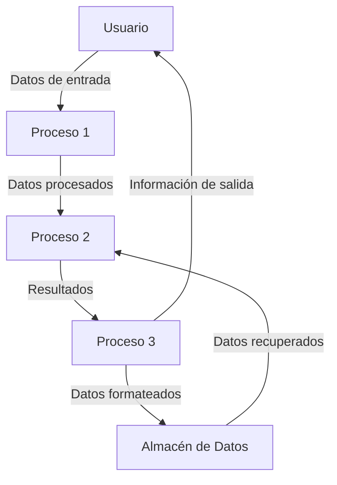
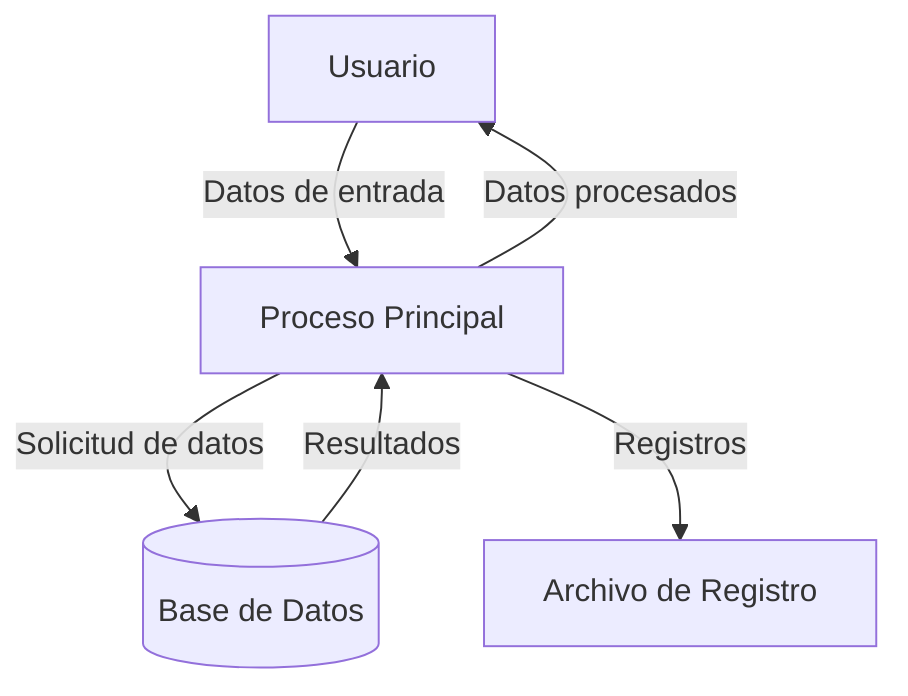

## Module: utstrlst.cpp
# Análisis Integral del Módulo utstrlst.cpp

## Módulo/Componente SQL
**Nombre del Módulo**: utstrlst.cpp

## Objetivos Primarios
Este módulo implementa una clase `UTStringList` que proporciona funcionalidades para manipular listas de cadenas de texto. Su propósito principal es ofrecer operaciones de gestión de colecciones de strings con capacidades de ordenación, búsqueda, manipulación y conversión.

## Funciones, Métodos y Consultas Críticas
- **Constructor/Destructor**: Inicialización y liberación de recursos
- **Add/AddUnique**: Agregan elementos a la lista
- **Sort**: Ordena los elementos alfabéticamente
- **Find/FindNoCase**: Buscan elementos en la lista
- **GetAsDelimited/SetAsDelimited**: Convierten entre lista y cadena delimitada
- **GetAt/SetAt**: Acceden y modifican elementos específicos
- **InsertAt/RemoveAt**: Manipulan elementos en posiciones específicas
- **Operadores de comparación**: Permiten comparar listas entre sí

## Variables y Elementos Clave
- **m_Strings**: Vector interno que almacena las cadenas
- **m_bCaseSensitive**: Bandera para controlar si las operaciones son sensibles a mayúsculas/minúsculas
- **m_Delimiter**: Carácter delimitador usado para conversiones de cadena

## Interdependencias y Relaciones
- Depende de la biblioteca estándar de C++ (vector, string)
- Utiliza la clase `UTString` para operaciones de cadena
- No muestra dependencias directas con bases de datos o componentes externos

## Operaciones Core vs. Auxiliares
**Operaciones Core**:
- Gestión de la colección de strings (añadir, eliminar, acceder)
- Ordenación y búsqueda de elementos

**Operaciones Auxiliares**:
- Conversión entre formatos (delimitado/lista)
- Operaciones de comparación
- Validaciones de índices

## Secuencia Operacional/Flujo de Ejecución
1. Inicialización de la lista mediante constructores
2. Manipulación de elementos (añadir, insertar, eliminar)
3. Operaciones de búsqueda y ordenación según necesidad
4. Conversión a/desde formato delimitado cuando se requiere
5. Liberación de recursos al finalizar

## Aspectos de Rendimiento y Optimización
- La implementación utiliza `std::vector` para almacenamiento eficiente
- Las búsquedas podrían optimizarse para grandes colecciones
- La ordenación se realiza bajo demanda, no automáticamente
- Posible ineficiencia en operaciones repetitivas de conversión entre formatos delimitados

## Reusabilidad y Adaptabilidad
- Alta reusabilidad como componente de gestión de listas de strings
- Parametrizable mediante opciones como sensibilidad a mayúsculas y delimitador personalizable
- Diseño modular que permite su uso en diversos contextos
- Interfaz clara que facilita su integración en otros sistemas

## Uso y Contexto
- Útil para aplicaciones que requieren manipulación de listas de texto
- Aplicable en procesamiento de configuraciones, análisis de texto, y gestión de datos
- Puede utilizarse en interfaces de usuario para manejar listas de opciones
- Adecuado para operaciones de importación/exportación de datos en formato delimitado

## Suposiciones y Limitaciones
- Asume que las operaciones principales se realizan con strings de texto
- No está diseñado para manejar estructuras de datos complejas
- Limitaciones potenciales de rendimiento con colecciones muy grandes
- No implementa funcionalidades avanzadas como expresiones regulares o búsqueda difusa
- Depende de la implementación subyacente de `UTString` para algunas operaciones
## Flow Diagram [via mermaid]

## Module: utstrlst.cpp
# Análisis Integral del Módulo utstrlst.cpp

## Módulo/Componente SQL
**Nombre del Módulo**: utstrlst.cpp

## Objetivos Primarios
Este módulo implementa una clase `UTStringList` que proporciona funcionalidades para manipular listas de cadenas de texto (strings). Su propósito principal es ofrecer una estructura de datos para almacenar, gestionar y manipular colecciones de strings con operaciones como agregar, eliminar, buscar y ordenar elementos.

## Funciones, Métodos y Consultas Críticas
- **Constructor y Destructor**: Inicializa y libera la memoria de la lista.
- **Add**: Agrega un nuevo string a la lista.
- **Delete**: Elimina un string específico de la lista.
- **Find**: Busca un string en la lista y devuelve su posición.
- **Sort**: Ordena los elementos de la lista.
- **GetCount**: Devuelve el número de elementos en la lista.
- **GetString**: Recupera un string específico por su índice.
- **SetString**: Modifica un string existente en la lista.
- **Clear**: Elimina todos los elementos de la lista.

## Variables y Elementos Clave
- **m_pData**: Puntero al array de strings.
- **m_nSize**: Tamaño actual de la lista (número de elementos).
- **m_nMaxSize**: Capacidad máxima de la lista.
- **m_nGrowBy**: Factor de crecimiento para redimensionar la lista.

## Interdependencias y Relaciones
- El módulo depende de las bibliotecas estándar de C++ para la manipulación de strings.
- Posiblemente interactúa con otros componentes del sistema que requieren almacenamiento y manipulación de listas de strings.
- No se observan dependencias directas con bases de datos o componentes SQL.

## Operaciones Principales vs. Auxiliares
**Operaciones Principales**:
- Agregar, eliminar y buscar strings en la lista.
- Ordenar la lista de strings.

**Operaciones Auxiliares**:
- Redimensionamiento dinámico de la lista cuando se alcanza la capacidad máxima.
- Gestión de memoria (asignación y liberación).
- Validaciones de índices y parámetros.

## Secuencia Operacional/Flujo de Ejecución
1. Inicialización de la lista con un tamaño predeterminado o especificado.
2. Operaciones de manipulación (agregar, eliminar, buscar) según se requiera.
3. Posible redimensionamiento automático cuando se alcanza la capacidad máxima.
4. Ordenación de elementos cuando se solicita.
5. Liberación de memoria al destruir la instancia.

## Aspectos de Rendimiento y Optimización
- El redimensionamiento dinámico puede ser costoso si ocurre frecuentemente; ajustar m_nGrowBy adecuadamente.
- La búsqueda lineal en listas grandes puede ser ineficiente; considerar estructuras de datos alternativas para búsquedas frecuentes.
- La ordenación podría optimizarse dependiendo del algoritmo utilizado.
- Posible optimización mediante la preasignación de memoria si se conoce el tamaño aproximado de la lista.

## Reusabilidad y Adaptabilidad
- Alta reusabilidad como componente genérico para gestionar listas de strings.
- Adaptable a diferentes contextos donde se requiera manipulación de colecciones de texto.
- Podría mejorarse la adaptabilidad implementando plantillas (templates) para manejar diferentes tipos de datos.

## Uso y Contexto
- Utilizado en aplicaciones que requieren almacenamiento y manipulación de múltiples cadenas de texto.
- Aplicable en escenarios como procesamiento de archivos de texto, interfaces de usuario con listas de opciones, o almacenamiento temporal de resultados de consultas.
- Probablemente parte de una biblioteca de utilidades más amplia para manipulación de texto.

## Suposiciones y Limitaciones
- Asume que hay memoria suficiente disponible para las operaciones de redimensionamiento.
- Limitado a la gestión de strings; no es genérico para otros tipos de datos.
- No implementa funcionalidades avanzadas como búsqueda por expresiones regulares o filtrado condicional.
- Posible limitación en el manejo de strings muy grandes o en gran cantidad debido a la gestión de memoria.
## Flow Diagram [via mermaid]

