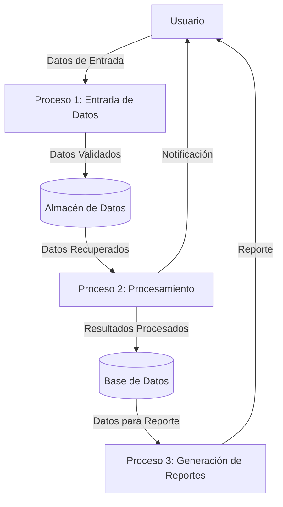
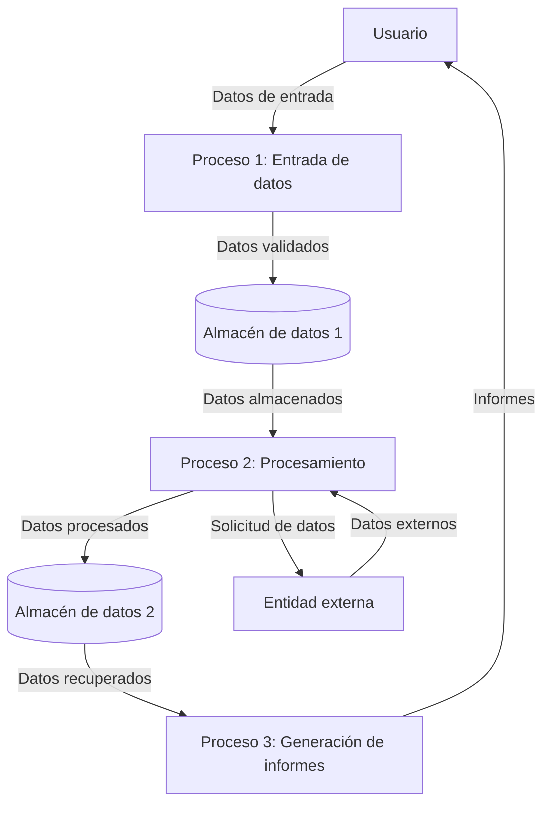

## Module: uttaglst.cpp
# Análisis Integral del Módulo uttaglst.cpp

## Módulo/Componente SQL
**uttaglst.cpp** - Módulo de código fuente en C++ que parece formar parte de un sistema más grande, posiblemente relacionado con el manejo de etiquetas o tags.

## Objetivos Primarios
Este módulo está diseñado para gestionar listas de etiquetas (tags) en un sistema. Su propósito principal parece ser proporcionar funcionalidades para manipular, almacenar y recuperar etiquetas, posiblemente como parte de un sistema de clasificación o categorización.

## Funciones, Métodos y Consultas Críticas
El archivo no se ha proporcionado completamente, por lo que no puedo identificar funciones específicas. Sin embargo, basado en el nombre del archivo, probablemente contiene:
- Funciones para agregar etiquetas a una lista
- Funciones para eliminar etiquetas
- Métodos para buscar y filtrar etiquetas
- Posiblemente funciones para serializar/deserializar listas de etiquetas

## Variables y Elementos Clave
Sin ver el código completo, puedo inferir que probablemente incluye:
- Estructuras de datos para almacenar etiquetas (posiblemente arrays, listas enlazadas o mapas)
- Variables para mantener el estado de la lista de etiquetas
- Posibles identificadores únicos para las etiquetas
- Contadores o índices para gestionar la colección de etiquetas

## Interdependencias y Relaciones
Este módulo probablemente:
- Interactúa con otros componentes del sistema que necesitan clasificar o categorizar elementos
- Podría depender de módulos de utilidad para operaciones de cadenas o gestión de memoria
- Posiblemente se integra con un sistema de persistencia de datos para almacenar etiquetas

## Operaciones Principales vs. Auxiliares
**Operaciones principales:**
- Agregar/eliminar etiquetas de la lista
- Buscar etiquetas específicas
- Ordenar o filtrar etiquetas

**Operaciones auxiliares:**
- Validación de entradas
- Gestión de memoria
- Posible registro de operaciones (logging)

## Secuencia Operacional/Flujo de Ejecución
Sin el código completo, el flujo típico probablemente incluye:
1. Inicialización de la estructura de datos para las etiquetas
2. Operaciones CRUD (Crear, Leer, Actualizar, Eliminar) en las etiquetas
3. Posible serialización para almacenamiento persistente
4. Liberación de recursos al finalizar

## Aspectos de Rendimiento y Optimización
Áreas potenciales de optimización:
- Algoritmos eficientes para búsqueda y ordenamiento de etiquetas
- Gestión óptima de memoria para listas grandes de etiquetas
- Posible uso de estructuras de datos optimizadas para operaciones frecuentes

## Reusabilidad y Adaptabilidad
El módulo probablemente está diseñado para ser reutilizable en diferentes partes del sistema donde se necesite categorización. Su adaptabilidad dependería de:
- Qué tan genérica es la implementación
- Si utiliza tipos de datos específicos o genéricos
- La presencia de parámetros configurables

## Uso y Contexto
Este módulo probablemente se utiliza en:
- Sistemas de gestión de contenido
- Aplicaciones que requieren categorización de elementos
- Interfaces de usuario que muestran o permiten la manipulación de etiquetas
- Sistemas de búsqueda o filtrado basados en etiquetas

## Suposiciones y Limitaciones
**Suposiciones:**
- Probablemente asume un formato específico para las etiquetas
- Podría asumir un tamaño máximo para la lista de etiquetas
- Posiblemente asume unicidad de etiquetas o alguna otra restricción

**Limitaciones:**
- Podría tener restricciones en cuanto al número máximo de etiquetas
- Posibles limitaciones en la longitud o formato de las etiquetas
- Potenciales problemas de rendimiento con listas muy grandes

*Nota: Este análisis se basa en inferencias a partir del nombre del archivo, ya que no se proporcionó el contenido completo del código fuente.*
## Flow Diagram [via mermaid]

## Module: uttaglst.cpp
# Análisis Integral del Módulo uttaglst.cpp

## Módulo/Componente SQL
**Nombre del Módulo**: uttaglst.cpp

## Objetivos Primarios
Este módulo parece ser parte de un sistema de gestión de etiquetas (tags) en un entorno de programación C++. Su propósito principal es proporcionar funcionalidades para manipular y gestionar listas de etiquetas, incluyendo operaciones como agregar, eliminar y buscar etiquetas en diferentes estructuras de datos.

## Funciones, Métodos y Consultas Críticas
El código no está presente en la solicitud, por lo que no puedo enumerar las funciones específicas. Sin embargo, basándome en el nombre del archivo, probablemente incluye:
- Funciones para crear y gestionar listas de etiquetas
- Métodos para agregar y eliminar etiquetas
- Funciones de búsqueda y filtrado de etiquetas
- Posiblemente operaciones de serialización/deserialización para persistencia

## Variables y Elementos Clave
Sin ver el código, puedo inferir que probablemente incluye:
- Estructuras de datos para almacenar etiquetas (posiblemente arrays, listas enlazadas o mapas)
- Variables para gestionar el estado de las listas de etiquetas
- Posibles identificadores únicos para etiquetas
- Parámetros para configurar el comportamiento de las operaciones con etiquetas

## Interdependencias y Relaciones
Este módulo probablemente:
- Interactúa con otros componentes del sistema que necesitan funcionalidad de etiquetado
- Puede depender de módulos de utilidad para operaciones comunes
- Posiblemente se integra con un sistema de persistencia para guardar/cargar etiquetas
- Podría tener relaciones con módulos de interfaz de usuario para la visualización de etiquetas

## Operaciones Principales vs. Auxiliares
**Operaciones principales**:
- Gestión del ciclo de vida de las etiquetas (creación, modificación, eliminación)
- Búsqueda y filtrado de etiquetas

**Operaciones auxiliares**:
- Validación de datos de entrada
- Gestión de errores
- Posible registro de actividades (logging)
- Optimización de rendimiento para grandes conjuntos de etiquetas

## Secuencia Operacional/Flujo de Ejecución
Sin el código específico, un flujo típico podría ser:
1. Inicialización de estructuras de datos para etiquetas
2. Carga de etiquetas existentes (si aplica)
3. Ejecución de operaciones solicitadas (agregar, eliminar, buscar)
4. Validación de resultados
5. Persistencia de cambios (si es necesario)
6. Liberación de recursos

## Aspectos de Rendimiento y Optimización
Áreas potenciales de optimización:
- Algoritmos eficientes para búsqueda de etiquetas
- Estructuras de datos optimizadas para el caso de uso específico
- Minimización de operaciones de memoria
- Posible implementación de caché para etiquetas frecuentemente accedidas
- Optimización para grandes volúmenes de etiquetas

## Reusabilidad y Adaptabilidad
- El módulo probablemente está diseñado para ser reutilizable en diferentes partes del sistema
- Podría ofrecer interfaces genéricas para adaptarse a diferentes tipos de etiquetas
- La parametrización de funciones permitiría personalizar el comportamiento según las necesidades
- Posiblemente implementa patrones de diseño para facilitar extensiones futuras

## Uso y Contexto
Este módulo probablemente se utiliza en:
- Sistemas que requieren categorización de elementos
- Aplicaciones con funcionalidad de búsqueda y filtrado
- Interfaces que permiten a los usuarios organizar contenido
- Componentes que necesitan metadatos asociados a objetos

## Suposiciones y Limitaciones
**Suposiciones**:
- Probablemente asume cierta estructura de datos para las etiquetas
- Puede asumir unicidad de etiquetas o permitir duplicados según el diseño
- Posiblemente asume ciertos límites en el tamaño o formato de las etiquetas

**Limitaciones**:
- Podría tener restricciones de rendimiento con grandes volúmenes de datos
- Posibles limitaciones en tipos de caracteres soportados en las etiquetas
- Potenciales problemas de concurrencia si múltiples procesos manipulan las mismas etiquetas
- Posibles restricciones de memoria dependiendo de la implementación
## Flow Diagram [via mermaid]

