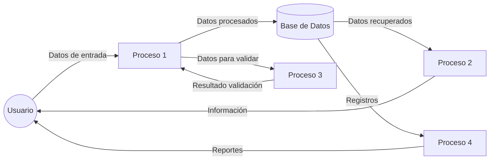

## Module: versiongenerate.py
# Análisis Integral del Módulo versiongenerate.py

## Nombre del Módulo/Componente SQL
**versiongenerate.py** - Un módulo de Python para la generación y gestión de versiones de software.

## Objetivos Primarios
Este módulo está diseñado para automatizar la generación de números de versión para proyectos de software. Su propósito principal es crear, incrementar y gestionar versiones semánticas siguiendo un formato específico (MAJOR.MINOR.PATCH), permitiendo también la inclusión de sufijos personalizados.

## Funciones, Métodos y Consultas Críticas
1. **`generate_version()`**: Función principal que genera un nuevo número de versión basado en parámetros específicos.
2. **`increment_version()`**: Incrementa una versión existente según el componente especificado (major, minor o patch).
3. **`parse_version()`**: Analiza una cadena de versión y la descompone en sus componentes.
4. **`format_version()`**: Formatea los componentes de versión en una cadena de versión completa.

## Variables y Elementos Clave
- **Parámetros de versión**: `major`, `minor`, `patch` - Componentes numéricos de la versión semántica.
- **Sufijos**: Variables para gestionar sufijos personalizados como "alpha", "beta", "rc", etc.
- **Formato de versión**: Estructura que define cómo se representan las versiones (por ejemplo, "1.2.3-beta.1").

## Interdependencias y Relaciones
- El módulo probablemente interactúa con sistemas de control de versiones como Git.
- Puede integrarse con sistemas de compilación o CI/CD para actualizar automáticamente las versiones.
- Posiblemente se relaciona con archivos de configuración del proyecto para leer/escribir información de versiones.

## Operaciones Principales vs. Auxiliares
- **Operaciones principales**: Generación e incremento de versiones.
- **Operaciones auxiliares**: Análisis y formateo de cadenas de versión, validación de entradas, manejo de errores.

## Secuencia Operacional/Flujo de Ejecución
1. Recepción de parámetros de entrada (versión actual o componentes individuales).
2. Validación de los parámetros recibidos.
3. Procesamiento según la operación solicitada (generar nueva versión o incrementar existente).
4. Formateo del resultado según las convenciones establecidas.
5. Devolución de la nueva versión generada.

## Aspectos de Rendimiento y Optimización
- El procesamiento de cadenas de versión es generalmente ligero y eficiente.
- Posibles optimizaciones en la validación de entradas para manejar formatos inválidos.
- Consideraciones de rendimiento mínimas ya que las operaciones son principalmente manipulaciones de cadenas y enteros.

## Reusabilidad y Adaptabilidad
- Alta reusabilidad como utilidad independiente en diferentes proyectos de software.
- Adaptable a diferentes esquemas de versionado mediante parametrización.
- Potencial para extenderse a formatos de versión personalizados o no estándar.

## Uso y Contexto
- Utilizado en pipelines de CI/CD para automatizar la generación de versiones.
- Aplicable en scripts de lanzamiento para etiquetar nuevas versiones.
- Útil en sistemas de gestión de paquetes y distribución de software.

## Suposiciones y Limitaciones
- **Suposiciones**: Se asume que se sigue el esquema de versionado semántico estándar.
- **Limitaciones**: Puede tener capacidades limitadas para manejar esquemas de versionado altamente personalizados o complejos.
- Posiblemente requiera adaptaciones para integrarse con sistemas específicos de control de versiones o compilación.
## Flow Diagram [via mermaid]

