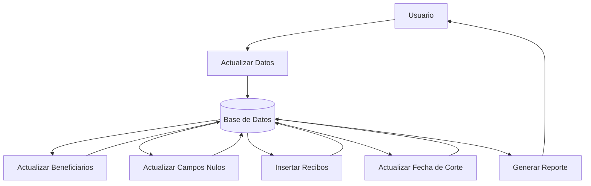

## Module: CD0011spcActualizaCarga.sql

# Análisis Integral del Módulo CD0011spcActualizaCarga

## Módulo/Componente SQL
**Nombre**: CD0011spcActualizaCarga
**Tipo**: Procedimiento Almacenado (Stored Procedure)

## Objetivos Primarios
Este procedimiento almacenado tiene como propósito principal realizar actualizaciones del filtro en el sistema, específicamente para gestionar datos relacionados con seguros, beneficiarios y transacciones. El procedimiento actualiza información de seguros adicionales, procesa movimientos de seguros de automóvil y gestiona registros de recibos de caja.

## Funciones, Métodos y Consultas Críticas
- **Actualización de Beneficiarios**: Actualiza datos de seguros adicionales en la tabla CarCargaTransacciones desde CarCargaBeneficiarios.
- **Normalización de Datos**: Establece valores predeterminados para campos nulos en la tabla CarCargaTransacciones.
- **Inserción de Recibos**: Realiza múltiples operaciones INSERT en la tabla ctlRecibosCajaCte desde diferentes fuentes:
  - CaCarMovHistorial (para diversos tipos de movimientos)
  - CaSegurosClientesNuevosHistorial (para seguros de clientes nuevos)
  - TdTiempoAire (para transacciones de tiempo aire)
- **Consolidación de Recibos**: Inserta registros resumidos en ctlRecibosCajasTda.
- **Actualización de Fechas**: Gestiona la tabla ctlMaestraFechas para mantener la fecha de corte actualizada.

## Variables y Elementos Clave
- **Tablas Principales**:
  - CarCargaTransacciones
  - CarCargaBeneficiarios
  - CaCarMovHistorial
  - CaSegurosClientesNuevosHistorial
  - TdTiempoAire
  - ctlRecibosCajaCte
  - ctlRecibosCajasTda
  - ctlMaestraFechas
  - tmpTiendasErrores
  - ctlMensajesErrorTienda
- **Variables Clave**:
  - @num_cajaTAcn: Número de caja para transacciones de tiempo aire
- **Columnas Críticas**:
  - Identificadores: NumeroCliente, Folio, Recibo, Factura
  - Fechas: FechaMovimiento, Fecha, FechaVenta
  - Datos personales: Nombre, ApellidoPaterno, ApellidoMaterno
  - Datos financieros: Importe, ImporteVenta

## Interdependencias y Relaciones
- Relación entre CarCargaTransacciones y CarCargaBeneficiarios para actualizar datos de seguros adicionales.
- Validación contra tmpTiendasErrores y ctlMensajesErrorTienda para filtrar tiendas con errores críticos.
- Obtención del número de caja desde ctl_configuracionCortesCajas.
- Relaciones entre transacciones, clientes y recibos a través de múltiples tablas del sistema.

## Operaciones Principales vs. Auxiliares
**Operaciones Principales**:
- Actualización de datos de seguros adicionales
- Inserción de registros de recibos desde diferentes fuentes de transacciones
- Consolidación de recibos por tienda, fecha y caja

**Operaciones Auxiliares**:
- Normalización de datos nulos
- Validación de errores críticos en tiendas
- Actualización de la fecha de corte

## Secuencia Operativa
1. Obtiene el número de caja para transacciones de tiempo aire
2. Actualiza datos de seguros adicionales en CarCargaTransacciones desde CarCargaBeneficiarios
3. Normaliza campos nulos en CarCargaTransacciones y CarCargaBeneficiarios
4. Inserta registros de recibos desde CaCarMovHistorial (excluyendo tiendas con errores críticos)
5. Inserta registros de recibos desde CaSegurosClientesNuevosHistorial
6. Inserta registros de recibos desde TdTiempoAire
7. Consolida recibos por tienda, fecha y caja en ctlRecibosCajasTda
8. Actualiza o inserta la fecha de corte en ctlMaestraFechas

## Aspectos de Rendimiento y Optimización
- Uso de NOLOCK en todas las consultas, lo que puede mejorar el rendimiento pero sacrifica consistencia transaccional
- Múltiples operaciones de actualización e inserción que podrían beneficiarse de índices adecuados
- Conversiones de tipos de datos (CAST) en cálculos de importes que podrían optimizarse
- Consultas anidadas (NOT EXISTS) que podrían requerir optimización en grandes volúmenes de datos

## Reusabilidad y Adaptabilidad
- El procedimiento está altamente acoplado a la estructura específica de las tablas del sistema
- Contiene lógica de negocio específica para el procesamiento de seguros y transacciones
- La parametrización es limitada (solo usa @num_cajaTAcn)
- Modificaciones históricas documentadas indican adaptabilidad para nuevos requisitos

## Uso y Contexto
- Ejecutado por la aplicación CD0011Filtro.EXE
- Utilizado en el contexto de procesamiento de transacciones, seguros y recibos
- Forma parte del sistema de gestión de cajas y tiendas
- Procesa diferentes tipos de movimientos financieros y de seguros

## Supuestos y Limitaciones
- Asume la existencia y estructura específica de múltiples tablas del sistema
- Depende de la configuración correcta de la tabla ctl_configuracionCortesCajas
- Limitado a procesar solo ciertos tipos de movimientos específicos
- No maneja explícitamente errores o excepciones durante la ejecución
- Asume que los datos de origen están en formatos específicos (especialmente para conversiones de tipos)
- La fecha de corte se establece como el día anterior a la fecha actual
## Flow Diagram [via mermaid]

