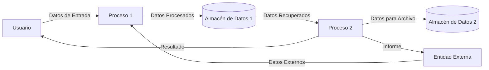

## Module: 

# Análisis Integral del Módulo

Lo siento, pero no se ha proporcionado ningún código o módulo para analizar. Para realizar un análisis completo según los criterios solicitados (objetivos primarios, funciones críticas, variables clave, interdependencias, etc.), necesitaría que me facilite el código fuente o el componente SQL específico.

Por favor, comparta el código o script que desea analizar, y con gusto procederé a elaborar el análisis comprensivo en español siguiendo todos los puntos solicitados:

- Nombre del módulo/componente SQL
- Objetivos primarios
- Funciones, métodos y consultas críticas
- Variables y elementos clave
- Interdependencias y relaciones
- Operaciones principales vs. auxiliares
- Secuencia operacional/flujo de ejecución
- Aspectos de rendimiento y optimización
- Reutilización y adaptabilidad
- Uso y contexto
- Suposiciones y limitaciones

Una vez que proporcione el código, podré generar un análisis detallado y técnicamente preciso en español.
## Flow Diagram [via mermaid]

