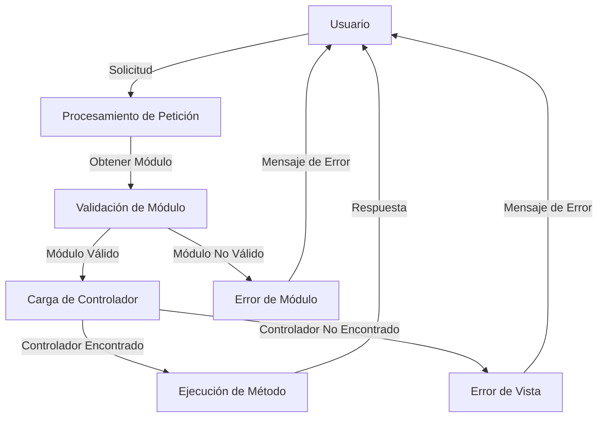

## Module: Bootstrap.php

# Análisis Integral del Módulo Bootstrap.php

## Nombre del Módulo/Componente SQL
**Bootstrap.php** - Clase de inicialización y enrutamiento de la aplicación

## Objetivos Primarios
Este módulo actúa como el punto de entrada principal para la aplicación, implementando un patrón Front Controller. Su propósito es procesar las peticiones entrantes, determinar qué controlador y método deben ejecutarse, y dirigir el flujo de la aplicación hacia el componente adecuado basándose en la URL solicitada.

## Funciones, Métodos y Consultas Críticas
- **run(Request $peticion)**: Método estático principal que analiza la petición, localiza el controlador correspondiente y ejecuta el método solicitado con los argumentos proporcionados.

## Variables y Elementos Clave
- **$modulo**: Identifica el módulo de la aplicación a utilizar
- **$controller**: Nombre del controlador a instanciar
- **$metodo**: Método del controlador a ejecutar
- **$args**: Argumentos que se pasarán al método del controlador
- **$rutaModulo**: Ruta al archivo del módulo
- **$rutaControlador**: Ruta al archivo del controlador

## Interdependencias y Relaciones
- Depende de la clase **Request** para obtener información sobre la petición actual
- Interactúa con el sistema de archivos para localizar y cargar controladores
- Se relaciona con la estructura de directorios de la aplicación (ROOT, DS)
- Utiliza la función JavaScript **MensajeErrorCargarVista** cuando no encuentra una vista

## Operaciones Principales vs. Auxiliares
**Operaciones principales:**
- Determinar el controlador y método a ejecutar
- Cargar dinámicamente los archivos de controlador
- Invocar el método correspondiente con los argumentos adecuados

**Operaciones auxiliares:**
- Verificación de la existencia y legibilidad de archivos
- Manejo de errores cuando no se encuentran los controladores
- Mostrar mensajes de error al usuario

## Secuencia Operacional/Flujo de Ejecución
1. Recibe un objeto Request con la información de la petición
2. Extrae el módulo, controlador, método y argumentos de la petición
3. Si existe un módulo, intenta cargar su archivo correspondiente
4. Determina la ruta al controlador (con o sin módulo)
5. Verifica si el controlador existe y es legible
6. Instancia el controlador
7. Verifica si el método solicitado existe, si no, usa 'index' por defecto
8. Ejecuta el método del controlador con los argumentos proporcionados
9. Si no encuentra el controlador, muestra un mensaje de error

## Aspectos de Rendimiento y Optimización
- Utiliza verificaciones de existencia de archivos (is_readable) antes de intentar cargarlos
- Implementa comprobaciones de llamabilidad (is_callable) para evitar errores de ejecución
- Podría optimizarse implementando un sistema de caché para rutas de controladores frecuentemente utilizados

## Reusabilidad y Adaptabilidad
- El diseño es modular y permite la fácil incorporación de nuevos controladores y módulos
- La estructura facilita la expansión del sistema sin modificar el código base
- La separación entre módulos y controladores permite una organización clara del código

## Uso y Contexto
- Se utiliza como parte del sistema de enrutamiento de la aplicación
- Actúa como intermediario entre las peticiones del usuario y la lógica de la aplicación
- Forma parte de una arquitectura MVC (Modelo-Vista-Controlador)

## Suposiciones y Limitaciones
- Asume una estructura de directorios específica (ROOT, controllers, modules)
- Requiere que los controladores sigan una convención de nomenclatura (nombre + 'Controller')
- Depende de la constante DS para la separación de directorios
- No implementa un manejo de errores robusto (utiliza excepciones básicas)
- La gestión de errores para vistas no encontradas está implementada con JavaScript en lugar de un enfoque más consistente con el resto del código
## Flow Diagram [via mermaid]

