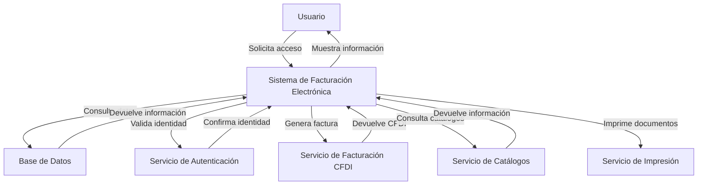

## Module: Config.php

# Análisis Integral del Módulo Config.php

## Módulo/Componente SQL
**Nombre del Módulo**: Config.php

## Objetivos Primarios
Este archivo es un módulo de configuración PHP que define constantes y variables globales para la aplicación de Facturación Electrónica CFDI 4.0. Su propósito principal es centralizar los parámetros de configuración del sistema, incluyendo URLs, credenciales, rutas de archivos, y otros valores constantes necesarios para el funcionamiento de la aplicación.

## Funciones, Métodos y Consultas Críticas
El archivo no contiene funciones o métodos específicos, sino que se compone principalmente de definiciones de constantes mediante la función `define()` de PHP. No hay consultas SQL directas en este archivo.

## Variables y Elementos Clave
- **Variables de Entorno**:
  - `$IPSERVER`: Almacena la dirección IP del servidor
- **Constantes de Configuración**:
  - `BASE_HOST`, `BASE_URL`: Definen la ubicación base del servidor y la URL
  - `DEFAULT_CONTROLLER`, `DEFAULT_LAYOUT`: Configuración MVC
  - `APP_VERSION`, `APP_NAME`, `APP_COMPANY`: Información de la aplicación
  - `SESSION_TIME`, `SESSION_NAME`: Configuración de sesiones
  - `RFC_EMPRESA`, `TIPO_COMPROBANTE`, `SERIE_COMPROBANTE`: Parámetros de facturación
  - Múltiples URLs de servicios web (WSDL)

## Interdependencias y Relaciones
El archivo establece conexiones con varios sistemas externos a través de URLs definidas:
- Servicios de bus empresarial (`URL_BUS_PERSONAL`)
- Sistema de autenticación de huellas (`WSHUELLAS`, `URL_VALIDAR_HUELLA`)
- Servicios de facturación electrónica (`WSFACTURACIONCFDI`)
- Servicios de impresión (`WS_IMPRESOR`)
- Consulta de clientes (`URL_CONSULTACLIENTE`)

## Operaciones Principales vs. Auxiliares
- **Operaciones Principales**: Definición de constantes críticas para la facturación electrónica (RFC, tipos de comprobantes, series)
- **Operaciones Auxiliares**: Configuración de rutas de archivos, logs, y parámetros de desarrollo

## Secuencia Operativa/Flujo de Ejecución
1. Establecimiento de la zona horaria (`date_default_timezone_set`)
2. Obtención de la dirección IP del servidor
3. Definición de constantes básicas de la aplicación (URLs, controladores)
4. Definición de constantes para sesiones
5. Configuración de servicios web externos
6. Establecimiento de parámetros específicos para facturación electrónica
7. Configuración de rutas para archivos y logs
8. Definición de parámetros para impresión y generación de códigos QR
9. Configuración de flags de desarrollo y funcionalidades

## Aspectos de Rendimiento y Optimización
- No hay operaciones intensivas que puedan afectar el rendimiento
- El archivo es cargado una vez al inicio de la aplicación
- No hay bucles ni operaciones repetitivas que puedan causar cuellos de botella

## Reusabilidad y Adaptabilidad
- El archivo está diseñado específicamente para la aplicación de Facturación Electrónica CFDI 4.0
- La centralización de constantes facilita cambios en un solo lugar
- Para adaptarlo a otros entornos, sería necesario modificar las URLs, rutas y parámetros específicos
- La estructura podría reutilizarse como plantilla para otros sistemas de configuración

## Uso y Contexto
- Este archivo es incluido al inicio de la aplicación para cargar todas las configuraciones necesarias
- Proporciona acceso global a parámetros críticos para todos los componentes de la aplicación
- Es fundamental para la conexión con servicios externos y la configuración del comportamiento del sistema

## Suposiciones y Limitaciones
- **Suposiciones**:
  - Se asume que el servidor tiene acceso a todos los servicios web definidos
  - Se espera que la estructura de directorios coincida con las rutas definidas
  - Se presupone un entorno de red corporativo con acceso a sistemas internos de Coppel
- **Limitaciones**:
  - Configuración específica para el entorno de Coppel, no es directamente portable
  - Dependencia de múltiples servicios externos que deben estar disponibles
  - Valores hardcodeados que podrían requerir modificación manual para cambios de entorno
## Flow Diagram [via mermaid]

