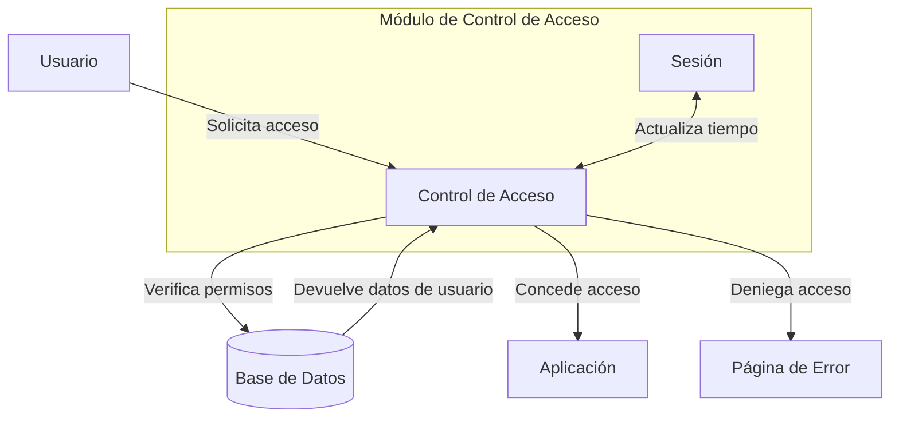

## Module: ControlAcceso.php

# Análisis Integral del Módulo ControlAcceso.php

## Nombre del Módulo/Componente SQL
**ControlAcceso.php** - Clase PHP para gestión de control de acceso y permisos de usuario.

## Objetivos Primarios
Este módulo está diseñado para gestionar el control de acceso basado en roles y permisos dentro de una aplicación web. Su propósito principal es verificar si un usuario tiene los permisos necesarios para acceder a determinadas funcionalidades o recursos del sistema.

## Funciones, Métodos y Consultas Críticas
1. **__construct()**: Constructor de la clase, actualmente vacío.
2. **permiso($key)**: Verifica si existe un permiso específico y si está habilitado.
3. **getPermisos()**: Devuelve la lista completa de permisos del usuario.
4. **acceso($key)**: Controla el acceso a recursos específicos y redirige al usuario si no tiene los permisos necesarios.

## Variables y Elementos Clave
- **$_role**: Variable privada que almacena el rol del usuario.
- **$_conndmp**: Variable privada que probablemente almacena una conexión a base de datos.
- **$_listaPermisos**: Array asociativo que contiene los permisos del usuario.
- **$_datosusuario**: Variable privada que almacena información del usuario.

## Interdependencias y Relaciones
- **Session**: El método `acceso()` utiliza `Session::tiempo()`, lo que indica una dependencia con una clase de gestión de sesiones.
- **BASE_URL**: Constante utilizada para la redirección, probablemente definida en otro archivo de configuración.
- El módulo parece ser parte de un sistema de autenticación y autorización más amplio.

## Operaciones Principales vs. Auxiliares
- **Operaciones Principales**: 
  - Verificación de permisos (`permiso()`)
  - Control de acceso a recursos (`acceso()`)
- **Operaciones Auxiliares**:
  - Obtención de la lista de permisos (`getPermisos()`)
  - Manejo de excepciones
  - Actualización del tiempo de sesión

## Secuencia Operativa/Flujo de Ejecución
1. Se instancia la clase `ControlAcceso`.
2. Se verifica un permiso específico mediante `permiso($key)`.
3. Si se requiere controlar el acceso, se llama a `acceso($key)`, que:
   - Verifica el permiso
   - Actualiza el tiempo de sesión si el permiso existe
   - Redirige a una página de error si el permiso no existe

## Aspectos de Rendimiento y Optimización
- El código utiliza estructuras de datos simples (arrays) para almacenar permisos, lo que es eficiente para búsquedas.
- No hay operaciones de base de datos visibles en el código mostrado, aunque la variable `$_conndmp` sugiere que podrían existir en métodos no mostrados.
- El manejo de excepciones podría optimizarse para proporcionar mensajes más específicos según el tipo de error.

## Reusabilidad y Adaptabilidad
- La clase está diseñada de manera modular, lo que facilita su reutilización en diferentes partes de la aplicación.
- La implementación actual es bastante genérica, permitiendo su adaptación a diferentes sistemas de permisos.
- Falta la inicialización de las variables privadas, lo que sugiere que podría haber métodos adicionales no mostrados para configurar estos valores.

## Uso y Contexto
- Este módulo se utiliza en un sistema de control de acceso basado en permisos, probablemente como parte de un framework MVC.
- Se implementa para proteger rutas o funcionalidades específicas de la aplicación.
- El método `acceso()` parece estar diseñado para ser llamado al inicio de controladores o acciones que requieren verificación de permisos.

## Suposiciones y Limitaciones
- **Suposiciones**:
  - Se asume que `$_listaPermisos` ha sido inicializado previamente con la estructura correcta.
  - Se espera que exista una clase `Session` con un método `tiempo()`.
  - Se asume que la constante `BASE_URL` está definida.
- **Limitaciones**:
  - No hay inicialización visible de las variables privadas.
  - No se muestra cómo se cargan los permisos del usuario.
  - El manejo de errores podría ser más específico para diferentes tipos de excepciones.
  - No hay documentación de código (comentarios) que explique el propósito de cada método.
## Flow Diagram [via mermaid]

