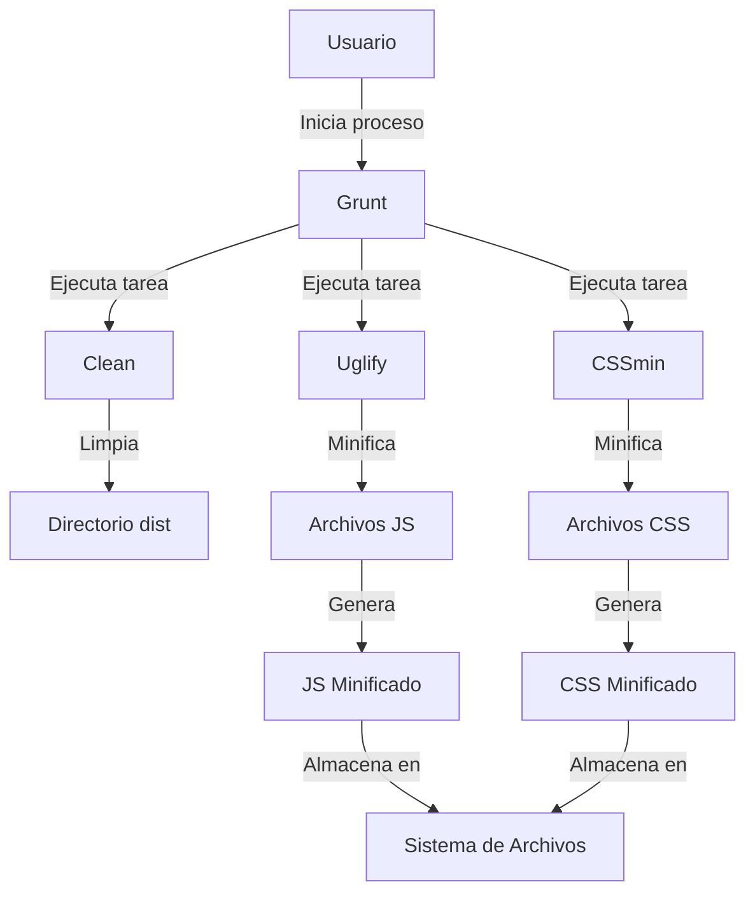

## Module: Gruntfile.js

# Análisis Integral del Módulo Gruntfile.js

## Módulo/Componente SQL
**Nombre del Módulo**: Gruntfile.js

## Objetivos Primarios
Este archivo es un script de configuración para Grunt, un ejecutor de tareas de JavaScript que automatiza procesos de desarrollo web. Su propósito principal es definir y configurar tareas para limpiar directorios, minificar archivos JavaScript y CSS, optimizando así los recursos para entornos de producción.

## Funciones, Métodos y Consultas Críticas
- **grunt.initConfig()**: Configura las tareas principales del proyecto.
- **clean**: Tarea para eliminar el directorio 'dist'.
- **uglify**: Tarea para minificar archivos JavaScript.
- **cssmin**: Tarea para minificar archivos CSS.
- **grunt.loadNpmTasks()**: Carga los plugins de Grunt necesarios.
- **grunt.registerTask()**: Define la tarea por defecto que ejecuta las tareas en secuencia.

## Variables y Elementos Clave
- **Configuración de 'clean'**: Define el directorio 'dist' como objetivo para limpieza.
- **Configuración de 'uglify'**: 
  - **options**: Preserva algunos comentarios y genera mapas de fuente.
  - **build**: Define patrones de archivos para procesar (todos los .js excepto los ya minificados).
- **Configuración de 'cssmin'**: 
  - **options**: Mantiene los saltos de línea.
  - **build**: Define patrones de archivos para procesar (todos los .css excepto los ya minificados).

## Interdependencias y Relaciones
El script depende de tres plugins de Grunt:
- 'grunt-contrib-clean'
- 'grunt-contrib-uglify'
- 'grunt-contrib-cssmin'

Estos plugins deben estar instalados mediante npm para que el script funcione correctamente.

## Operaciones Principales vs. Auxiliares
- **Operaciones Principales**: 
  - Minificación de JavaScript (uglify)
  - Minificación de CSS (cssmin)
- **Operaciones Auxiliares**: 
  - Limpieza de directorios (clean)
  - Configuración de opciones para preservar comentarios y generar mapas de fuente

## Secuencia Operacional/Flujo de Ejecución
1. Al ejecutar la tarea por defecto ('default'), se inicia la secuencia:
2. Primero se ejecuta 'clean' para eliminar el directorio 'dist'
3. Luego se ejecuta 'uglify' para minificar los archivos JavaScript
4. Finalmente se ejecuta 'cssmin' para minificar los archivos CSS

## Aspectos de Rendimiento y Optimización
- La minificación de JavaScript y CSS reduce significativamente el tamaño de los archivos, mejorando los tiempos de carga.
- La generación de mapas de fuente (sourceMap: true) facilita la depuración en entornos de producción.
- El script excluye archivos ya minificados para evitar procesamiento redundante.

## Reusabilidad y Adaptabilidad
- El script es altamente reutilizable y puede adaptarse a diferentes proyectos web.
- La estructura modular permite añadir o modificar tareas fácilmente.
- Las configuraciones de patrones de archivos (cwd, src, dest) pueden ajustarse para diferentes estructuras de directorios.

## Uso y Contexto
Este Gruntfile se utiliza en un entorno de desarrollo web para automatizar tareas de optimización antes de desplegar a producción. Se ejecutaría mediante el comando `grunt` en la terminal, dentro del directorio del proyecto, procesando los archivos JavaScript y CSS según las configuraciones establecidas.

## Suposiciones y Limitaciones
- **Suposiciones**:
  - Se asume que los archivos JavaScript están en el directorio 'js'.
  - Se asume que los archivos CSS están en el directorio 'css'.
  - Se asume que los archivos ya minificados tienen la extensión '.min.js' o '.min.css'.
- **Limitaciones**:
  - No incluye tareas para otras optimizaciones comunes como concatenación de archivos o procesamiento de imágenes.
  - No tiene configuración para entornos específicos (desarrollo vs. producción).
  - No incluye tareas de validación o pruebas de código.
## Flow Diagram [via mermaid]

