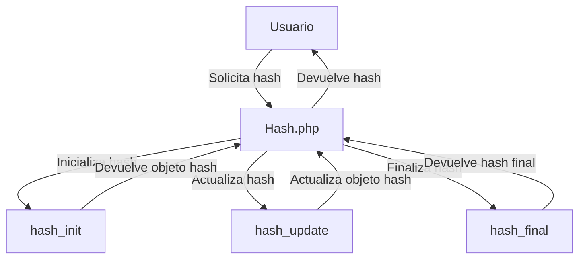

## Module: Hash.php

# Análisis Integral del Módulo Hash.php

## Módulo/Componente SQL
**Nombre**: Hash.php
**Tipo**: Clase PHP

## Objetivos Primarios
Este módulo proporciona una funcionalidad de generación de hash utilizando el algoritmo HMAC (Hash-based Message Authentication Code). Su propósito principal es crear hashes seguros para datos utilizando una clave secreta, lo que permite la autenticación y verificación de integridad de la información.

## Funciones, Métodos y Consultas Críticas
- **getHash($algoritmo, $data, $key)**: Método estático que genera un hash HMAC utilizando el algoritmo especificado, los datos proporcionados y una clave secreta. Es la única función del módulo y constituye su funcionalidad central.

## Variables y Elementos Clave
- **$algoritmo**: Parámetro que especifica el algoritmo de hash a utilizar (como MD5, SHA-1, SHA-256, etc.).
- **$data**: Los datos que se van a hashear.
- **$key**: La clave secreta utilizada para el proceso HMAC.
- **$hash**: Variable interna que almacena el contexto del hash durante el proceso.

## Interdependencias y Relaciones
- El módulo depende de las funciones nativas de PHP para el manejo de hash: `hash_init()`, `hash_update()` y `hash_final()`.
- No tiene dependencias explícitas con otros módulos o componentes del sistema.
- Probablemente es utilizado por otros componentes del sistema que requieren funcionalidad de hash para autenticación, seguridad o verificación de integridad.

## Operaciones Principales vs. Auxiliares
- **Operación Principal**: La generación del hash HMAC mediante el método `getHash()`.
- **Operaciones Auxiliares**: No hay operaciones auxiliares significativas en este módulo debido a su naturaleza simple y enfocada.

## Secuencia Operacional/Flujo de Ejecución
1. Inicialización del contexto de hash con el algoritmo especificado y la clave mediante `hash_init()`.
2. Actualización del contexto de hash con los datos proporcionados mediante `hash_update()`.
3. Finalización y retorno del valor hash resultante mediante `hash_final()`.

## Aspectos de Rendimiento y Optimización
- El módulo es eficiente ya que utiliza funciones nativas de PHP para el procesamiento de hash.
- La complejidad computacional dependerá del algoritmo de hash seleccionado.
- No hay bucles o estructuras de control que puedan causar problemas de rendimiento.

## Reusabilidad y Adaptabilidad
- Alta reusabilidad debido a su diseño como método estático que acepta parámetros para el algoritmo, datos y clave.
- Puede adaptarse fácilmente a diferentes contextos de seguridad seleccionando diferentes algoritmos de hash.
- El diseño modular permite su incorporación en cualquier sistema PHP que requiera funcionalidad de hash HMAC.

## Uso y Contexto
- Típicamente utilizado en:
  - Autenticación de usuarios (generación de tokens)
  - Verificación de integridad de datos
  - Firmas digitales simples
  - Almacenamiento seguro de contraseñas (aunque para contraseñas se recomendarían funciones específicas como password_hash)

## Suposiciones y Limitaciones
- **Suposiciones**:
  - Se asume que el desarrollador conoce y selecciona un algoritmo de hash apropiado para su caso de uso.
  - Se asume que la clave secreta se gestiona de manera segura fuera de este módulo.
  
- **Limitaciones**:
  - No incluye validación de los parámetros de entrada.
  - No maneja excepciones que podrían surgir si se proporciona un algoritmo no válido.
  - No ofrece funcionalidad para comparar hashes (verificación), lo que sería un complemento natural para este módulo.
  - No implementa medidas adicionales como salting o key stretching que podrían ser necesarias en ciertos contextos de seguridad.
## Flow Diagram [via mermaid]

