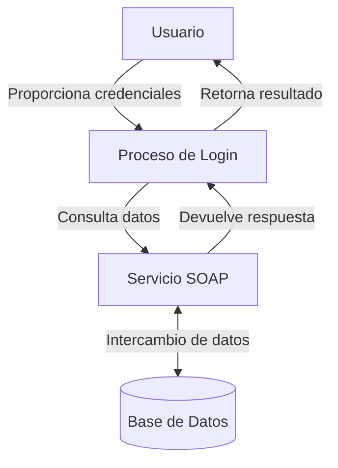

## Module: Huella.php

# Análisis Integral del Módulo Huella.php

## Módulo/Componente SQL
**Nombre del Módulo**: Huella.php - Clase PHP para autenticación biométrica

## Objetivos Primarios
El módulo tiene como propósito principal gestionar la autenticación de empleados mediante huellas dactilares, estableciendo una conexión con un servicio web SOAP para validar las credenciales biométricas de los usuarios.

## Funciones, Métodos y Consultas Críticas
- **login($numEmpleado, $template)**: Método principal que maneja la autenticación biométrica de empleados. Recibe el número de empleado y la plantilla de huella dactilar, y devuelve un objeto de respuesta con el estado y mensaje de la operación.

## Variables y Elementos Clave
- **$numEmpleado**: Parámetro que identifica al empleado (valor predeterminado: 9000000)
- **$template**: Cadena que contiene los datos de la huella dactilar codificada
- **$ERRORESSOAP**: Array asociativo que mapea códigos de error a mensajes descriptivos
- **$response**: Objeto que almacena el resultado de la operación
- **WSHUELLAS**: Constante (no definida en el fragmento) que contiene la URL del servicio web SOAP

## Interdependencias y Relaciones
- Dependencia del servicio web SOAP externo definido por la constante WSHUELLAS
- Utiliza la clase SoapClient nativa de PHP para la comunicación con el servicio web
- El método ConsultaEmpleado del servicio web requiere parámetros específicos (idu-num, des-Template64, num-nivel)

## Operaciones Principales vs. Auxiliares
- **Operación Principal**: Llamada al método ConsultaEmpleado del servicio web SOAP para validar la huella dactilar
- **Operaciones Auxiliares**: Manejo de errores y formateo de la respuesta para el cliente

## Secuencia Operacional/Flujo de Ejecución
1. Se inicializa un objeto de respuesta
2. Se define un array de mensajes de error
3. Se crea una instancia del cliente SOAP
4. Se realiza la llamada al método ConsultaEmpleado del servicio web
5. Se evalúa la respuesta del servicio
6. Se construye y devuelve un objeto de respuesta con el estado y mensaje apropiados

## Aspectos de Rendimiento y Optimización
- La comunicación SOAP puede representar un cuello de botella potencial, especialmente si el servicio web es lento o está sobrecargado
- No hay manejo de tiempos de espera o reintentos para la llamada al servicio web
- No se implementa caché para reducir llamadas repetidas al servicio

## Reutilización y Adaptabilidad
- La clase está diseñada de manera modular, permitiendo su reutilización en diferentes partes de la aplicación
- Los parámetros del método login tienen valores predeterminados, lo que facilita su uso
- La estructura de respuesta estandarizada facilita el procesamiento por parte de los componentes que consumen este servicio

## Uso y Contexto
- Este módulo se utiliza probablemente en un sistema de control de acceso o registro de asistencia de empleados
- Se integra con un sistema biométrico existente a través del servicio web SOAP
- Forma parte de un proceso de autenticación que verifica la identidad de los empleados mediante huellas dactilares

## Suposiciones y Limitaciones
- Asume que la constante WSHUELLAS está definida en algún lugar del sistema
- Requiere que el servicio web SOAP esté disponible y funcional
- No implementa manejo de excepciones para fallos en la conexión SOAP
- No incluye validación de la calidad o formato de la plantilla de huella dactilar antes de enviarla
- Depende completamente de la disponibilidad y correcto funcionamiento del servicio web externo
- No proporciona mecanismos alternativos de autenticación en caso de fallo del servicio biométrico
## Flow Diagram [via mermaid]

