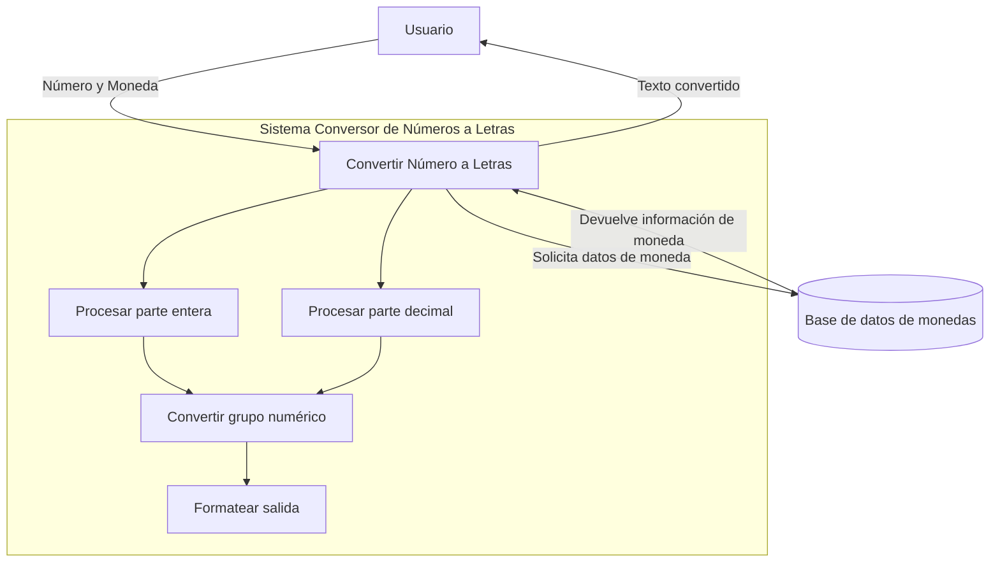

## Module: NumberToLetterConverter.php

# Análisis Integral del Módulo NumberToLetterConverter.php

## Nombre del Módulo/Componente SQL
**NumberToLetterConverter.php** - Clase PHP para convertir números a su representación textual en letras.

## Objetivos Primarios
El propósito principal de este código es convertir valores numéricos a su representación textual en palabras, con soporte para diferentes monedas. Está diseñado específicamente para transformar cantidades monetarias en su forma escrita, lo que es útil para documentos financieros, facturas o cheques donde se requiere expresar montos en letras.

## Funciones, Métodos y Consultas Críticas
- **to_word($number, $miMoneda)**: Método público principal que evalúa si el número contiene separadores decimales y coordina la conversión completa.
- **convertNumber($number, $miMoneda, $type)**: Método privado que realiza la conversión del número a palabras, manejando millones, miles y cientos.
- **convertGroup($n)**: Método privado que convierte grupos de tres dígitos (centenas, decenas y unidades) a su representación textual.

## Variables y Elementos Clave
- **$UNIDADES**: Array con la representación textual de números del 0 al 20.
- **$DECENAS**: Array con la representación textual de las decenas (20, 30, 40, etc.).
- **$CENTENAS**: Array con la representación textual de las centenas.
- **$MONEDAS**: Array multidimensional que contiene información sobre diferentes monedas (país, código de moneda, forma singular, plural y símbolo).
- **$separator**, **$decimal_mark**, **$glue**: Variables para configurar los separadores y la forma de unir partes enteras y decimales.

## Interdependencias y Relaciones
El módulo es independiente y no tiene dependencias externas directas. Está diseñado para funcionar de manera autónoma, aunque probablemente se utilice como parte de un sistema más grande para generar documentos financieros o facturas.

## Operaciones Principales vs. Auxiliares
- **Operaciones Principales**: La conversión de números a texto (métodos `to_word` y `convertNumber`).
- **Operaciones Auxiliares**: La gestión de monedas, validación de entradas y el formateo de grupos de dígitos (método `convertGroup`).

## Secuencia Operacional/Flujo de Ejecución
1. Se recibe un número y opcionalmente un código de moneda.
2. Se verifica si el número contiene decimales.
3. Se separa el número en parte entera y decimal si es necesario.
4. Se convierte cada parte utilizando el método `convertNumber`.
5. Para cada conversión, se descompone el número en millones, miles y cientos.
6. Se aplica la lógica específica para cada grupo de dígitos.
7. Se añade el nombre de la moneda según corresponda.
8. Se unen las partes convertidas con el separador definido.

## Aspectos de Rendimiento y Optimización
- El código utiliza operaciones de cadena y arrays que son eficientes para los volúmenes de datos esperados.
- La complejidad algorítmica es constante O(1) ya que procesa un número fijo de dígitos (máximo 9).
- Podría optimizarse el manejo de excepciones y la búsqueda de monedas utilizando un enfoque más eficiente que `array_filter`.

## Reusabilidad y Adaptabilidad
- Alta reusabilidad: puede integrarse fácilmente en cualquier proyecto PHP.
- Adaptabilidad: soporta múltiples monedas y puede extenderse para incluir más.
- Parametrización: permite configurar separadores decimales y de miles.
- Podría mejorarse la modularidad extrayendo la lógica de monedas a una clase separada.

## Uso y Contexto
Este módulo se utiliza típicamente en:
- Generación de facturas y documentos financieros.
- Sistemas de contabilidad y ERP.
- Aplicaciones bancarias donde se requiere expresar cantidades en letras.
- Cheques y documentos legales donde los montos deben escribirse textualmente.

## Suposiciones y Limitaciones
- **Suposiciones**:
  - Se asume que los números no excederán los 999,999,999.
  - Se espera un formato específico de entrada (con separadores predefinidos).
  - Se asume que los códigos de moneda proporcionados existen en el array de monedas.

- **Limitaciones**:
  - No maneja números negativos.
  - Está limitado a 9 dígitos (hasta cientos de millones).
  - El manejo de errores es básico y podría mejorarse.
  - La configuración de separadores es fija y no se puede cambiar dinámicamente después de la instanciación.
  - Hay un error de sintaxis en la definición del array $MONEDAS (falta el operador => en 'symbol').
## Flow Diagram [via mermaid]

