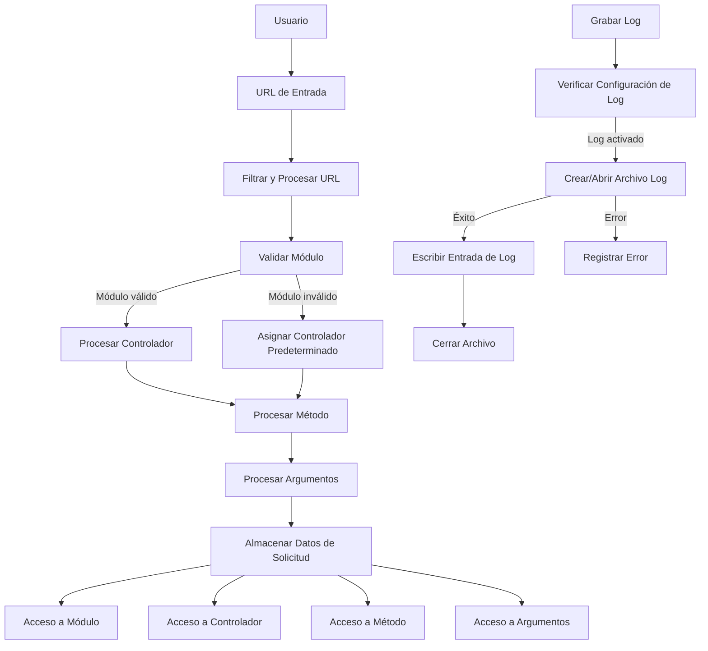

## Module: Request.php

# Análisis Completo del Módulo Request.php

## Nombre del Componente
**Módulo**: Request.php - Clase Request

## Objetivos Primarios
Este módulo tiene como propósito principal gestionar y procesar las solicitudes HTTP entrantes, interpretando la URL para determinar qué módulo, controlador y método deben ejecutarse en una aplicación web basada en un patrón MVC (Modelo-Vista-Controlador). También proporciona funcionalidad para el registro de actividades (logging).

## Funciones, Métodos y Consultas Críticas
- **__construct()**: Constructor que analiza la URL para determinar el módulo, controlador, método y argumentos.
- **getModulo()**: Devuelve el módulo actual.
- **getControlador()**: Devuelve el controlador actual.
- **getMetodo()**: Devuelve el método actual.
- **getArgs()**: Devuelve los argumentos de la solicitud.
- **GrabaLog()**: Método estático para registrar actividades en archivos de log.

## Variables y Elementos Clave
- **_modulo**: Almacena el módulo actual de la aplicación.
- **_controlador**: Almacena el controlador a ejecutar.
- **_metodo**: Almacena el método a invocar dentro del controlador.
- **_argumentos**: Array con los argumentos adicionales de la URL.
- **_modules**: Array que define los módulos válidos de la aplicación.

## Interdependencias y Relaciones
- Depende de constantes globales como `DEFAULT_CONTROLLER`, `APP_LOGFILE`, `APP_LOGPATH`, `DS` y `GRABAR_LOGS`.
- Interactúa con el sistema de archivos para la escritura de logs.
- Se integra con el patrón MVC, proporcionando información esencial para el enrutamiento de solicitudes.

## Operaciones Principales vs. Auxiliares
- **Operaciones Principales**: 
  - Análisis y procesamiento de la URL para determinar el flujo de ejecución.
  - Provisión de métodos getter para acceder a los componentes de la solicitud.
  
- **Operaciones Auxiliares**:
  - Registro de actividades mediante el método `GrabaLog()`.
  - Validación y sanitización de entradas de URL.

## Secuencia Operacional/Flujo de Ejecución
1. Al instanciar la clase, se analiza la URL mediante `filter_input()` y `explode()`.
2. Se determina el módulo, verificando si está en la lista de módulos permitidos.
3. Se extrae el controlador de la URL o se asigna uno por defecto.
4. Se extrae el método a ejecutar o se asigna 'index' por defecto.
5. Se recopilan los argumentos restantes de la URL.
6. Los métodos getter permiten acceder a estos componentes desde otras partes de la aplicación.
7. El método `GrabaLog()` escribe registros en archivos de log cuando se invoca.

## Aspectos de Rendimiento y Optimización
- El código utiliza `filter_input()` para sanitizar la URL, lo que es una buena práctica de seguridad.
- La verificación de módulos válidos mediante `in_array()` podría optimizarse utilizando un array asociativo para búsquedas más rápidas en aplicaciones con muchos módulos.
- El método de logging abre y cierra el archivo en cada llamada, lo que podría ser ineficiente para operaciones de registro frecuentes.

## Reusabilidad y Adaptabilidad
- La clase está diseñada para ser reutilizable en diferentes proyectos MVC.
- La lista de módulos está codificada directamente en el constructor, lo que limita la adaptabilidad; sería mejor extraerla a un archivo de configuración.
- El método `GrabaLog()` es estático, permitiendo su uso sin instanciar la clase.

## Uso y Contexto
- Este módulo se utiliza como parte del sistema de enrutamiento en una aplicación web MVC.
- Procesa las solicitudes entrantes para determinar qué código debe ejecutarse.
- Parece estar orientado a una aplicación de facturación, dado los nombres de los módulos como 'generarfacturas', 'cancelarfacturas', etc.

## Suposiciones y Limitaciones
- **Suposiciones**:
  - Se asume que las constantes globales están definidas en algún lugar del sistema.
  - Se espera que la URL siga un formato específico: módulo/controlador/método/argumentos.
  
- **Limitaciones**:
  - La lista de módulos está hardcodeada en el constructor.
  - El método de logging no maneja rotación de logs ni límites de tamaño.
  - No hay manejo explícito de errores HTTP como 404 para rutas no encontradas.
  - La detección del ID de proceso (`posix_getpid()`) es específica de sistemas UNIX/Linux.
## Flow Diagram [via mermaid]

